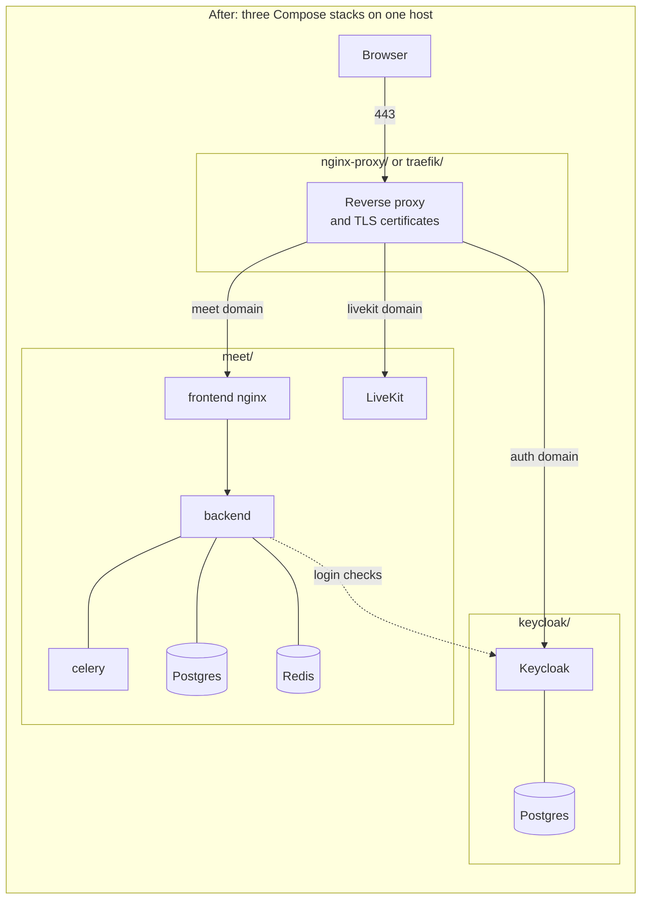

# The Meet documentation website

## TLDR

Before, Meet's documentation is sixteen loose Markdown files under
`docs/`, read on GitHub, and a Docker Compose install means downloading six
files by hand and filling in every placeholder yourself. After, `docs/` is the
source of a navigable website of 51 pages in five sections, built by a static
site generator called Zensical, and a Compose install can run from one script
that asks for three domain names and starts three stacks: a reverse proxy, a
login server and Meet itself.

## What it is for

Meet is a video conferencing app: a Django backend, a React frontend and a
[LiveKit](https://livekit.io/) media server. Three kinds of people need its
documentation, and until now they shared one folder:

| Reader | Needs |
| --- | --- |
| Someone in a meeting | What each button does, how to record, subtitles |
| An operator hosting Meet | How to install, configure and upgrade it |
| A contributor | How to run it locally, where the code lives, how to test |

The pull request answers
[issue #937](https://github.com/suitenumerique/meet/issues/937), which asked
for complete documentation. Its body says the site is previewed at a temporary
address, `documentation-meet.beta.numerique.gouv.fr`.

## How it works today

### The docs folder, before

The repository [`README.md`](https://github.com/suitenumerique/meet/blob/75836fc81701e75642ee4cabb1cb0ca71cb05020/README.md?plain=1#L88)
sends operators to `docs/installation/README.md`, and
[a later line](https://github.com/suitenumerique/meet/blob/75836fc81701e75642ee4cabb1cb0ca71cb05020/README.md?plain=1#L138)
sends contributors to `docs/developping_locally.md`. Nothing builds a website:
each file is a page GitHub renders on its own.

This is the layout before the change:

| Path, before | Holds |
| --- | --- |
| [`docs/installation/`](https://github.com/suitenumerique/meet/tree/75836fc81701e75642ee4cabb1cb0ca71cb05020/docs/installation) | An index plus Compose, Kubernetes and Scalingo guides |
| [`docs/features/`](https://github.com/suitenumerique/meet/tree/75836fc81701e75642ee4cabb1cb0ca71cb05020/docs/features) | Eight notes: login, recording, transcription, telephony and more |
| `docs/developping_locally.md`, `docs/theming.md` | Contributor setup, custom look |
| [`docs/examples/compose/`](https://github.com/suitenumerique/meet/tree/75836fc81701e75642ee4cabb1cb0ca71cb05020/docs/examples/compose), [`docs/examples/helm/`](https://github.com/suitenumerique/meet/tree/75836fc81701e75642ee4cabb1cb0ca71cb05020/docs/examples/helm) | Sample files the guides tell you to download |
| `docs/openapi.yaml`, `docs/resource_server.yaml` | Machine-readable API descriptions |

### A Compose install, before

The Compose guide has the operator download six files one `curl` at a time,
[the compose file, the domain names, two settings files, the LiveKit config and an nginx template](https://github.com/suitenumerique/meet/blob/75836fc81701e75642ee4cabb1cb0ca71cb05020/docs/installation/compose.md?plain=1#L40-L45),
then edit each placeholder such as `<generate a secret key>` by hand.
One compose file runs Meet's five services. Putting it behind a reverse proxy
means uncommenting lines in that file, such as
[the frontend's `VIRTUAL_HOST`](https://github.com/suitenumerique/meet/blob/75836fc81701e75642ee4cabb1cb0ca71cb05020/docs/examples/compose/compose.yaml#L52).
The login server, Keycloak, is a separate guide the operator assembles
alongside.

Meet's frontend container runs nginx, which sends API calls to the backend.
Before, it reads
[an nginx template](https://github.com/suitenumerique/meet/blob/75836fc81701e75642ee4cabb1cb0ca71cb05020/docs/examples/compose/compose.yaml#L59)
whose backend address is
[a variable, `BACKEND_INTERNAL_HOST`](https://github.com/suitenumerique/meet/blob/75836fc81701e75642ee4cabb1cb0ca71cb05020/docker/files/production/default.conf.template#L2),
set in the domain-names file.

## What the change does

### A website built from `docs/`, after

[`zensical.toml`](https://github.com/unteem/meet/blob/bcbf0a6459f5d90a05fb0b277318668c695086f2/zensical.toml#L5-L77)
at the repository root lists every page and its place in the menu. Zensical
turns each Markdown file under `docs/` into one page of the site.
[One `docker run`](https://github.com/unteem/meet/blob/bcbf0a6459f5d90a05fb0b277318668c695086f2/docs/contributing/docs-site.md?plain=1#L12)
serves it on port 8000 and rebuilds on every edit. No CI job builds or
publishes it: `zensical` appears only in `.gitignore` and that contributor
page.

The menu after the change, with the Markdown pages counted per folder:

| Menu section | Folder | Pages |
| --- | --- | --- |
| Background: what Meet is, architecture, concepts, feature list, changelog | `docs/overview/` | 5 |
| User Guide: meetings, settings, recording, subtitles, accessibility | `docs/user/` | 8 |
| Self-Hosting: Compose, Kubernetes, Scalingo, eleven configuration pages | `docs/self-hosting/` | 20 |
| Reference: API, external APIs, environment variables, networking, security, troubleshooting | `docs/reference/` | 8 |
| Contributing: local setup, repository map, backend, frontend, tests, pull requests | `docs/contributing/` | 8 |

A home page, `docs/index.md`, and `docs/faq.md` make 51. The home page is
`index.md` and never `README.md`:
[the contributor page warns](https://github.com/unteem/meet/blob/bcbf0a6459f5d90a05fb0b277318668c695086f2/docs/contributing/docs-site.md?plain=1#L24)
that Zensical builds both into the same home page.

The changelog page
[summarises releases and links `CHANGELOG.md`](https://github.com/unteem/meet/blob/bcbf0a6459f5d90a05fb0b277318668c695086f2/docs/overview/changelog.md?plain=1#L3)
for the full list, so release notes now live in two files: 376 lines on the
site, 761 in `CHANGELOG.md`.

Everything under `docs/installation/`, `docs/features/`,
`docs/examples/compose/` and `docs/examples/helm/` is deleted, along with
`docs/developping_locally.md` and `docs/theming.md`; their content is
rewritten into the pages above. The two API descriptions move to
`docs/reference/`, and the LiveKit sample config moves to
`docs/examples/meet/livekit-server.yaml`. `README.md` is unchanged.

### Self-hosting on Compose as three stacks, after

The single compose file becomes three, each in its own directory, joined by one
shared Docker network called `proxy`:



[The Meet compose file](https://github.com/unteem/meet/blob/bcbf0a6459f5d90a05fb0b277318668c695086f2/docs/examples/meet/compose.yml#L6-L7)
names no proxy. The operator copies one of two override files next to it, and
Compose merges that file in on its own:

| Proxy | What the override adds to `frontend` and `livekit`, after |
| --- | --- |
| nginx-proxy | [`VIRTUAL_HOST`](https://github.com/unteem/meet/blob/bcbf0a6459f5d90a05fb0b277318668c695086f2/docs/examples/meet/docker-compose.override.yml.nginx#L14) and [`LETSENCRYPT_HOST`](https://github.com/unteem/meet/blob/bcbf0a6459f5d90a05fb0b277318668c695086f2/docs/examples/meet/docker-compose.override.yml.nginx#L16) environment variables |
| Traefik | [A router label matching the domain](https://github.com/unteem/meet/blob/bcbf0a6459f5d90a05fb0b277318668c695086f2/docs/examples/meet/docker-compose.override.yml.traefik#L15) and a certificate resolver |

The frontend's nginx now reads
[a fixed routing file](https://github.com/unteem/meet/blob/bcbf0a6459f5d90a05fb0b277318668c695086f2/docs/examples/meet/compose.yml#L50)
that names
[the backend by its service name](https://github.com/unteem/meet/blob/bcbf0a6459f5d90a05fb0b277318668c695086f2/docs/examples/meet/nginx-routing.conf#L2),
`backend:8000`, instead of a variable.

The shared settings templates in `env.d/production.dist/` change to match.
The domain-names file, before and after:

```diff
 MEET_HOST=meet.domain.tld
-KEYCLOAK_HOST=id.domain.tld
+IDP_HOST=id.domain.tld
 LIVEKIT_HOST=livekit.domain.tld
-BACKEND_INTERNAL_HOST=backend
-FRONTEND_INTERNAL_HOST=frontend
-LIVEKIT_INTERNAL_HOST=livekit
 REALM_NAME=meet
+LETSENCRYPT_EMAIL=you@domain.tld
```

In
[`env.d/production.dist/common`](https://github.com/unteem/meet/blob/bcbf0a6459f5d90a05fb0b277318668c695086f2/env.d/production.dist/common#L13-L17),
after, the five mail settings start commented out,
[the login endpoints read `IDP_HOST`](https://github.com/unteem/meet/blob/bcbf0a6459f5d90a05fb0b277318668c695086f2/env.d/production.dist/common#L29-L33),
and [the client id defaults to `meet`](https://github.com/unteem/meet/blob/bcbf0a6459f5d90a05fb0b277318668c695086f2/env.d/production.dist/common#L35). In
[`env.d/production.dist/keycloak`](https://github.com/unteem/meet/blob/bcbf0a6459f5d90a05fb0b277318668c695086f2/env.d/production.dist/keycloak#L6-L9),
after, Keycloak's public address comes from `IDP_HOST` and its health endpoint
is turned on so Compose can wait for it.

### The one-run installer, after

[`docs/install.sh`](https://github.com/unteem/meet/blob/bcbf0a6459f5d90a05fb0b277318668c695086f2/docs/install.sh#L64-L69)
asks for three domains and two email addresses, then works in this order:

| Step, after | What happens |
| --- | --- |
| [Network](https://github.com/unteem/meet/blob/bcbf0a6459f5d90a05fb0b277318668c695086f2/docs/install.sh#L78) | Creates the shared `proxy` network, or reuses it |
| [Stack 1](https://github.com/unteem/meet/blob/bcbf0a6459f5d90a05fb0b277318668c695086f2/docs/install.sh#L93-L107) | Downloads and starts nginx-proxy with its certificate companion in `~/docker/nginx-proxy/` |
| [Stack 2](https://github.com/unteem/meet/blob/bcbf0a6459f5d90a05fb0b277318668c695086f2/docs/install.sh#L111-L162) | Downloads Keycloak's files to `~/docker/keycloak/`, generates its passwords, writes the Meet domain and a random first password for a `meet-admin` user into the realm file, starts it |
| [Stack 3](https://github.com/unteem/meet/blob/bcbf0a6459f5d90a05fb0b277318668c695086f2/docs/install.sh#L166-L202) | Downloads Meet's files to `~/docker/meet/`, copies Keycloak's client secret into Meet's settings, runs the secrets script, starts it |
| [Database](https://github.com/unteem/meet/blob/bcbf0a6459f5d90a05fb0b277318668c695086f2/docs/install.sh#L206-L217) | Polls the backend's health for up to three minutes, then applies the database migrations |

It ends by printing the `meet-admin` password. Keycloak marks that password
[temporary](https://github.com/unteem/meet/blob/bcbf0a6459f5d90a05fb0b277318668c695086f2/docs/examples/keycloak/keycloak-realm.json#L23),
so the first login asks for a new one. The script fetches every file from
GitHub at run time rather than from a local checkout, from the `main` branch
unless `RAW_BASE_URL` points elsewhere. That is why the pull request body tells
testers to point it at the fork's branch.
[The Quick Start page](https://github.com/unteem/meet/blob/bcbf0a6459f5d90a05fb0b277318668c695086f2/docs/self-hosting/compose/quick-start.md?plain=1#L17-L21)
downloads the script the same way and asks the reader to review it before
running it.

### The secrets script, after

[`docs/generate-secrets.sh`](https://github.com/unteem/meet/blob/bcbf0a6459f5d90a05fb0b277318668c695086f2/docs/generate-secrets.sh#L17-L21)
fills six secrets across four settings files with random values from
`openssl`. It writes a value only where the current one is
[a placeholder](https://github.com/unteem/meet/blob/bcbf0a6459f5d90a05fb0b277318668c695086f2/docs/generate-secrets.sh#L57):
something in angle brackets, `REPLACE_ME`, or empty. Given a second argument,
it also writes the LiveKit secret into
[the LiveKit config's placeholder](https://github.com/unteem/meet/blob/bcbf0a6459f5d90a05fb0b277318668c695086f2/docs/generate-secrets.sh#L99-L100),
so the two always agree. Each file it writes is then readable by its owner
only.

The script at the head of the branch, run against sample files in a scratch
directory, gave:

| Line in the file, before | After | Script prints |
| --- | --- | --- |
| `DJANGO_SECRET_KEY=<generate a secret key>` | random 64 hex characters | `set` |
| `OIDC_RP_CLIENT_SECRET=` | random 32 hex characters | `set` |
| `LIVEKIT_API_SECRET=already-chosen` | unchanged | `skip`, already set |
| `KC_BOOTSTRAP_ADMIN_PASSWORD=REPLACE_ME` | random 32 hex characters | `set` |
| `DB_PASSWORD` absent from the file | appended with a random value | `add` |
| `kc_postgresql` file missing | nothing written | `skip`, file not found |

The LiveKit config's `meet: <your livekit secret key>` became
`meet: already-chosen`, the value already in `common`, and all four files
ended with mode `600`.

## Concepts

- **Static site generator**: a tool that turns a folder of Markdown files into
  a folder of HTML pages. Zensical is the one used here; `zensical.toml` is its
  menu and settings.
- **Compose stack**: one `compose.yml` and the containers it starts, managed
  with `docker compose up -d` from its directory.
- **Override file**: a `docker-compose.override.yml` beside `compose.yml`.
  Compose merges it in without being asked; `docker compose config` on a
  two-file sample showed the override's environment variable on the service.
- **Reverse proxy**: the one program listening on ports 80 and 443. It reads
  the domain a browser asked for and forwards the request to the matching
  container. nginx-proxy picks containers by their `VIRTUAL_HOST` variable,
  Traefik by their labels, and both fetch a free TLS certificate from Let's
  Encrypt for each domain.
- **Keycloak, identity provider**: the login server. Meet sends users there to
  sign in and trusts the answer. A **realm** is one set of users and apps in
  Keycloak; the example realm file ships with a `meet` app and a `meet-admin`
  user.
- **Placeholder**: a value in a template that the operator must replace, such
  as `<generate a secret key>`.
- **`env.d/production.dist/`**: the settings templates both the guides and the
  installer download. The Compose files read them as environment files.
