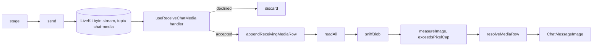

# Images in the meeting chat

PR: [suitenumerique/meet#1551](https://github.com/suitenumerique/meet/pull/1551),
code linked at its head, cfee4752.

## TLDR

A participant pastes, picks or drops an image into the chat of a running
meeting, adds a caption, and sends it. The image travels as a
[LiveKit byte stream](https://docs.livekit.io/transport/data/byte-streams/)
straight to the other browsers in the meeting, and no server stores it: it is
gone when the meeting ends. Every receiver treats the stream as hostile, since a
meeting admits guests without an account. It reads nothing whose size is not
declared within the cap, takes the type from the bytes and never from the
sender, refuses an image whose pixel count would exhaust memory, and keeps every
row's shape within bounds. The feature is on by default, behind
[`CHAT_MEDIA_ENABLED`](https://github.com/davd-gzl/meet/blob/cfee475273db746b1ca16b1dded7030088ecb0aa/src/backend/meet/settings.py#L1051-L1053).

## What image sharing is

Someone in a call wants to show a screenshot without leaving the call to send
it elsewhere. They paste it into the chat box, pick it with the image button, or
drop it anywhere on the chat panel. The image waits above the text box as a
thumbnail, whatever they type becomes its caption, and send delivers both as one
chat row.

- every other browser shows a row with a progress bar, then the image;
- clicking an image opens it larger, with a download link;
- an image over 5 MB, or larger than 4096 x 4096 pixels, is reduced before it
  leaves; an animation that large is refused, since reducing it keeps one frame;
- the sender's filename never leaves their browser;
- someone who joins later sees no earlier image, as they see no earlier text.

## How it works, in five steps

A browser in a meeting holds one connection to one LiveKit room. An image is a
byte stream on that connection, on the `chat-media` topic, separate from the
`lk.chat` topic the text chat uses, so typing a marker into the message box can
never forge one. The example is a 1 000 000-byte PNG screenshot of 1500 by 1200
pixels, captioned `build fails here`.

1. **Stage.** Paste, the picker or a drop calls
   [`stage`](https://github.com/davd-gzl/meet/blob/cfee475273db746b1ca16b1dded7030088ecb0aa/src/frontend/src/features/chat/media/useSendChatMedia.ts#L42-L109).
   It reads the first 12 bytes and gets `image/png` from the PNG signature,
   whatever the file is called. The file is under both caps, so its bytes are
   kept as they are, and it waits in `chatStore.pendingAttachment` as
   `{ mimeType: 'image/png', width: 1500, height: 1200, previewUrl: 'blob:…' }`.
2. **Send.** Pressing send while an image is staged calls
   [`send`](https://github.com/davd-gzl/meet/blob/cfee475273db746b1ca16b1dded7030088ecb0aa/src/frontend/src/features/chat/media/useSendChatMedia.ts#L111-L170),
   which opens the stream with this header and writes 67 chunks of 15 000
   bytes:

   ```ts
   // what the sender passes to streamBytes for the example
   {
     topic: 'chat-media',
     mimeType: 'image/png',
     totalSize: 1000000,
     name: 'image.png',
     attributes: { caption: 'build fails here', width: '1500', height: '1200' },
   }
   ```

   A byte stream is not delivered back to its sender, so the sender's own row is
   added locally from the preview it already holds.
3. **Open.** On every other browser the handler
   [`useReceiveChatMedia`](https://github.com/davd-gzl/meet/blob/cfee475273db746b1ca16b1dded7030088ecb0aa/src/frontend/src/features/chat/media/useReceiveChatMedia.ts#L64-L93)
   registers runs as the header arrives, before any byte. It accepts the stream
   only if the sender has fewer than 3 streams in flight, the declared size is
   present and within 5 MB, and no row already holds the stream's id. It then
   adds a row in the `receiving` state. A stream it declines is read and
   dropped, since LiveKit buffers every chunk of a stream whether anyone reads it
   or not.
4. **Read.** `readAll` collects the bytes while the bar moves in 5 % steps.
   LiveKit fails the read once more bytes arrive than were declared.
5. **Check and show.** The receiver sniffs the bytes again and ignores the
   declared type, then has the browser load them. Loading reads the header
   alone and gives the real dimensions: an image past 4096 x 4096 pixels, or
   one that does not load, fails its row there and is never drawn. Otherwise
   [`resolveMediaRow`](https://github.com/davd-gzl/meet/blob/cfee475273db746b1ca16b1dded7030088ecb0aa/src/frontend/src/stores/chat.ts#L262-L280)
   marks the row `ready` with the measured 1500 by 1200, replacing what the
   sender declared.

An image over a cap takes a detour at step 1. It is drawn onto a canvas whose
long edge is
[2048 pixels](https://github.com/davd-gzl/meet/blob/cfee475273db746b1ca16b1dded7030088ecb0aa/src/frontend/src/features/chat/media/constants.ts#L22)
and re-encoded as the first of WebP, JPEG and PNG that the deployment allows and
the browser can encode. The sizes it produces, from running the scale lines of
[`downscaleImage`](https://github.com/davd-gzl/meet/blob/cfee475273db746b1ca16b1dded7030088ecb0aa/src/frontend/src/features/chat/media/downscaleImage.ts#L21-L58)
in Node:

| Original, pixels | Sent, pixels |
| --- | --- |
| 4032 x 3024, a phone photo over 5 MB | 2048 x 1536 |
| 3840 x 2160, a 4K screenshot over 5 MB | 2048 x 1152 |
| 1000 x 8000, a tall page capture over 5 MB | 256 x 2048 |
| 1500 x 1200 over 5 MB | 1500 x 1200, re-encoded only |

## The parts, at a glance

| Part | Where | Its job |
| --- | --- | --- |
| Settings | [`settings.py`](https://github.com/davd-gzl/meet/blob/cfee475273db746b1ca16b1dded7030088ecb0aa/src/backend/meet/settings.py#L1048-L1062) | `CHAT_MEDIA_ENABLED`, `CHAT_MEDIA_MAX_SIZE`, `CHAT_MEDIA_ALLOWED_MIMETYPES` |
| Configuration | [`get_frontend_configuration`](https://github.com/davd-gzl/meet/blob/cfee475273db746b1ca16b1dded7030088ecb0aa/src/backend/core/api/__init__.py#L63-L67) | sends the three to every browser under `chat_media` |
| The sender | [`useSendChatMedia.ts`](https://github.com/davd-gzl/meet/blob/cfee475273db746b1ca16b1dded7030088ecb0aa/src/frontend/src/features/chat/media/useSendChatMedia.ts) | `stage` checks and reduces, `send` streams |
| The receiver | [`useReceiveChatMedia.ts`](https://github.com/davd-gzl/meet/blob/cfee475273db746b1ca16b1dded7030088ecb0aa/src/frontend/src/features/chat/media/useReceiveChatMedia.ts) | accepts, reads and checks what another browser sends |
| The byte probes | [`probeImage.ts`](https://github.com/davd-gzl/meet/blob/cfee475273db746b1ca16b1dded7030088ecb0aa/src/frontend/src/features/chat/media/probeImage.ts) | the type from the bytes, animation, the pixel cap, the decode check |
| The caption filter | [`sanitize.ts`](https://github.com/davd-gzl/meet/blob/cfee475273db746b1ca16b1dded7030088ecb0aa/src/frontend/src/features/chat/media/sanitize.ts) | what a receiver keeps of the caption and the declared size |
| The store | [`stores/chat.ts`](https://github.com/davd-gzl/meet/blob/cfee475273db746b1ca16b1dded7030088ecb0aa/src/frontend/src/stores/chat.ts) | rows become text or image, one row per stream id, the 50 images kept |
| What is drawn | [`ChatMessageImage.tsx`](https://github.com/davd-gzl/meet/blob/cfee475273db746b1ca16b1dded7030088ecb0aa/src/frontend/src/features/chat/components/ChatMessageImage.tsx), [`ChatImageLightbox.tsx`](https://github.com/davd-gzl/meet/blob/cfee475273db746b1ca16b1dded7030088ecb0aa/src/frontend/src/features/chat/components/ChatImageLightbox.tsx) | the row, its bounded shape, the enlarged view |

## The flow, function by function

The same five steps, each box named as the code names it.



## Read the code in this order

Each stop makes the next one legible. The first four decide what another
participant can make this browser do; the rest are the sender and the screen.

### 1. Accepting a stream, [`useReceiveChatMedia`](https://github.com/davd-gzl/meet/blob/cfee475273db746b1ca16b1dded7030088ecb0aa/src/frontend/src/features/chat/media/useReceiveChatMedia.ts#L64-L93)

Everything here runs on the header alone, before a byte is read. A wrong check
lets a guest fill another browser's memory or write into another participant's
row.

```ts
// LiveKit fails a read that passes the declared size, and skips that
// check when no size or a zero size is declared.
const accepted =
  running < MAX_CONCURRENT_STREAMS_PER_SENDER &&
  !!size &&
  size <= limits.maxSize &&
  appendReceivingMediaRow({
    // ...
  })
if (!accepted) {
  void discard(reader)
  return
}
```

### 2. One row per stream id, [`appendReceivingMediaRow`](https://github.com/davd-gzl/meet/blob/cfee475273db746b1ca16b1dded7030088ecb0aa/src/frontend/src/stores/chat.ts#L235-L249)

The stream id is chosen by the sender, and LiveKit accepts an id again once the
first stream that used it has ended. Every later step finds its row by that id,
so the store refuses an id a row already holds, the local participant's own
included.

```ts
export function appendReceivingMediaRow(row: NewMediaRow) {
  if (findMediaRow(row.id)) return false
  pushMediaRow(row, { isLocal: false, status: 'receiving', progress: 0 })
  countAsUnread()
  return true
}
```

### 3. Dropping what is declined, [`discard`](https://github.com/davd-gzl/meet/blob/cfee475273db746b1ca16b1dded7030088ecb0aa/src/frontend/src/features/chat/media/useReceiveChatMedia.ts#L19-L43)

LiveKit gives a handler no way to refuse a stream, and queues its chunks until
the sender's trailer. `discard` reads them and keeps nothing. Past its declared
size the public reader throws on every chunk, so the rest is read from the queue
it wraps; that queue is not public API, and a renamed field throws rather than
buffering in silence.

### 4. What the bytes are, [`probeImage.ts`](https://github.com/davd-gzl/meet/blob/cfee475273db746b1ca16b1dded7030088ecb0aa/src/frontend/src/features/chat/media/probeImage.ts#L21-L40)

Both sides call it. `sniffImageType` returns JPEG, PNG, GIF or WebP from the
leading bytes and null for anything else, SVG included, which carries no
signature and can run script.
[`exceedsPixelCap`](https://github.com/davd-gzl/meet/blob/cfee475273db746b1ca16b1dded7030088ecb0aa/src/frontend/src/features/chat/media/probeImage.ts#L126-L136)
is the one question both sides ask: the sender reduces past it, the receiver
refuses past it. A 249 kB PNG declaring 16000 x 16000 pixels costs a receiver
about 1.3 GB to draw in Chromium, which the byte cap alone does not stop.

```ts
export const exceedsPixelCap = ({ width, height }) =>
  width * height > MAX_IMAGE_PIXELS // 4096 * 4096
```

### 5. Reducing before sending, [`stage`](https://github.com/davd-gzl/meet/blob/cfee475273db746b1ca16b1dded7030088ecb0aa/src/frontend/src/features/chat/media/useSendChatMedia.ts#L59-L99)

An image under both caps leaves untouched, since re-encoding a lossless
screenshot costs the legibility the feature exists for. One over either is
reduced, unless it is animated:
[`isAnimated`](https://github.com/davd-gzl/meet/blob/cfee475273db746b1ca16b1dded7030088ecb0aa/src/frontend/src/features/chat/media/probeImage.ts#L98-L112)
walks a GIF's blocks, looks for a PNG's `acTL` before its first `IDAT`, and
reads a WebP's animation flag.

```ts
let size =
  file.size > limits.maxSize
    ? undefined
    : await measureImage(previewUrl)

if (!size || exceedsPixelCap(size)) {
  // refuse an animation, else downscaleImage
}
```

### 6. Sending, [`send`](https://github.com/davd-gzl/meet/blob/cfee475273db746b1ca16b1dded7030088ecb0aa/src/frontend/src/features/chat/media/useSendChatMedia.ts#L136-L149)

The image goes out a chunk at a time, so it is never copied whole. A failed
write closes the stream short of its declared size, which fails it on every
receiver and frees the slot it held there.

```ts
} catch (error) {
  await writer.close().catch(() => {})
  throw error
}
```

### 7. Text rows beside image rows, [`appendNewMessages`](https://github.com/davd-gzl/meet/blob/cfee475273db746b1ca16b1dded7030088ecb0aa/src/frontend/src/stores/chat.ts#L154-L165)

Text still comes from LiveKit's `chatMessages`, which never holds images. The
store counts the messages it has copied apart from its rows, so an image row
between two messages never hides the next one.

```ts
let copiedMessages = 0

export function appendNewMessages(messages: ReceivedChatMessage[]) {
  for (; copiedMessages < messages.length; copiedMessages++) {
    appendRow(messages[copiedMessages])
  }
}
```

### 8. The row's shape, [`aspectRatio`](https://github.com/davd-gzl/meet/blob/cfee475273db746b1ca16b1dded7030088ecb0aa/src/frontend/src/features/chat/components/ChatMessageImage.tsx#L33-L45)

While bytes arrive the row reserves the shape the sender declared; once the
image loads it takes the measured one. Either way the ratio is held between
1:4 and 4:1, so a sender declaring 1 x 100000 cannot stretch the list past every
other message, and a taller image is letterboxed inside its row.

## What each person sees

| Who | What they see | What decides it |
| --- | --- | --- |
| The sender | the thumbnail above the text box, then their own row at once | the preview already in their browser |
| Everyone else in the meeting | a row with a progress bar, then the image, at most 16rem wide | the checks of stops 1 to 4 |
| Someone joining later | no earlier image | images are never stored |
| Anyone, after 50 newer images | `This image is no longer available.` in place of the oldest | [`MAX_RETAINED_MEDIA`](https://github.com/davd-gzl/meet/blob/cfee475273db746b1ca16b1dded7030088ecb0aa/src/frontend/src/stores/chat.ts#L11), per browser |
| The sender, on a refusal | one line under the thumbnail: wrong type, too large, an animation too large, or a failed send | `chatStore.mediaFailure` |

## What it guarantees, and its limits

| What | Kept by | How, or why not |
| --- | --- | --- |
| Nothing is stored on a server | the transport | a byte stream goes browser to browser through LiveKit |
| A receiver never draws SVG or a non-image | every receiver | the type comes from the bytes, and the browser must load them |
| A receiver's memory per image is bounded | every receiver | 5 MB per stream read, 4096 x 4096 pixels drawn, 3 streams per sender at once, 50 images kept |
| A declined stream is not buffered | every receiver | `discard` reads and drops it |
| One participant cannot write into another's row | the store | one row per stream id |
| No row can bury the chat | the row | its ratio is held between 1:4 and 4:1 |
| The filename stays private | the sender | the stream is named `image.<type>` |
| Metadata inside the image is removed | not kept | a reduced image carries none, since a canvas copies pixels; an image sent unreduced keeps its EXIF, the second task on [#1547](https://github.com/suitenumerique/meet/issues/1547) |
| A sent image can be taken back | not kept | it stays in each browser until the meeting ends or 50 newer images expire it |
| Fifty images from one guest expire everyone else's | not kept | the 50 are counted across all senders |

## Turning it on

Three settings, read by the backend and sent to every browser through
`/config/`. No migration, no storage and no new service.

| Setting | Default | Effect |
| --- | --- | --- |
| [`CHAT_MEDIA_ENABLED`](https://github.com/davd-gzl/meet/blob/cfee475273db746b1ca16b1dded7030088ecb0aa/src/backend/meet/settings.py#L1051-L1053) | `True` | off hides the button and stops browsers receiving images |
| [`CHAT_MEDIA_MAX_SIZE`](https://github.com/davd-gzl/meet/blob/cfee475273db746b1ca16b1dded7030088ecb0aa/src/backend/meet/settings.py#L1054-L1056) | 5 MB | the size sent unreduced and the size a receiver reads |
| [`CHAT_MEDIA_ALLOWED_MIMETYPES`](https://github.com/davd-gzl/meet/blob/cfee475273db746b1ca16b1dded7030088ecb0aa/src/backend/meet/settings.py#L1057-L1062) | JPEG, PNG, WebP, GIF | narrowing it refuses the rest on both sides and changes what a reduced image is encoded as; adding a type the probes do not know refuses it anyway |

A browser reads these [once per page load](https://github.com/davd-gzl/meet/blob/cfee475273db746b1ca16b1dded7030088ecb0aa/src/frontend/src/api/useConfig.ts#L88), so a
change reaches tabs opened after it.

## Every file, one line each

<details>
<summary>Every file the pull request changes</summary>

| File | Role |
| --- | --- |
| [`meet/settings.py`](https://github.com/davd-gzl/meet/blob/cfee475273db746b1ca16b1dded7030088ecb0aa/src/backend/meet/settings.py#L1048-L1062) | the three settings |
| [`core/api/__init__.py`](https://github.com/davd-gzl/meet/blob/cfee475273db746b1ca16b1dded7030088ecb0aa/src/backend/core/api/__init__.py#L63-L67) | sends them to browsers |
| [`core/tests/test_api_config.py`](https://github.com/davd-gzl/meet/blob/cfee475273db746b1ca16b1dded7030088ecb0aa/src/backend/core/tests/test_api_config.py) | pins the defaults and the overrides |
| [`api/useConfig.ts`](https://github.com/davd-gzl/meet/blob/cfee475273db746b1ca16b1dded7030088ecb0aa/src/frontend/src/api/useConfig.ts) | the `chat_media` type |
| [`chat/media/constants.ts`](https://github.com/davd-gzl/meet/blob/cfee475273db746b1ca16b1dded7030088ecb0aa/src/frontend/src/features/chat/media/constants.ts) | the topic, the fallbacks and every cap |
| [`chat/media/useChatMediaLimits.ts`](https://github.com/davd-gzl/meet/blob/cfee475273db746b1ca16b1dded7030088ecb0aa/src/frontend/src/features/chat/media/useChatMediaLimits.ts) | the configuration, with the fallbacks until it answers |
| [`chat/media/probeImage.ts`](https://github.com/davd-gzl/meet/blob/cfee475273db746b1ca16b1dded7030088ecb0aa/src/frontend/src/features/chat/media/probeImage.ts) | type, animation, pixel cap and decode check |
| [`chat/media/sanitize.ts`](https://github.com/davd-gzl/meet/blob/cfee475273db746b1ca16b1dded7030088ecb0aa/src/frontend/src/features/chat/media/sanitize.ts) | the caption and the declared size, as a receiver keeps them |
| [`chat/media/downscaleImage.ts`](https://github.com/davd-gzl/meet/blob/cfee475273db746b1ca16b1dded7030088ecb0aa/src/frontend/src/features/chat/media/downscaleImage.ts) | reduces an image over a cap |
| [`chat/media/useSendChatMedia.ts`](https://github.com/davd-gzl/meet/blob/cfee475273db746b1ca16b1dded7030088ecb0aa/src/frontend/src/features/chat/media/useSendChatMedia.ts) | `stage` and `send` |
| [`chat/media/useReceiveChatMedia.ts`](https://github.com/davd-gzl/meet/blob/cfee475273db746b1ca16b1dded7030088ecb0aa/src/frontend/src/features/chat/media/useReceiveChatMedia.ts) | the receiving handler and `discard` |
| [`stores/chat.ts`](https://github.com/davd-gzl/meet/blob/cfee475273db746b1ca16b1dded7030088ecb0aa/src/frontend/src/stores/chat.ts) | text and image rows, the staged image, the unread count, retention |
| [`chat/components/ChatProvider.tsx`](https://github.com/davd-gzl/meet/blob/cfee475273db746b1ca16b1dded7030088ecb0aa/src/frontend/src/features/chat/components/ChatProvider.tsx) | mounts the receiver, copies text, resets on leaving |
| [`chat/components/ChatTextArea.tsx`](https://github.com/davd-gzl/meet/blob/cfee475273db746b1ca16b1dded7030088ecb0aa/src/frontend/src/features/chat/components/ChatTextArea.tsx), [`ChatAttachButton.tsx`](https://github.com/davd-gzl/meet/blob/cfee475273db746b1ca16b1dded7030088ecb0aa/src/frontend/src/features/chat/components/ChatAttachButton.tsx), [`ChatDropZone.tsx`](https://github.com/davd-gzl/meet/blob/cfee475273db746b1ca16b1dded7030088ecb0aa/src/frontend/src/features/chat/components/ChatDropZone.tsx) | paste, the picker and drop, all calling `stage` |
| [`chat/components/ChatPendingAttachment.tsx`](https://github.com/davd-gzl/meet/blob/cfee475273db746b1ca16b1dded7030088ecb0aa/src/frontend/src/features/chat/components/ChatPendingAttachment.tsx) | the staged thumbnail, its remove button and any failure |
| [`chat/components/ChatMessageImage.tsx`](https://github.com/davd-gzl/meet/blob/cfee475273db746b1ca16b1dded7030088ecb0aa/src/frontend/src/features/chat/components/ChatMessageImage.tsx), [`ChatImageLightbox.tsx`](https://github.com/davd-gzl/meet/blob/cfee475273db746b1ca16b1dded7030088ecb0aa/src/frontend/src/features/chat/components/ChatImageLightbox.tsx) | the image row and the enlarged view |
| [`chat/components/Chat.tsx`](https://github.com/davd-gzl/meet/blob/cfee475273db746b1ca16b1dded7030088ecb0aa/src/frontend/src/features/chat/components/Chat.tsx), [`ChatMessage.tsx`](https://github.com/davd-gzl/meet/blob/cfee475273db746b1ca16b1dded7030088ecb0aa/src/frontend/src/features/chat/components/ChatMessage.tsx), [`ChatMessageBody.tsx`](https://github.com/davd-gzl/meet/blob/cfee475273db746b1ca16b1dded7030088ecb0aa/src/frontend/src/features/chat/components/ChatMessageBody.tsx) | the drop zone around the panel and a body per row kind |
| `locales/en/rooms.json`, `locales/fr/rooms.json` | the strings |
| `*.test.ts` beside the code | the probes, the caption filter and the store |
| `CHANGELOG.md` | one line |

</details>

## Not in this pull request

| What | Why it waits |
| --- | --- |
| Removing metadata from an image sent unreduced | the second task on [#1547](https://github.com/suitenumerique/meet/issues/1547): it means re-encoding every image or a parser per format |
| The strings in German, Dutch and Spanish | they [fall back to French](https://github.com/davd-gzl/meet/blob/cfee475273db746b1ca16b1dded7030088ecb0aa/src/frontend/src/i18n/init.ts#L6) until translated |
| A sound and a toast when an image arrives with the chat closed | the unread count already moves; the toast [listens to text alone](https://github.com/davd-gzl/meet/blob/cfee475273db746b1ca16b1dded7030088ecb0aa/src/frontend/src/features/notifications/MainNotificationToast.tsx#L53) |

## Words used here

| Word | What it is |
| --- | --- |
| byte stream | a LiveKit transfer of raw bytes to the other participants: a header naming the topic, name, type, total size and attributes, then the chunks, then a trailer |
| `chat-media` | the byte stream topic images use, separate from the text chat's `lk.chat` |
| stream id | the id in a stream's header, chosen by the sender; the store keeps one row per id |
| declared | what the sender wrote in the header: size, type, width, height, caption; a receiver trusts none of it |
| sniffing | reading a file's first bytes to learn its type, ignoring its name and the declared type |
| pixel cap | `MAX_IMAGE_PIXELS`, 4096 x 4096, about 64 MiB once drawn |
| object URL | a `blob:` address from `URL.createObjectURL`; the bytes stay in memory until it is revoked |
| `ChatMediaRow` | a chat row of `kind: 'media'`, `receiving`, `ready` or `failed` |
| retention | the 50 images a browser keeps before expiring the oldest |
| `/config/` | `GET /api/v1.0/config/`, readable without signing in, now carrying `chat_media` |
