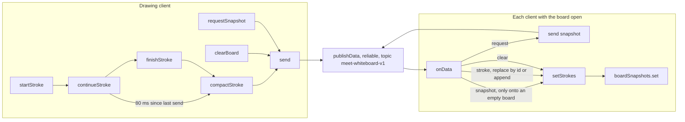

# Collaborative whiteboard: `CollaborativeWhiteboard`

PR: [suitenumerique/meet#1746](https://github.com/suitenumerique/meet/pull/1746).
Every link, excerpt, table and diagram below is the after.

## TLDR

More tools offered transcription and screen recording. Now it also opens
[`CollaborativeWhiteboard`](https://github.com/suitenumerique/meet/blob/613623fe9424445172aeefabd6bbfd888199201d/src/frontend/src/features/whiteboard/CollaborativeWhiteboard.tsx#L25-L216), a drawing board in the side panel.
Each stroke goes to the other participants as JSON over the media server's
data channel, on the topic [`meet-whiteboard-v1`](https://github.com/suitenumerique/meet/blob/613623fe9424445172aeefabd6bbfd888199201d/src/frontend/src/features/whiteboard/CollaborativeWhiteboard.tsx#L8), and no server code
changes. Each tab keeps its board in memory, the [last 20 strokes](https://github.com/suitenumerique/meet/blob/613623fe9424445172aeefabd6bbfd888199201d/src/frontend/src/features/whiteboard/CollaborativeWhiteboard.tsx#L9), and
asks the others for their copy when it opens. It answers
[#714](https://github.com/suitenumerique/meet/issues/714), the request for a
built-in whiteboard, which the [changelog entry](https://github.com/suitenumerique/meet/blob/613623fe9424445172aeefabd6bbfd888199201d/CHANGELOG.md#L13) cites.

## What the whiteboard is

A drawing surface shared by everyone in the meeting. A participant opens More
tools and presses Whiteboard. The side panel shows a white board, four pen
colours and a Clear board button. A line drawn with a mouse, a pen or a finger
appears on the board of every participant who has the whiteboard open, growing
while it is drawn. Clear board empties every open board.

## How it works, in 7 steps

1. A participant presses the [Whiteboard button](https://github.com/suitenumerique/meet/blob/613623fe9424445172aeefabd6bbfd888199201d/src/frontend/src/features/rooms/livekit/components/Tools.tsx#L196-L203).
   [`openWhiteboard`](https://github.com/suitenumerique/meet/blob/613623fe9424445172aeefabd6bbfd888199201d/src/frontend/src/features/rooms/livekit/hooks/useSidePanel.ts#L75-L78) sets `activeSubPanelId` to `'whiteboard'`
   and `activePanelId` to `'tools'`. `Tools` then renders
   `<CollaborativeWhiteboard />` in place of its button list, on the
   [`SubPanelId.WHITEBOARD` case](https://github.com/suitenumerique/meet/blob/613623fe9424445172aeefabd6bbfd888199201d/src/frontend/src/features/rooms/livekit/components/Tools.tsx#L140-L141).
2. On mount, [`strokes` starts from `boardSnapshots.get(room.name)`](https://github.com/suitenumerique/meet/blob/613623fe9424445172aeefabd6bbfd888199201d/src/frontend/src/features/whiteboard/CollaborativeWhiteboard.tsx#L28-L30),
   the copy this tab kept when the board was last open in this room, or from
   an empty list. In a connected meeting,
   [`requestSnapshot` runs at once](https://github.com/suitenumerique/meet/blob/613623fe9424445172aeefabd6bbfd888199201d/src/frontend/src/features/whiteboard/CollaborativeWhiteboard.tsx#L101) and sends `{"type":"request"}`.
3. Each client that receives the request
   [answers with its current strokes](https://github.com/suitenumerique/meet/blob/613623fe9424445172aeefabd6bbfd888199201d/src/frontend/src/features/whiteboard/CollaborativeWhiteboard.tsx#L72-L73), as
   `{"type":"snapshot","strokes":[…]}`. A client
   [adopts a snapshot only while its own board is empty](https://github.com/suitenumerique/meet/blob/613623fe9424445172aeefabd6bbfd888199201d/src/frontend/src/features/whiteboard/CollaborativeWhiteboard.tsx#L74-L78), and
   keeps the last 20 strokes of it.
4. A press on the board runs [`startStroke`](https://github.com/suitenumerique/meet/blob/613623fe9424445172aeefabd6bbfd888199201d/src/frontend/src/features/whiteboard/CollaborativeWhiteboard.tsx#L117-L126), which opens a
   stroke whose id is the participant's identity and a random UUID. Each move
   runs [`continueStroke`](https://github.com/suitenumerique/meet/blob/613623fe9424445172aeefabd6bbfd888199201d/src/frontend/src/features/whiteboard/CollaborativeWhiteboard.tsx#L128-L140). It adds the point to the local board
   and, [once 80 ms have passed since its last send](https://github.com/suitenumerique/meet/blob/613623fe9424445172aeefabd6bbfd888199201d/src/frontend/src/features/whiteboard/CollaborativeWhiteboard.tsx#L135-L139), sends the
   whole stroke so far, thinned by [`compactStroke`](https://github.com/suitenumerique/meet/blob/613623fe9424445172aeefabd6bbfd888199201d/src/frontend/src/features/whiteboard/CollaborativeWhiteboard.tsx#L162-L168) to 25
   points at most. Releasing runs [`finishStroke`](https://github.com/suitenumerique/meet/blob/613623fe9424445172aeefabd6bbfd888199201d/src/frontend/src/features/whiteboard/CollaborativeWhiteboard.tsx#L142-L151), which sends
   the thinned stroke a last time and
   [puts the same thinned copy on the local board](https://github.com/suitenumerique/meet/blob/613623fe9424445172aeefabd6bbfd888199201d/src/frontend/src/features/whiteboard/CollaborativeWhiteboard.tsx#L147-L149).
5. On every receiving client, [`onData`](https://github.com/suitenumerique/meet/blob/613623fe9424445172aeefabd6bbfd888199201d/src/frontend/src/features/whiteboard/CollaborativeWhiteboard.tsx#L57-L92)
   [drops a packet whose topic is not `meet-whiteboard-v1`](https://github.com/suitenumerique/meet/blob/613623fe9424445172aeefabd6bbfd888199201d/src/frontend/src/features/whiteboard/CollaborativeWhiteboard.tsx#L64). For a
   stroke it [replaces the stroke carrying the same id, or appends it](https://github.com/suitenumerique/meet/blob/613623fe9424445172aeefabd6bbfd888199201d/src/frontend/src/features/whiteboard/CollaborativeWhiteboard.tsx#L82-L91)
   and trims the board to its last 20 strokes.
6. [`clearBoard`](https://github.com/suitenumerique/meet/blob/613623fe9424445172aeefabd6bbfd888199201d/src/frontend/src/features/whiteboard/CollaborativeWhiteboard.tsx#L153-L157) empties the local board and sends
   `{"type":"clear"}`. Every receiving client
   [empties its own](https://github.com/suitenumerique/meet/blob/613623fe9424445172aeefabd6bbfd888199201d/src/frontend/src/features/whiteboard/CollaborativeWhiteboard.tsx#L79-L81).
7. [An effect copies `strokes` into `boardSnapshots`](https://github.com/suitenumerique/meet/blob/613623fe9424445172aeefabd6bbfd888199201d/src/frontend/src/features/whiteboard/CollaborativeWhiteboard.tsx#L39-L41) on every
   change, keyed by `room.name`. Closing the side panel
   [sets `activeSubPanelId` to `null`](https://github.com/suitenumerique/meet/blob/613623fe9424445172aeefabd6bbfd888199201d/src/frontend/src/stores/layout.ts#L38-L41), and so do its
   [back arrow](https://github.com/suitenumerique/meet/blob/613623fe9424445172aeefabd6bbfd888199201d/src/frontend/src/features/rooms/livekit/components/SidePanel.tsx#L221) and [opening any other panel](https://github.com/suitenumerique/meet/blob/613623fe9424445172aeefabd6bbfd888199201d/src/frontend/src/features/rooms/livekit/hooks/useSidePanel.ts#L35-L63). That
   unmounts the board, and step 2 restores the copy when it opens again.

The message step 4 sends for a short five-point stroke, in the after's shape.
It was built by running a copy of the after's `compactStroke` and the
`JSON.stringify` inside [`send`](https://github.com/suitenumerique/meet/blob/613623fe9424445172aeefabd6bbfd888199201d/src/frontend/src/features/whiteboard/CollaborativeWhiteboard.tsx#L43-L55) in node, with coordinates chosen
for the example; on the wire it is one line of 341 bytes, printed here
indented:

```json
{
  "type": "stroke",
  "stroke": {
    "id": "alice-3f2b9c1e-8d4a-4b6f-9e21-7c5d0a1b2c3d",
    "color": "#2563eb",
    "points": [
      { "x": 97.5609756097561, "y": 146.34146341463415 },
      { "x": 114.6341463414634, "y": 153.65853658536588 },
      { "x": 131.70731707317074, "y": 160.97560975609758 },
      { "x": 148.78048780487805, "y": 168.2926829268293 },
      { "x": 165.85365853658536, "y": 175.609756097561 }
    ]
  }
}
```

Points are in board units, 0 to [800 across and 0 to 560 down](https://github.com/suitenumerique/meet/blob/613623fe9424445172aeefabd6bbfd888199201d/src/frontend/src/features/whiteboard/CollaborativeWhiteboard.tsx#L10-L11):
[`getPoint`](https://github.com/suitenumerique/meet/blob/613623fe9424445172aeefabd6bbfd888199201d/src/frontend/src/features/whiteboard/CollaborativeWhiteboard.tsx#L109-L115) scales the pointer position by the board's
on-screen size and clamps it to that range, without rounding.

How many points a stroke carries over the wire, after `compactStroke`. The
change adds no test, so these come from running a copy of the after's
function in node over strokes of every length from 1 to 5,000 points. It keeps
every `stride`-th point, `stride` being the point count divided by 24 and
rounded up, then appends the last point if that one was skipped.

| Points drawn | `stride` | Points sent |
| ---: | ---: | ---: |
| 10 | 1 | 10 |
| 24 | 1 | 24 |
| 25 | 2 | 13 |
| 48 | 2 | 25 |
| 49 | 3 | 17 |
| 100 | 5 | 21 |
| 1,000 | 42 | 25 |

25 is the most any length produced, first reached at 48 points. The same run
encodes a 25-point `stroke` message at 1,237 bytes and a `snapshot` of 20 such
strokes at 24,251 bytes.

## The parts, at a glance

The after:

| Part | File | Job |
| --- | --- | --- |
| [`CollaborativeWhiteboard`](https://github.com/suitenumerique/meet/blob/613623fe9424445172aeefabd6bbfd888199201d/src/frontend/src/features/whiteboard/CollaborativeWhiteboard.tsx#L25-L216) | [`features/whiteboard/CollaborativeWhiteboard.tsx`](https://github.com/suitenumerique/meet/blob/613623fe9424445172aeefabd6bbfd888199201d/src/frontend/src/features/whiteboard/CollaborativeWhiteboard.tsx) | Draws the board, turns pointer events into strokes, sends and applies messages |
| [`boardSnapshots`](https://github.com/suitenumerique/meet/blob/613623fe9424445172aeefabd6bbfd888199201d/src/frontend/src/features/whiteboard/CollaborativeWhiteboard.tsx#L21) | [`CollaborativeWhiteboard.tsx`](https://github.com/suitenumerique/meet/blob/613623fe9424445172aeefabd6bbfd888199201d/src/frontend/src/features/whiteboard/CollaborativeWhiteboard.tsx#L21) | Keeps each room's strokes after the board unmounts, for the life of the tab |
| [`TOPIC`](https://github.com/suitenumerique/meet/blob/613623fe9424445172aeefabd6bbfd888199201d/src/frontend/src/features/whiteboard/CollaborativeWhiteboard.tsx#L8), [`Message`](https://github.com/suitenumerique/meet/blob/613623fe9424445172aeefabd6bbfd888199201d/src/frontend/src/features/whiteboard/CollaborativeWhiteboard.tsx#L15-L19) | [`CollaborativeWhiteboard.tsx`](https://github.com/suitenumerique/meet/blob/613623fe9424445172aeefabd6bbfd888199201d/src/frontend/src/features/whiteboard/CollaborativeWhiteboard.tsx#L8-L19) | Name the data channel topic and the four message types |
| [`SubPanelId.WHITEBOARD`](https://github.com/suitenumerique/meet/blob/613623fe9424445172aeefabd6bbfd888199201d/src/frontend/src/features/rooms/livekit/hooks/useSidePanel.ts#L16), [`openWhiteboard`](https://github.com/suitenumerique/meet/blob/613623fe9424445172aeefabd6bbfd888199201d/src/frontend/src/features/rooms/livekit/hooks/useSidePanel.ts#L75-L78) | [`hooks/useSidePanel.ts`](https://github.com/suitenumerique/meet/blob/613623fe9424445172aeefabd6bbfd888199201d/src/frontend/src/features/rooms/livekit/hooks/useSidePanel.ts) | Name the sub-panel and open it inside More tools |
| [`Tools`](https://github.com/suitenumerique/meet/blob/613623fe9424445172aeefabd6bbfd888199201d/src/frontend/src/features/rooms/livekit/components/Tools.tsx#L140-L141) | [`components/Tools.tsx`](https://github.com/suitenumerique/meet/blob/613623fe9424445172aeefabd6bbfd888199201d/src/frontend/src/features/rooms/livekit/components/Tools.tsx) | Renders the board for that sub-panel, and the [Whiteboard button](https://github.com/suitenumerique/meet/blob/613623fe9424445172aeefabd6bbfd888199201d/src/frontend/src/features/rooms/livekit/components/Tools.tsx#L196-L203) otherwise |
| [`SidePanel`](https://github.com/suitenumerique/meet/blob/613623fe9424445172aeefabd6bbfd888199201d/src/frontend/src/features/rooms/livekit/components/SidePanel.tsx#L232-L234) | [`components/SidePanel.tsx`](https://github.com/suitenumerique/meet/blob/613623fe9424445172aeefabd6bbfd888199201d/src/frontend/src/features/rooms/livekit/components/SidePanel.tsx) | Mounts `Tools`, and titles the panel from [`sidePanel.heading.whiteboard`](https://github.com/suitenumerique/meet/blob/613623fe9424445172aeefabd6bbfd888199201d/src/frontend/src/features/rooms/livekit/components/SidePanel.tsx#L182) |
| Strings | [`locales/en/rooms.json`](https://github.com/suitenumerique/meet/blob/613623fe9424445172aeefabd6bbfd888199201d/src/frontend/src/locales/en/rooms.json#L460-L468), `de`, `es`, `fr`, `nl` | Panel heading, close label, the button's title and body, and five board labels |
| Changelog | [`CHANGELOG.md`](https://github.com/suitenumerique/meet/blob/613623fe9424445172aeefabd6bbfd888199201d/CHANGELOG.md#L11-L13) | One `Added` line under `Unreleased` |

## How the sync works

The after. One drawing client on the left, any client with the
board open on the right. Every node is a function in
`CollaborativeWhiteboard.tsx` or a call it makes: `publishData` belongs to the
media server's client library, `setStrokes` replaces the board's state, and
`boardSnapshots.set` keeps a copy of it.



- [`startStroke`](https://github.com/suitenumerique/meet/blob/613623fe9424445172aeefabd6bbfd888199201d/src/frontend/src/features/whiteboard/CollaborativeWhiteboard.tsx#L117-L126) decides the stroke's id and colour, and
  [captures the pointer](https://github.com/suitenumerique/meet/blob/613623fe9424445172aeefabd6bbfd888199201d/src/frontend/src/features/whiteboard/CollaborativeWhiteboard.tsx#L119), so a stroke dragged past the board's edge
  keeps receiving moves.
- [`continueStroke`](https://github.com/suitenumerique/meet/blob/613623fe9424445172aeefabd6bbfd888199201d/src/frontend/src/features/whiteboard/CollaborativeWhiteboard.tsx#L128-L140) decides when a partial stroke goes out: on
  a move at least 80 ms after the last send, timed with `Date.now()` per
  board.
- [`finishStroke`](https://github.com/suitenumerique/meet/blob/613623fe9424445172aeefabd6bbfd888199201d/src/frontend/src/features/whiteboard/CollaborativeWhiteboard.tsx#L142-L151) closes the stroke on
  [`pointerup` or `pointercancel`](https://github.com/suitenumerique/meet/blob/613623fe9424445172aeefabd6bbfd888199201d/src/frontend/src/features/whiteboard/CollaborativeWhiteboard.tsx#L198-L199) and sends its final form.
- [`compactStroke`](https://github.com/suitenumerique/meet/blob/613623fe9424445172aeefabd6bbfd888199201d/src/frontend/src/features/whiteboard/CollaborativeWhiteboard.tsx#L162-L168) decides which points travel, 25 at most.
- [`clearBoard`](https://github.com/suitenumerique/meet/blob/613623fe9424445172aeefabd6bbfd888199201d/src/frontend/src/features/whiteboard/CollaborativeWhiteboard.tsx#L153-L157) decides nothing about who may clear: it runs
  for any participant who presses the button.
- [`send`](https://github.com/suitenumerique/meet/blob/613623fe9424445172aeefabd6bbfd888199201d/src/frontend/src/features/whiteboard/CollaborativeWhiteboard.tsx#L43-L55) encodes the message as JSON and publishes it as a
  reliable packet on `meet-whiteboard-v1` to the whole meeting. A failed
  publish [logs `Unable to sync whiteboard data`](https://github.com/suitenumerique/meet/blob/613623fe9424445172aeefabd6bbfd888199201d/src/frontend/src/features/whiteboard/CollaborativeWhiteboard.tsx#L50-L51) to the console.
- [`onData`](https://github.com/suitenumerique/meet/blob/613623fe9424445172aeefabd6bbfd888199201d/src/frontend/src/features/whiteboard/CollaborativeWhiteboard.tsx#L57-L92) decides what applies: a packet on another topic or
  [one that fails to parse](https://github.com/suitenumerique/meet/blob/613623fe9424445172aeefabd6bbfd888199201d/src/frontend/src/features/whiteboard/CollaborativeWhiteboard.tsx#L66-L70) is dropped, a request is answered
  from [`strokesRef`](https://github.com/suitenumerique/meet/blob/613623fe9424445172aeefabd6bbfd888199201d/src/frontend/src/features/whiteboard/CollaborativeWhiteboard.tsx#L36-L37), a snapshot fills an empty board only, and
  a stroke or a clear always applies.
- [`requestSnapshot`](https://github.com/suitenumerique/meet/blob/613623fe9424445172aeefabd6bbfd888199201d/src/frontend/src/features/whiteboard/CollaborativeWhiteboard.tsx#L95-L98) runs when the board mounts in a connected
  meeting, and again on
  [`RoomEvent.Connected` and `RoomEvent.Reconnected`](https://github.com/suitenumerique/meet/blob/613623fe9424445172aeefabd6bbfd888199201d/src/frontend/src/features/whiteboard/CollaborativeWhiteboard.tsx#L99-L100).

The topic is all that sets these packets apart. Three other listeners decode
every packet on the data channel whatever its topic:
[`MainNotificationToast`](https://github.com/suitenumerique/meet/blob/613623fe9424445172aeefabd6bbfd888199201d/src/frontend/src/features/notifications/MainNotificationToast.tsx#L67-L138),
[`LobbyProvider`](https://github.com/suitenumerique/meet/blob/613623fe9424445172aeefabd6bbfd888199201d/src/frontend/src/features/rooms/components/LobbyProvider.tsx#L60-L68) and
[`LimitReachedAlertDialog`](https://github.com/suitenumerique/meet/blob/613623fe9424445172aeefabd6bbfd888199201d/src/frontend/src/features/recording/components/LimitReachedAlertDialog.tsx#L49-L58). Each acts on a `type` from
[`NotificationType`](https://github.com/suitenumerique/meet/blob/613623fe9424445172aeefabd6bbfd888199201d/src/frontend/src/features/notifications/NotificationType.ts#L1-L25), whose 23 values include none of `stroke`,
`clear`, `request` or `snapshot`.

## Read the code in this order

Every excerpt is the after, copied from the head.

1. [`useSidePanel.ts`](https://github.com/suitenumerique/meet/blob/613623fe9424445172aeefabd6bbfd888199201d/src/frontend/src/features/rooms/livekit/hooks/useSidePanel.ts#L75-L78) adds the sub-panel and its opener. A
   wrong pair of assignments here opens More tools on its button list instead
   of the board.

   ```ts
   const openWhiteboard = () => {
     layoutStore.activeSubPanelId = SubPanelId.WHITEBOARD
     layoutStore.activePanelId = PanelId.TOOLS
   }
   ```

2. [`Tools.tsx`](https://github.com/suitenumerique/meet/blob/613623fe9424445172aeefabd6bbfd888199201d/src/frontend/src/features/rooms/livekit/components/Tools.tsx#L135-L144) renders the board for that sub-panel, and
   [`SidePanel.tsx`](https://github.com/suitenumerique/meet/blob/613623fe9424445172aeefabd6bbfd888199201d/src/frontend/src/features/rooms/livekit/components/SidePanel.tsx#L232-L234) keeps `Tools` mounted while the panel is
   hidden. The board itself stays mounted only while `activeSubPanelId` reads
   `'whiteboard'`, and its listener lives exactly that long.

   ```tsx
   switch (activeSubPanelId) {
     case SubPanelId.TRANSCRIPT:
       return <TranscriptSidePanel />
     case SubPanelId.SCREEN_RECORDING:
       return <ScreenRecordingSidePanel />
     case SubPanelId.WHITEBOARD:
       return <CollaborativeWhiteboard />
     default:
       break
   }
   ```

3. [`CollaborativeWhiteboard.tsx`, the constants and types](https://github.com/suitenumerique/meet/blob/613623fe9424445172aeefabd6bbfd888199201d/src/frontend/src/features/whiteboard/CollaborativeWhiteboard.tsx#L8-L21) fix
   the protocol: the topic every client filters on, the 20-stroke cap, the
   board size every point is scaled to, and the four messages.

   ```tsx
   const TOPIC = 'meet-whiteboard-v1'
   const MAX_STROKES = 20
   const WIDTH = 800
   const HEIGHT = 560

   type Point = { x: number; y: number }
   type Stroke = { id: string; color: string; points: Point[] }
   type Message =
     | { type: 'stroke'; stroke: Stroke }
     | { type: 'clear' }
     | { type: 'request' }
     | { type: 'snapshot'; strokes: Stroke[] }

   const boardSnapshots = new Map<string, Stroke[]>()
   ```

4. [The initial state and the effect that saves it](https://github.com/suitenumerique/meet/blob/613623fe9424445172aeefabd6bbfd888199201d/src/frontend/src/features/whiteboard/CollaborativeWhiteboard.tsx#L28-L41) decide what
   a board shows when it reopens in the same tab.

   ```tsx
   const [strokes, setStrokes] = useState<Stroke[]>(
     () => boardSnapshots.get(room.name) ?? []
   )
   ```

   ```tsx
   useEffect(() => {
     boardSnapshots.set(room.name, strokes)
   }, [room.name, strokes])
   ```

5. [`onData`](https://github.com/suitenumerique/meet/blob/613623fe9424445172aeefabd6bbfd888199201d/src/frontend/src/features/whiteboard/CollaborativeWhiteboard.tsx#L72-L91) decides how a received message changes the
   board. The snapshot branch is the one that leaves a non-empty board alone.

   ```tsx
   if (message.type === 'request') {
     void send({ type: 'snapshot', strokes: strokesRef.current })
   } else if (message.type === 'snapshot' && Array.isArray(message.strokes)) {
     setStrokes((current) =>
       current.length ? current : message.strokes.slice(-MAX_STROKES)
     )
     setIsReady(true)
   } else if (message.type === 'clear') {
     setStrokes([])
     setIsReady(true)
   } else if (message.type === 'stroke' && message.stroke?.points) {
     setStrokes((current) => {
       const index = current.findIndex((stroke) => stroke.id === message.stroke.id)
       if (index === -1) return [...current, message.stroke].slice(-MAX_STROKES)
       return current.map((stroke, strokeIndex) =>
         strokeIndex === index ? message.stroke : stroke
       )
     })
     setIsReady(true)
   }
   ```

6. [The subscriptions](https://github.com/suitenumerique/meet/blob/613623fe9424445172aeefabd6bbfd888199201d/src/frontend/src/features/whiteboard/CollaborativeWhiteboard.tsx#L94-L101) decide when a board asks for a
   snapshot.

   ```tsx
   room.on(RoomEvent.DataReceived, onData)
   const requestSnapshot = () => {
     setIsReady(true)
     void send({ type: 'request' })
   }
   room.on(RoomEvent.Connected, requestSnapshot)
   room.on(RoomEvent.Reconnected, requestSnapshot)
   if (room.state === 'connected') requestSnapshot()
   ```

7. [`continueStroke`](https://github.com/suitenumerique/meet/blob/613623fe9424445172aeefabd6bbfd888199201d/src/frontend/src/features/whiteboard/CollaborativeWhiteboard.tsx#L128-L140) and
   [`compactStroke`](https://github.com/suitenumerique/meet/blob/613623fe9424445172aeefabd6bbfd888199201d/src/frontend/src/features/whiteboard/CollaborativeWhiteboard.tsx#L162-L168) decide how often a growing stroke goes out
   and how many points it carries.

   ```tsx
   const now = Date.now()
   if (now - lastBroadcastAt.current >= 80) {
     lastBroadcastAt.current = now
     void send({ type: 'stroke', stroke: compactStroke(stroke) })
   }
   ```

   ```tsx
   function compactStroke(stroke: Stroke): Stroke {
     const stride = Math.max(1, Math.ceil(stroke.points.length / 24))
     const points = stroke.points.filter((_, index) => index % stride === 0)
     const lastPoint = stroke.points.at(-1)
     if (lastPoint && points.at(-1) !== lastPoint) points.push(lastPoint)
     return { ...stroke, points }
   }
   ```

8. [The board element](https://github.com/suitenumerique/meet/blob/613623fe9424445172aeefabd6bbfd888199201d/src/frontend/src/features/whiteboard/CollaborativeWhiteboard.tsx#L191-L200) wires the pointer handlers, and its
   style [turns off the browser's own touch scrolling](https://github.com/suitenumerique/meet/blob/613623fe9424445172aeefabd6bbfd888199201d/src/frontend/src/features/whiteboard/CollaborativeWhiteboard.tsx#L200) over it, so a
   finger draws.

   ```tsx
   <svg
     ref={svgRef}
     viewBox={`0 0 ${WIDTH} ${HEIGHT}`}
     role="application"
     aria-label={t('canvas', { defaultValue: 'Collaborative whiteboard canvas' })}
     onPointerDown={startStroke}
     onPointerMove={continueStroke}
     onPointerUp={finishStroke}
     onPointerCancel={finishStroke}
   ```

9. [`locales/en/rooms.json`](https://github.com/suitenumerique/meet/blob/613623fe9424445172aeefabd6bbfd888199201d/src/frontend/src/locales/en/rooms.json#L460-L468) carries the button and board
   strings under `moreTools.tools.whiteboard`, the key prefix the board
   [reads them from](https://github.com/suitenumerique/meet/blob/613623fe9424445172aeefabd6bbfd888199201d/src/frontend/src/features/whiteboard/CollaborativeWhiteboard.tsx#L27). `de`, `es`, `fr` and `nl` carry the same seven
   keys, and each `t()` call in the board also passes an English
   `defaultValue`.

## What a user notices

Each effect is the after.

- **A Whiteboard button in More tools, for every participant.** The
  [button](https://github.com/suitenumerique/meet/blob/613623fe9424445172aeefabd6bbfd888199201d/src/frontend/src/features/rooms/livekit/components/Tools.tsx#L196-L203) sits outside any condition, where transcription and
  screen recording each [depend on a recording mode](https://github.com/suitenumerique/meet/blob/613623fe9424445172aeefabd6bbfd888199201d/src/frontend/src/features/rooms/livekit/components/Tools.tsx#L180-L195).
- **A panel titled Whiteboard, with a back arrow.** The title comes from
  [`sidePanel.heading.whiteboard`](https://github.com/suitenumerique/meet/blob/613623fe9424445172aeefabd6bbfd888199201d/src/frontend/src/locales/en/rooms.json#L424), and the arrow
  [shows for any sub-panel](https://github.com/suitenumerique/meet/blob/613623fe9424445172aeefabd6bbfd888199201d/src/frontend/src/features/rooms/livekit/components/SidePanel.tsx#L218) and
  [returns to the More tools list](https://github.com/suitenumerique/meet/blob/613623fe9424445172aeefabd6bbfd888199201d/src/frontend/src/features/rooms/livekit/components/SidePanel.tsx#L221).
- **Four colours, Clear board, and a board scaled to the panel's width.**
  The [colours](https://github.com/suitenumerique/meet/blob/613623fe9424445172aeefabd6bbfd888199201d/src/frontend/src/features/whiteboard/CollaborativeWhiteboard.tsx#L23) are dark grey, red, blue and green, every line is
  [4 units wide with rounded ends](https://github.com/suitenumerique/meet/blob/613623fe9424445172aeefabd6bbfd888199201d/src/frontend/src/features/whiteboard/CollaborativeWhiteboard.tsx#L203-L211), and the board keeps its
  [800 by 560 coordinate space](https://github.com/suitenumerique/meet/blob/613623fe9424445172aeefabd6bbfd888199201d/src/frontend/src/features/whiteboard/CollaborativeWhiteboard.tsx#L193) at any on-screen size.
- **Strokes arrive only while the receiver's own board is open.** The
  listener is [registered when the board mounts](https://github.com/suitenumerique/meet/blob/613623fe9424445172aeefabd6bbfd888199201d/src/frontend/src/features/whiteboard/CollaborativeWhiteboard.tsx#L94) and
  [removed when it unmounts](https://github.com/suitenumerique/meet/blob/613623fe9424445172aeefabd6bbfd888199201d/src/frontend/src/features/whiteboard/CollaborativeWhiteboard.tsx#L102-L106), per browser tab. A stroke drawn
  while a participant's board is closed never reaches that tab.
- **Reopening the board in the same tab shows what that tab last held.**
  [`boardSnapshots`](https://github.com/suitenumerique/meet/blob/613623fe9424445172aeefabd6bbfd888199201d/src/frontend/src/features/whiteboard/CollaborativeWhiteboard.tsx#L21) lives in the page's memory, keyed by the room
  name, so it lasts for the tab's life and a reload empties it. A board
  reopened with strokes on it [keeps them over any snapshot](https://github.com/suitenumerique/meet/blob/613623fe9424445172aeefabd6bbfd888199201d/src/frontend/src/features/whiteboard/CollaborativeWhiteboard.tsx#L75-L77);
  strokes received afterwards add to it.
- **A board opened empty fills from the first non-empty snapshot that
  arrives**, sent by whoever has the board open. With nobody else's board open,
  it stays empty.
- **Only the last 20 strokes stay.** Drawing or receiving a 21st drops the
  oldest, [on the drawing side](https://github.com/suitenumerique/meet/blob/613623fe9424445172aeefabd6bbfd888199201d/src/frontend/src/features/whiteboard/CollaborativeWhiteboard.tsx#L125) and
  [on each receiving side](https://github.com/suitenumerique/meet/blob/613623fe9424445172aeefabd6bbfd888199201d/src/frontend/src/features/whiteboard/CollaborativeWhiteboard.tsx#L85), per tab.
- **Others see a stroke grow in steps.** A partial stroke goes out at most
  once every 80 ms, each time with 25 points or fewer, so a receiver's copy
  is a simplified version of the drawer's. The drawer's own line is
  [simplified the same way](https://github.com/suitenumerique/meet/blob/613623fe9424445172aeefabd6bbfd888199201d/src/frontend/src/features/whiteboard/CollaborativeWhiteboard.tsx#L146-L149) when the pointer is released.
- **Clear board empties every open board, with no confirmation**, whoever
  presses it: [`clearBoard`](https://github.com/suitenumerique/meet/blob/613623fe9424445172aeefabd6bbfd888199201d/src/frontend/src/features/whiteboard/CollaborativeWhiteboard.tsx#L153-L157) checks no role.
- **"Waiting for the shared board…"** [shows while `isReady` is false](https://github.com/suitenumerique/meet/blob/613623fe9424445172aeefabd6bbfd888199201d/src/frontend/src/features/whiteboard/CollaborativeWhiteboard.tsx#L173-L175).
  [`requestSnapshot` sets it true](https://github.com/suitenumerique/meet/blob/613623fe9424445172aeefabd6bbfd888199201d/src/frontend/src/features/whiteboard/CollaborativeWhiteboard.tsx#L96), and runs as the board mounts in a
  connected meeting.
- **Strings in five languages**: English, German, Spanish, French and Dutch.

## Words used here

| Word | What it is |
| --- | --- |
| [`CollaborativeWhiteboard`](https://github.com/suitenumerique/meet/blob/613623fe9424445172aeefabd6bbfd888199201d/src/frontend/src/features/whiteboard/CollaborativeWhiteboard.tsx#L25) | The React component that is the board; mounted while `activeSubPanelId` reads `'whiteboard'`. |
| [`SubPanelId.WHITEBOARD`](https://github.com/suitenumerique/meet/blob/613623fe9424445172aeefabd6bbfd888199201d/src/frontend/src/features/rooms/livekit/hooks/useSidePanel.ts#L16) | The value `'whiteboard'` in `layoutStore.activeSubPanelId`, meaning More tools shows the board rather than its button list. |
| [`openWhiteboard`](https://github.com/suitenumerique/meet/blob/613623fe9424445172aeefabd6bbfd888199201d/src/frontend/src/features/rooms/livekit/hooks/useSidePanel.ts#L75-L78) | Sets `activeSubPanelId` to `'whiteboard'` and `activePanelId` to `'tools'`; the Whiteboard button calls it. |
| [`keepAlive`](https://github.com/suitenumerique/meet/blob/613623fe9424445172aeefabd6bbfd888199201d/src/frontend/src/features/rooms/livekit/components/SidePanel.tsx#L156-L167) | A `Panel` prop; when true the panel's children stay mounted while it is hidden. `Tools` [has it](https://github.com/suitenumerique/meet/blob/613623fe9424445172aeefabd6bbfd888199201d/src/frontend/src/features/rooms/livekit/components/SidePanel.tsx#L232). |
| [`TOPIC`](https://github.com/suitenumerique/meet/blob/613623fe9424445172aeefabd6bbfd888199201d/src/frontend/src/features/whiteboard/CollaborativeWhiteboard.tsx#L8) | `'meet-whiteboard-v1'`, the data channel topic every whiteboard packet carries and every board filters on. |
| [`MAX_STROKES`](https://github.com/suitenumerique/meet/blob/613623fe9424445172aeefabd6bbfd888199201d/src/frontend/src/features/whiteboard/CollaborativeWhiteboard.tsx#L9) | `20`, the most strokes a board holds; a longer list keeps its last 20. |
| [`WIDTH`, `HEIGHT`](https://github.com/suitenumerique/meet/blob/613623fe9424445172aeefabd6bbfd888199201d/src/frontend/src/features/whiteboard/CollaborativeWhiteboard.tsx#L10-L11) | `800` and `560`, the board's coordinate space; every point lies within it. |
| [`Stroke`](https://github.com/suitenumerique/meet/blob/613623fe9424445172aeefabd6bbfd888199201d/src/frontend/src/features/whiteboard/CollaborativeWhiteboard.tsx#L14) | One continuous line: an `id`, a `color` and a list of `points`. |
| Stroke id | [`<identity>-<UUID>`](https://github.com/suitenumerique/meet/blob/613623fe9424445172aeefabd6bbfd888199201d/src/frontend/src/features/whiteboard/CollaborativeWhiteboard.tsx#L121), where the identity is the drawer's identity on the media server; two packets with the same id are the same line. |
| [`Message`](https://github.com/suitenumerique/meet/blob/613623fe9424445172aeefabd6bbfd888199201d/src/frontend/src/features/whiteboard/CollaborativeWhiteboard.tsx#L15-L19) | One of `stroke`, `clear`, `request` or `snapshot`, sent as JSON text. |
| Snapshot handshake | A board sends `request` [as it mounts in a connected meeting](https://github.com/suitenumerique/meet/blob/613623fe9424445172aeefabd6bbfd888199201d/src/frontend/src/features/whiteboard/CollaborativeWhiteboard.tsx#L101); each receiver answers `snapshot` with its strokes; an empty board takes the first snapshot it gets. |
| [`boardSnapshots`](https://github.com/suitenumerique/meet/blob/613623fe9424445172aeefabd6bbfd888199201d/src/frontend/src/features/whiteboard/CollaborativeWhiteboard.tsx#L21) | A `Map` from `room.name` to strokes at module level, so it survives the board unmounting and is lost on reload. |
| [`room.name`](https://github.com/suitenumerique/meet/blob/613623fe9424445172aeefabd6bbfd888199201d/src/frontend/src/features/whiteboard/CollaborativeWhiteboard.tsx#L29) | The meeting's name on the media server, the key `boardSnapshots` stores each board under. |
| [`publishData`](https://github.com/suitenumerique/meet/blob/613623fe9424445172aeefabd6bbfd888199201d/src/frontend/src/features/whiteboard/CollaborativeWhiteboard.tsx#L46-L49) | The media server client's call that sends bytes to the meeting; `reliable: true` picks the channel with a delivery guarantee over the lossy one, per `DataPublishOptions` in livekit-client 2.21.0. |
| [`RoomEvent.DataReceived`](https://github.com/suitenumerique/meet/blob/613623fe9424445172aeefabd6bbfd888199201d/src/frontend/src/features/whiteboard/CollaborativeWhiteboard.tsx#L94) | The client event for a packet received from another participant, per its declaration in livekit-client 2.21.0; `onData` handles it. |
| [`compactStroke`](https://github.com/suitenumerique/meet/blob/613623fe9424445172aeefabd6bbfd888199201d/src/frontend/src/features/whiteboard/CollaborativeWhiteboard.tsx#L162-L168) | Thins a stroke to its every `stride`-th point plus its last, 25 points at most. |
| [`isReady`](https://github.com/suitenumerique/meet/blob/613623fe9424445172aeefabd6bbfd888199201d/src/frontend/src/features/whiteboard/CollaborativeWhiteboard.tsx#L32) | False until the first `requestSnapshot` or received message; while false the board shows "Waiting for the shared board…". |
| [`strokesRef`](https://github.com/suitenumerique/meet/blob/613623fe9424445172aeefabd6bbfd888199201d/src/frontend/src/features/whiteboard/CollaborativeWhiteboard.tsx#L36-L37) | A ref holding the latest `strokes`, so a request is answered with the current board. |
