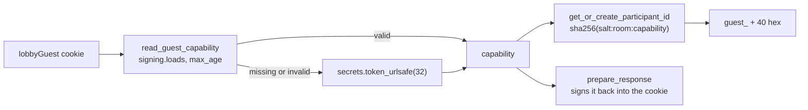

# Signed guest identities

PR: [suitenumerique/meet#1762](https://github.com/suitenumerique/meet/pull/1762)

## TLDR

A guest's `participant_id`, the identity the media server and the waiting room
know them by, used to be either a new `uuid4()` on every room fetch or the raw
value of the `lobbyParticipantId` cookie. This PR replaces both with one rule:
each browser holds a random *capability* in a signed cookie, and a guest's
`participant_id` in a room is `guest_` plus the first 40 hex characters of a
SHA-256 over a salt, the room and the capability. The same browser gets the
same identity every time it comes back to a room, and a different one in every
other room. Breakout rooms,
[#1765](https://github.com/suitenumerique/meet/pull/1765), store assignments
by that identity.

## Before and after

| When a guest gets a `participant_id` | Before | After |
| --- | --- | --- |
| a guest opens a registered room, through `retrieve` and `RoomSerializer` | `generate_token` falls back to `uuid4()`, a new identity per fetch, no cookie | derived from the capability and the room id, cookie set |
| a guest opens an unregistered room, through `retrieve` | a new `uuid4()` per fetch, no cookie | derived from the capability and the room's slug, cookie set |
| a guest waits in the waiting room, through `request_entry` | the raw cookie value, a server-generated UUID that is never checked | the same derived identity |
| the media server identity of a signed-in user | their `sub` | unchanged |

An unregistered room has no id, so the slug stands in for it in the hash.

## How `participant_id` is derived

All of it lives in `LobbyService`, in
[`lobby.py`](https://github.com/davd-gzl/meet/blob/69924308/src/backend/core/services/lobby.py#L141-L198):

- **capability**: 32 random bytes from `secrets.token_urlsafe(32)`, one per
  browser. It is the secret: whoever holds the cookie is that guest. It is only
  ever sent back in the cookie, never in an identity.
- **`read_guest_capability`** reads the cookie with Django's `signing.loads`.
  A signed value carries an HMAC made with `SECRET_KEY` and a timestamp, so a
  value the server did not issue, or one older than `SESSION_COOKIE_AGE`, 12 h
  by default, raises `BadSignature` and counts as no cookie.
- **`get_or_create_participant_id`** reuses the capability already resolved in
  this request, stored on the request as `_meet_guest_capability`, else reads
  the cookie, else creates one. The hash is one-way, so other participants, who
  see the identity, cannot recover the capability. It takes no server key, so
  rotating `SECRET_KEY` while keeping the old one in `SECRET_KEY_FALLBACKS`,
  Django's list of keys still accepted for signatures, keeps every identity.
- **`prepare_response`** signs the capability again and sets it as the cookie
  `LOBBY_GUEST_COOKIE_NAME` names, `lobbyGuest` by default: `HttpOnly`,
  `Secure`, `SameSite=Lax`, with no max age, so it ends with the browser
  session. It also sets `Cache-Control: no-store`, since the same
  response carries a join token. It does nothing for a request that resolved no
  capability, so a signed-in user fetching a room gets no cookie.

Two other places read the capability:

- `ParticipantEntrySerializer`, the admit or deny request a host sends, accepts
  only `^guest_[0-9a-f]{40}\Z`.
- `RequestEntryAnonRateThrottle` counts waiting-room requests per capability; a
  request without a valid cookie is not counted.

## What a user or a host notices

- A guest who reloads a room keeps their identity.
- A second tab in the same browser shares the cookie, so it gets the same
  identity. The media server allows one connection per identity and drops the
  older one, which the frontend shows as `DUPLICATE_IDENTITY`, already the case
  for a signed-in user. Only the cookie decides this: a private window, another
  browser profile or another device has its own cookie and its own identity,
  whatever its IP address.
- A host admits or denies by a `guest_` id; a UUID is refused.

## Upgrading

- The cookie's name comes from a new setting, `LOBBY_GUEST_COOKIE_NAME`,
  default `lobbyGuest`. `LOBBY_COOKIE_NAME` is no longer read. A server on the
  previous version reads only the name `LOBBY_COOKIE_NAME` gave it, so during a
  rolling upgrade neither version misreads the other's cookie.
- Per `UPGRADE.md`, a deployment removes `LOBBY_COOKIE_NAME` and never gives
  `LOBBY_GUEST_COOKIE_NAME` the value it held. Otherwise a server on the
  previous version lists the signed value as a guest's id, and admitting that
  guest fails.
- Guests waiting during the upgrade get a new identity and queue again. Until
  the rollout ends, and for `LOBBY_WAITING_TIMEOUT` seconds after, a host may
  still see the guest under the old UUID; admitting that entry on a new server
  fails, and the guest is admitted under the new id.

## Words used here

| Word | What it is |
| --- | --- |
| guest | someone in a room who is not signed in |
| `sub` | a signed-in user's account id from the login provider, used as their identity |
| `participant_id` | the identity of one person in one room: the name the media server, LiveKit, knows their connection by, and the key the waiting room stores them under; never shown on screen |
| join token | the pass the browser presents to LiveKit to enter a room, minted by `generate_token` and carrying the `participant_id` |
| `retrieve` | the view behind `GET /rooms/<id>/`, which the browser calls when it opens a room |
| `RoomSerializer` | the code that builds `retrieve`'s answer for a room stored in the database, join token included when the person may enter straight away |
| registered room | a room with a `Room` row in the database |
| unregistered room | a room code with no `Room` row, opened by typing it into the address bar; `ALLOW_UNREGISTERED_ROOMS`, on by default, lets `retrieve` serve it as a public room with no id |
| slug | the room code in the address, `abc-defg-hij` |
| waiting room, lobby | where someone not allowed straight in waits until a host admits them; its logic is `LobbyService` |
| `request_entry` | `POST /rooms/<id>/request-entry/`, which a waiting browser calls every 3 seconds; it answers waiting, denied, or accepted with a join token, through `LobbyService.request_entry` |
| capability | the random secret this PR stores in the browser's cookie; whoever holds it is that guest |
| signed cookie | a cookie value the server stores together with a signature only it can make, so it can tell its own values from forged ones |
| `SECRET_KEY` | the Django setting holding the server's private key, which every signature is made with; `SECRET_KEY_FALLBACKS` lists older keys whose signatures are still accepted |
| `SESSION_COOKIE_AGE` | the Django setting for how long a login session lasts, 12 hours by default; this PR reuses it as the oldest signature it accepts |
| salt | a fixed label mixed into a hash or a signature, here `meet.guest-identity.v1` and `meet.guest-capability.v1`, so the same input used for another purpose gives a different result |
| `uuid4()` | a random identifier, different on every call |
| `HttpOnly`, `Secure`, `SameSite=Lax` | cookie flags: the page's scripts cannot read it, it travels only over HTTPS, and other sites cannot make the browser send it with their own form posts |
| `Cache-Control: no-store` | tells every proxy and cache not to keep the response, so one person's answer is never served to another |
| `DUPLICATE_IDENTITY` | the reason LiveKit gives a connection it closes because another connection joined with the same identity |
| `LOBBY_WAITING_TIMEOUT` | how many seconds a waiting-room entry lives without a new poll, 6 by default |
| rolling upgrade | an upgrade where old and new servers answer requests side by side until the old ones stop |
