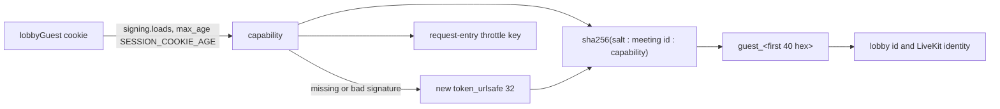

# Signed guest identities in the meet lobby

## TLDR

A guest who is not signed in used to be known to the server by a random UUID cookie it never signed, or by nothing at all in a public meeting. After this change the cookie holds a signed secret, one per browser, and the guest's identity in each meeting is derived from that secret and the meeting's id. Breakout rooms need that stable identity to place a guest.

## What it is for

LiveKit, the media server behind meet, names every participant by an identity string. Signed-in users have one, their OIDC `sub`. Guests had none the server could check, so a feature that must recognise the same guest twice, such as assigning them to a breakout room, had nothing to key on.

## How it works today

Before the change, on the merge base:

| Where the guest is | Identity sent to LiveKit | Cookie |
| --- | --- | --- |
| Public room, room fetch | a new `uuid4` on every fetch | none |
| Room with a lobby, `request-entry` | the raw value of the `lobbyParticipantId` cookie, a UUID the server generated | session cookie, unsigned, no expiry |
| Unregistered room (`ALLOW_UNREGISTERED_ROOMS`) | a new `uuid4` on every fetch | none |

The lobby's waiting list, the admit or deny call and the request-entry throttle all read that UUID.

## What the change does

After the change:

| Where the guest is | Identity sent to LiveKit | Cookie |
| --- | --- | --- |
| Public room, room fetch | `guest_` + the first 40 hex of SHA-256(salt : meeting id : capability), 46 characters | `lobbyGuest`, a session cookie holding the signed capability, re-signed on the response |
| Room with a lobby, `request-entry` | the same `guest_` identity, also its lobby id | same cookie |
| Unregistered room | a new `uuid4` on every fetch, unchanged | none |

The cookie's default name moves from `lobbyParticipantId` to `lobbyGuest`, so a pod still on the previous image never reads the signed value; a deployment that sets `LOBBY_COOKIE_NAME` keeps one name for both images, and `UPGRADE.md` asks it to pick a new one. The cookie is set `HttpOnly`, `Secure`, `SameSite=Lax` with no `max-age`, so it ends with the browser session, and the signature inside it expires after `SESSION_COOKIE_AGE` (12 h by default) unless a visit re-signs it. The response carrying it gets `Cache-Control: no-store`. A guest arriving with only the old cookie gets a new capability and, if they were waiting in a lobby, waits again. The admit or deny endpoint accepts only `guest_` plus 40 lowercase hex characters.

## Concepts

- **Capability**: the random secret in the cookie. Whoever holds the cookie is that guest, in every meeting.
- **Salted hash**: SHA-256 over a fixed salt, the meeting id and the capability, with no server key in it. The same capability gives a different identity in each meeting, an identity does not reveal the capability, and a `SECRET_KEY` rotation that keeps the old key in `SECRET_KEY_FALLBACKS` keeps every identity, since the cookie still verifies.
- **Signed cookie**: `django.core.signing` adds a timestamp and a signature, so the server rejects a value it did not issue or one older than the max age.
- **Lobby**: the waiting room of a restricted or trusted meeting, where an owner or admin admits or denies each guest by their lobby id.
