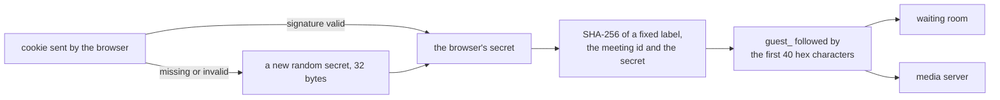

# A guest keeps one identity in each meeting

PR: [suitenumerique/meet#1762](https://github.com/suitenumerique/meet/pull/1762)

## TLDR

[Meet](https://github.com/suitenumerique/meet) is a video meeting app. People
who join without an account, guests, had no identity the server could
recognise twice. After this change each browser keeps one secret in a cookie
the server signs, and a guest's identity in a meeting is computed from that
secret and the meeting. The same browser gets the same identity each time it
returns to a meeting, and a different one in every other meeting. Breakout
rooms, [#1765](https://github.com/suitenumerique/meet/pull/1765), need this to
know which group a guest belongs in.

## What it is for

A meeting has one of three access levels:

| Level | Who gets in |
| --- | --- |
| public | anyone with the link, straight in |
| trusted | anyone signed in, straight in; guests wait |
| restricted | people given access to the meeting straight in; everyone else waits |

People who wait sit in a waiting room until someone already in the meeting
admits them.

The media server, which carries the sound and video, knows each connection by
an identity, a string the screen never shows. A signed-in person's identity is
their account, so it never changes. A guest had nothing stable, so no feature
could find the same guest a second time.

## Before

| Where the guest is | Their identity | Stored in the browser |
| --- | --- | --- |
| a public meeting | a new random one every time the page loads the meeting | nothing |
| a waiting room | the raw value of a cookie the server sets and never checks | that cookie, until the browser closes |
| a meeting code nobody created | a new random one every time | nothing |

## After

| Where the guest is | Their identity | Stored in the browser |
| --- | --- | --- |
| a public meeting | computed from the browser's secret and the meeting | one signed cookie, until the browser closes |
| a waiting room | the same identity, which the waiting room also uses | the same cookie |
| a meeting code nobody created | a new random one every time, unchanged | nothing |

How the identity is computed:

What follows from that design:

- The secret is 32 random bytes and never leaves the cookie. The identity is a
  one-way hash of it, so other people in the meeting, who see the identity,
  cannot rebuild the cookie.
- One cookie serves every meeting, since the meeting id is part of the hash.
- The cookie is signed with the server's secret key, so a value the server did
  not issue is ignored and the browser gets a new secret.
- The cookie is deleted when the browser closes. Each visit signs it again, and
  a signature older than `SESSION_COOKIE_AGE`, 12 hours by default, is refused.
- The hash itself uses no server key. An operator who replaces the server's
  secret key and lists the old one in `SECRET_KEY_FALLBACKS`, Django's setting
  for keys still accepted, keeps every guest's identity.

Behaviour a user or a host can notice:

| Situation | Before | After |
| --- | --- | --- |
| a guest reloads a public meeting | a new identity | the same identity |
| a guest opens the same meeting in a second tab | two connections | one; the media server drops the older tab, as it already does for a signed-in person |
| a host admits someone from the waiting room | the request names a UUID | the request names a `guest_` identity, and nothing else is accepted |

## Upgrading

- The cookie's default name changes from `lobbyParticipantId` to `lobbyGuest`.
  A server still running the previous version reads only the old name, so the
  two versions never misread each other's cookie during a rolling upgrade.
- A deployment that sets its own name through `LOBBY_COOKIE_NAME` must change
  it for this release, as `UPGRADE.md` in the PR says. Keeping it makes a
  server on the previous version show the signed value as the guest's id, and
  admitting that guest fails.
- Guests waiting in a waiting room during the upgrade get a new identity and
  queue again.
- While old and new servers both run, admitting a guest that an old server
  queued fails with an error, since that guest's id is still a UUID. It stops
  once the old servers are gone.
