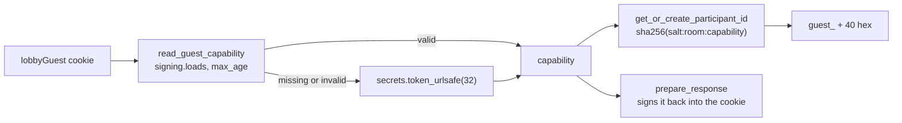

# Signed guest identities

PR: [suitenumerique/meet#1762](https://github.com/suitenumerique/meet/pull/1762)

## TLDR

A guest's `participant_id`, the identity the media server and the waiting room
know them by, used to be either a new `uuid4()` on every room fetch or the raw
value of the `lobbyParticipantId` cookie. This PR replaces both with one rule:
each browser holds a random *capability* in a signed cookie, and a guest's
`participant_id` in a room is `guest_` plus the first 40 hex characters of a
SHA-256 over a salt, the room and the capability. The same browser gets the
same identity every time it comes back to a room, and a different one in every
other room. Breakout rooms,
[#1765](https://github.com/suitenumerique/meet/pull/1765), store assignments
by that identity.

## Before and after

| Where the identity is issued | Before | After |
| --- | --- | --- |
| `RoomSerializer`, a guest fetching a registered room | `generate_token` falls back to `uuid4()`, a new identity per fetch, no cookie | derived from the capability and the room id, cookie set |
| `retrieve`, a guest fetching an unregistered room | a new `uuid4()` per fetch, no cookie | derived from the capability and the room's slug, cookie set |
| `LobbyService.request_entry`, a guest in the waiting room | the raw cookie value, a server-generated UUID that is never checked | the same derived identity |
| the media server identity of a signed-in user | their `sub` | unchanged |

An *unregistered room* is a room code with no `Room` row in the database,
opened by typing it into the address bar. `ALLOW_UNREGISTERED_ROOMS`, on by
default, lets `retrieve` serve it as a public room with no id, so the slug
stands in for the id in the hash.

## How `participant_id` is derived

All of it lives in `LobbyService`, in
[`lobby.py`](https://github.com/davd-gzl/meet/blob/cbd0fd7b/src/backend/core/services/lobby.py#L141-L198):

- **capability**: 32 random bytes from `secrets.token_urlsafe(32)`, one per
  browser. It is the secret: whoever holds the cookie is that guest. It is only
  ever sent back in the cookie, never in an identity.
- **`read_guest_capability`** reads the cookie with Django's `signing.loads`.
  A signed value carries an HMAC made with `SECRET_KEY` and a timestamp, so a
  value the server did not issue, or one older than `SESSION_COOKIE_AGE`, 12 h
  by default, raises `BadSignature` and counts as no cookie.
- **`get_or_create_participant_id`** reuses the capability already resolved in
  this request, stored on the request as `_meet_guest_capability`, else reads
  the cookie, else creates one. The hash is one-way, so other participants, who
  see the identity, cannot recover the capability. It takes no server key, so
  rotating `SECRET_KEY` while keeping the old one in `SECRET_KEY_FALLBACKS`,
  Django's list of keys still accepted for signatures, keeps every identity.
- **`prepare_response`** signs the capability again and sets the `lobbyGuest`
  cookie, `HttpOnly`, `Secure`, `SameSite=Lax`, with no max age, so it ends with
  the browser session. It also sets `Cache-Control: no-store`, since the same
  response carries a join token. It does nothing for a request that resolved no
  capability, so a signed-in user fetching a room gets no cookie.

Two other places read the capability:

- `ParticipantEntrySerializer`, the admit or deny request a host sends, accepts
  only `^guest_[0-9a-f]{40}\Z`.
- `RequestEntryAnonRateThrottle` counts waiting-room requests per capability; a
  request without a valid cookie is not counted.

## What a user or a host notices

- A guest who reloads a room keeps their identity.
- A second tab in the same browser shares the cookie, so it gets the same
  identity. The media server allows one connection per identity and drops the
  older one, which the frontend shows as `DUPLICATE_IDENTITY`, already the case
  for a signed-in user. Only the cookie decides this: a private window, another
  browser profile or another device has its own cookie and its own identity,
  whatever its IP address.
- A host admits or denies by a `guest_` id; a UUID is refused.

## Upgrading

- `LOBBY_COOKIE_NAME` now defaults to `lobbyGuest` instead of
  `lobbyParticipantId`. A server on the previous version reads only the old
  name, so during a rolling upgrade neither version misreads the other's
  cookie.
- A deployment that sets `LOBBY_COOKIE_NAME` must change it for this release,
  per `UPGRADE.md`. Otherwise a server on the previous version lists the signed
  value as a guest's id, and admitting that guest fails.
- Guests waiting during the upgrade get a new identity and queue again. While
  old and new servers both run, admitting a guest that an old server queued
  fails, since that id is still a UUID.
