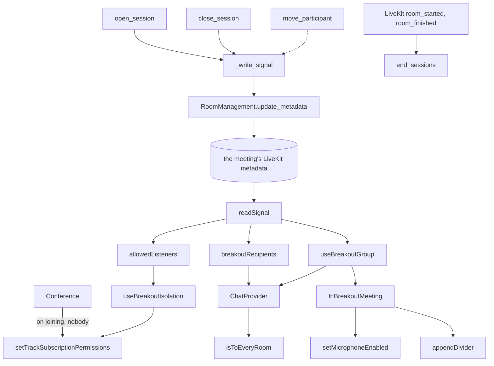
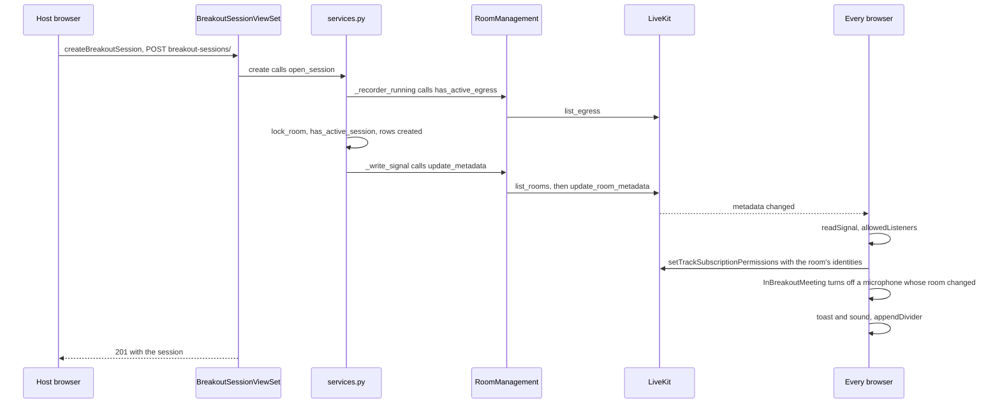
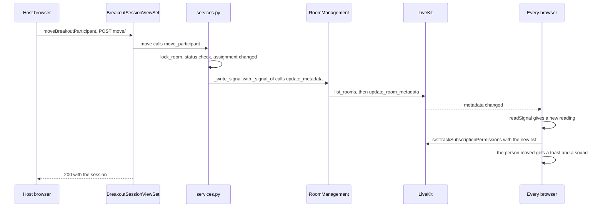
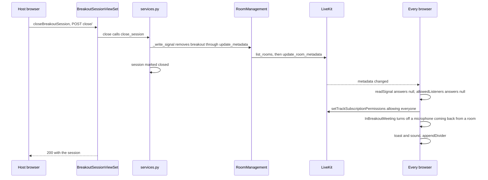

# Breakout rooms

PR: [suitenumerique/meet#1765](https://github.com/suitenumerique/meet/pull/1765)

## TLDR

The owner or an administrator of a meeting splits it into 2 to 10 breakout
rooms, joins any of them by placing themself there, talks to every room at once
from the main room, and brings everyone back with one press. Nobody changes
connection: a room is a group inside the meeting's one LiveKit room. Each
browser tells LiveKit, through `setTrackSubscriptionPermissions`, that only its
room may receive its audio and video. LiveKit itself refuses everyone off that
list, so a modified browser cannot listen to another room. The feature is off
by default, behind `BREAKOUT_ROOMS_ENABLED`.

## What a host can do

1. Select Breakout rooms under Tools. The entry,
   [`BreakoutToolButton`](https://github.com/davd-gzl/meet/blob/a43eeb20c3c708ea38b966cc45a346f16d78cefb/src/frontend/src/features/rooms/livekit/components/Tools.tsx#L100),
   shows for the owner or an administrator while the flag is on, and
   [stays while rooms are open](https://github.com/davd-gzl/meet/blob/a43eeb20c3c708ea38b966cc45a346f16d78cefb/src/frontend/src/features/breakout/hooks/useCanManageBreakout.ts#L16)
   so a host can still close them once the flag is off.
2. Set [how many rooms](https://github.com/davd-gzl/meet/blob/a43eeb20c3c708ea38b966cc45a346f16d78cefb/src/frontend/src/features/breakout/components/BreakoutSetup.tsx#L100-L103),
   from 2 to 10: type the number, or
   [step it with − and +](https://github.com/davd-gzl/meet/blob/a43eeb20c3c708ea38b966cc45a346f16d78cefb/src/frontend/src/features/breakout/components/RoomCountField.tsx#L18-L23)
   or the arrow keys. The backend
   [accepts the same range](https://github.com/davd-gzl/meet/blob/a43eeb20c3c708ea38b966cc45a346f16d78cefb/src/backend/core/breakout/serializers.py#L64)
   and [refuses a participant placed in two rooms](https://github.com/davd-gzl/meet/blob/a43eeb20c3c708ea38b966cc45a346f16d78cefb/src/backend/core/breakout/serializers.py#L73-L76).
3. Place each participant
   [by hand](https://github.com/davd-gzl/meet/blob/a43eeb20c3c708ea38b966cc45a346f16d78cefb/src/frontend/src/features/breakout/components/BreakoutSetup.tsx#L156-L164),
   or [at random](https://github.com/davd-gzl/meet/blob/a43eeb20c3c708ea38b966cc45a346f16d78cefb/src/frontend/src/features/breakout/components/BreakoutSetup.tsx#L112-L129)
   with Assign randomly, which
   [deals people round the rooms](https://github.com/davd-gzl/meet/blob/a43eeb20c3c708ea38b966cc45a346f16d78cefb/src/frontend/src/features/breakout/utils/setup.ts#L28)
   so room sizes differ by one at most. The list offers
   [every browser in the meeting](https://github.com/davd-gzl/meet/blob/a43eeb20c3c708ea38b966cc45a346f16d78cefb/src/frontend/src/features/breakout/utils/setup.ts#L8-L11),
   the host's own row
   [marked "(you)"](https://github.com/davd-gzl/meet/blob/a43eeb20c3c708ea38b966cc45a346f16d78cefb/src/frontend/src/features/breakout/components/BreakoutSetup.tsx#L44-L52);
   phone callers and agents are not on it.
4. Join a room by placing yourself in it, and place other hosts the same way.
   Hosts go to a room
   [by hand only](https://github.com/davd-gzl/meet/blob/a43eeb20c3c708ea38b966cc45a346f16d78cefb/src/frontend/src/features/breakout/components/BreakoutSetup.tsx#L117-L127):
   Assign randomly keeps a host's hand-placed room and leaves every other host
   in the main room. A host placed in a room hears, sees and chats with that
   room alone, like any member of it.
5. Press [Open rooms](https://github.com/davd-gzl/meet/blob/a43eeb20c3c708ea38b966cc45a346f16d78cefb/src/frontend/src/features/breakout/components/BreakoutSetup.tsx#L171-L178),
   which is
   [enabled once anyone is placed](https://github.com/davd-gzl/meet/blob/a43eeb20c3c708ea38b966cc45a346f16d78cefb/src/frontend/src/features/breakout/components/BreakoutSetup.tsx#L95),
   or press
   [Enter](https://github.com/davd-gzl/meet/blob/a43eeb20c3c708ea38b966cc45a346f16d78cefb/src/frontend/src/features/breakout/hooks/useOpenShortcut.ts#L7-L22)
   while focus is on no control, or Ctrl or Cmd with Enter from anywhere but a
   text field. Each placed participant is in their room at once, with no
   reconnection. The panel then
   [lists each room](https://github.com/davd-gzl/meet/blob/a43eeb20c3c708ea38b966cc45a346f16d78cefb/src/frontend/src/features/breakout/components/BreakoutPanel.tsx#L54-L64)
   with the people in it who are
   [still connected](https://github.com/davd-gzl/meet/blob/a43eeb20c3c708ea38b966cc45a346f16d78cefb/src/frontend/src/features/breakout/components/BreakoutPanel.tsx#L32-L38).
6. Write to every room from the main room. In the chat, a host in the main
   room turns on
   [Send to every room](https://github.com/davd-gzl/meet/blob/a43eeb20c3c708ea38b966cc45a346f16d78cefb/src/frontend/src/features/chat/components/Chat.tsx#L42-L57),
   and each message then reaches every room,
   [set apart by a bar and tagged To every room](https://github.com/davd-gzl/meet/blob/a43eeb20c3c708ea38b966cc45a346f16d78cefb/src/frontend/src/features/chat/components/ChatMessage.tsx#L50-L61).
   The switch
   [turns off when the rooms close](https://github.com/davd-gzl/meet/blob/a43eeb20c3c708ea38b966cc45a346f16d78cefb/src/frontend/src/features/chat/components/ChatProvider.tsx#L43-L46),
   so each split starts with the host writing to the main room alone.
7. Press [Close rooms](https://github.com/davd-gzl/meet/blob/a43eeb20c3c708ea38b966cc45a346f16d78cefb/src/frontend/src/features/breakout/components/BreakoutPanel.tsx#L67-L74).
   Everyone hears and sees everyone again. A meeting holds
   [one split at a time](https://github.com/davd-gzl/meet/blob/a43eeb20c3c708ea38b966cc45a346f16d78cefb/docs/features/breakout_rooms.md?plain=1#L11),
   so new assignments take a Close and a new Open.

Two pull requests stacked on this one add to that journey. Each is a separate
pull request, reviewed on its own, and each link below is pinned at that pull
request's head.

- **Move one person while rooms are open**, from
  [davd-gzl/meet#22](https://github.com/davd-gzl/meet/pull/22). The open-rooms
  panel
  [lists every room and the main room](https://github.com/davd-gzl/meet/blob/bd73ab1efb6fd6dd13409aa2f1dff3bc3b0b8d79/src/frontend/src/features/breakout/components/BreakoutPanel.tsx#L47-L59),
  with a room picker beside each person. Choosing another room or the main room
  moves that person at once. The person moved gets
  [a toast and a sound](https://github.com/davd-gzl/meet/blob/bd73ab1efb6fd6dd13409aa2f1dff3bc3b0b8d79/src/frontend/src/features/breakout/components/BreakoutParticipant.tsx#L39-L52)
  naming their new room,
  [or the main room](https://github.com/davd-gzl/meet/blob/bd73ab1efb6fd6dd13409aa2f1dff3bc3b0b8d79/src/frontend/src/features/notifications/components/ToastBreakoutRoomChanged.tsx#L18-L20).
- **Pick how to split first**, from
  [davd-gzl/meet#23](https://github.com/davd-gzl/meet/pull/23). The host
  chooses
  [Automatically, Manually or Same as last time](https://github.com/davd-gzl/meet/blob/55fc0daad3c92629fc5068d2bfbdb3363a36a91c/src/frontend/src/features/breakout/components/BreakoutSetup.tsx#L157-L184),
  the last shown once a split has opened in this meeting. The room count
  defaults to
  [the count last opened, else one room per four people](https://github.com/davd-gzl/meet/blob/55fc0daad3c92629fc5068d2bfbdb3363a36a91c/src/frontend/src/features/breakout/utils/setup.ts#L24-L34),
  and goes [up to 20 rooms](https://github.com/davd-gzl/meet/blob/55fc0daad3c92629fc5068d2bfbdb3363a36a91c/src/backend/core/breakout/serializers.py#L70).
- **Place each person with one press**, from #23. Each person has
  [a numbered button per room](https://github.com/davd-gzl/meet/blob/55fc0daad3c92629fc5068d2bfbdb3363a36a91c/src/frontend/src/features/breakout/components/PersonRow.tsx#L82-L93),
  and a second press on their room takes them out of it. The open-rooms panel
  [uses the same buttons](https://github.com/davd-gzl/meet/blob/55fc0daad3c92629fc5068d2bfbdb3363a36a91c/src/frontend/src/features/breakout/components/BreakoutPanel.tsx#L86-L94),
  where that second press sends the person to the main room. Each person is
  [one Tab stop](https://github.com/davd-gzl/meet/blob/55fc0daad3c92629fc5068d2bfbdb3363a36a91c/src/frontend/src/features/breakout/components/PersonRow.tsx#L62-L66),
  and the arrow keys move between rooms.
- **See each room before opening**, from #23. A
  [preview card per room](https://github.com/davd-gzl/meet/blob/55fc0daad3c92629fc5068d2bfbdb3363a36a91c/src/frontend/src/features/breakout/components/BreakoutSetup.tsx#L235-L301)
  names who is in it.
  [Place them evenly](https://github.com/davd-gzl/meet/blob/55fc0daad3c92629fc5068d2bfbdb3363a36a91c/src/frontend/src/features/breakout/components/BreakoutSetup.tsx#L335-L346)
  puts each person with no room in
  [the emptiest room](https://github.com/davd-gzl/meet/blob/55fc0daad3c92629fc5068d2bfbdb3363a36a91c/src/frontend/src/features/breakout/utils/setup.ts#L54-L71).
- **Find the plan again**, from #23. The plan built by hand and the last split
  opened are
  [kept per meeting in session storage](https://github.com/davd-gzl/meet/blob/55fc0daad3c92629fc5068d2bfbdb3363a36a91c/src/frontend/src/features/breakout/store.ts#L27-L61),
  with a copy in memory where storage is blocked. The plan built by hand
  [keeps the room of someone who leaves](https://github.com/davd-gzl/meet/blob/55fc0daad3c92629fc5068d2bfbdb3363a36a91c/src/frontend/src/features/breakout/components/BreakoutSetup.tsx#L87-L94),
  so a person who rejoins finds it.

## What everyone else sees

- **In a room.** At Open, the browser gets a
  [toast and a sound](https://github.com/davd-gzl/meet/blob/a43eeb20c3c708ea38b966cc45a346f16d78cefb/src/frontend/src/features/breakout/components/BreakoutParticipant.tsx#L54-L62)
  naming the room. A microphone that was on is
  [turned off](https://github.com/davd-gzl/meet/blob/a43eeb20c3c708ea38b966cc45a346f16d78cefb/src/frontend/src/features/breakout/components/BreakoutParticipant.tsx#L47-L50),
  and the toast
  [adds "Your microphone is off."](https://github.com/davd-gzl/meet/blob/a43eeb20c3c708ea38b966cc45a346f16d78cefb/src/frontend/src/features/notifications/components/ToastBreakoutRoomChanged.tsx#L30-L31),
  so nobody speaks to a new group by surprise. A
  [banner](https://github.com/davd-gzl/meet/blob/a43eeb20c3c708ea38b966cc45a346f16d78cefb/src/frontend/src/features/breakout/components/BreakoutParticipant.tsx#L76-L95)
  names the room while rooms are open and the browser is connected. The chat
  [writes a dividing line](https://github.com/davd-gzl/meet/blob/a43eeb20c3c708ea38b966cc45a346f16d78cefb/src/frontend/src/features/breakout/components/BreakoutParticipant.tsx#L66-L74),
  "Room 1: messages reach this room". The participant hears, sees and chats
  with that room alone. The
  [grid](https://github.com/davd-gzl/meet/blob/a43eeb20c3c708ea38b966cc45a346f16d78cefb/src/frontend/src/features/layout/components/StageLayout.tsx#L31),
  the [list](https://github.com/davd-gzl/meet/blob/a43eeb20c3c708ea38b966cc45a346f16d78cefb/src/frontend/src/features/participants/components/ParticipantsList.tsx#L36),
  the [count](https://github.com/davd-gzl/meet/blob/a43eeb20c3c708ea38b966cc45a346f16d78cefb/src/frontend/src/features/participants/components/ParticipantsCount.tsx#L41),
  the [raised hands](https://github.com/davd-gzl/meet/blob/a43eeb20c3c708ea38b966cc45a346f16d78cefb/src/frontend/src/features/rooms/livekit/hooks/useRaisedHand.ts#L46),
  the [chat](https://github.com/davd-gzl/meet/blob/a43eeb20c3c708ea38b966cc45a346f16d78cefb/src/frontend/src/features/chat/components/ChatProvider.tsx#L55-L56)
  and the
  [notifications](https://github.com/davd-gzl/meet/blob/a43eeb20c3c708ea38b966cc45a346f16d78cefb/src/frontend/src/features/notifications/hooks/useNotifyParticipants.ts#L34)
  keep to the room. A host's messages to every room still show, as
  [one group](https://github.com/davd-gzl/meet/blob/a43eeb20c3c708ea38b966cc45a346f16d78cefb/src/frontend/src/stores/chat.ts#L59-L64) with a bar down
  its left side and the tag once at its top.
- **In the main room.** Phone callers, anyone left unassigned and every host
  not placed by hand stay here, and so does anyone who joins during a split,
  since an identity with
  [no assignment](https://github.com/davd-gzl/meet/blob/a43eeb20c3c708ea38b966cc45a346f16d78cefb/src/frontend/src/features/breakout/utils/group.ts#L17-L18)
  belongs to the main room. A guest of a public meeting who reloads
  [lands here too](https://github.com/davd-gzl/meet/blob/a43eeb20c3c708ea38b966cc45a346f16d78cefb/docs/features/breakout_rooms.md?plain=1#L53),
  since each pass gives a guest a new identity. The banner names the main room,
  the chat's dividing line reads "Main room: messages reach the main room", and
  the main room hears and sees itself alone. A microphone here stays as it
  was, since this browser's room did not change.
- **At Close.** Every browser gets a toast and a sound, and everyone hears and
  sees everyone. A browser coming back from a room has its microphone turned
  off, with the same line in the toast; cameras stay as they were, since
  nobody reconnected. The chat's dividing line reads "Rooms closed: messages
  reach everyone".

## How it works

The diagram shows the feature at a43eeb20: the backend writes the split into
the meeting's LiveKit metadata, and every browser turns that metadata into its
allow list, its chat recipients, its microphone on a change of room and what
it shows. The dotted edge is `move_participant`, added by #22.

- [`open_session`](https://github.com/davd-gzl/meet/blob/a43eeb20c3c708ea38b966cc45a346f16d78cefb/src/backend/core/breakout/services.py#L109)
  decides whether a split may start. It
  [refuses while LiveKit runs a recorder](https://github.com/davd-gzl/meet/blob/a43eeb20c3c708ea38b966cc45a346f16d78cefb/src/backend/core/breakout/services.py#L112-L113),
  then holds the meeting's row and refuses a second active split or an active
  recording. It writes the rows, then the `breakout` key. A meeting with no
  live LiveKit room, or a failed write,
  [deletes the session](https://github.com/davd-gzl/meet/blob/a43eeb20c3c708ea38b966cc45a346f16d78cefb/src/backend/core/breakout/services.py#L150-L159)
  and answers 503.
- [`close_session`](https://github.com/davd-gzl/meet/blob/a43eeb20c3c708ea38b966cc45a346f16d78cefb/src/backend/core/breakout/services.py#L163)
  removes the key, then marks the session `closed`. A failed removal answers
  503 and leaves the session `active`, so a second Close tries again.
- [`_write_signal`](https://github.com/davd-gzl/meet/blob/a43eeb20c3c708ea38b966cc45a346f16d78cefb/src/backend/core/breakout/services.py#L89)
  turns a metadata write into the split's answers: false when the meeting has
  no live LiveKit room, and a 503 on any other failure.
- [`RoomManagement.update_metadata`](https://github.com/davd-gzl/meet/blob/a43eeb20c3c708ea38b966cc45a346f16d78cefb/src/backend/core/services/room_management.py#L57)
  decides when a metadata write may run. Every writer takes
  [a lock in the cache](https://github.com/davd-gzl/meet/blob/a43eeb20c3c708ea38b966cc45a346f16d78cefb/src/backend/core/services/room_management.py#L76-L81)
  named after the room, so no write drops a key another one set. A dropped
  `breakout` key would merge every room.
- [`end_sessions`](https://github.com/davd-gzl/meet/blob/a43eeb20c3c708ea38b966cc45a346f16d78cefb/src/backend/core/breakout/services.py#L57)
  marks the meeting's split `closed` when LiveKit reports its room
  [started](https://github.com/davd-gzl/meet/blob/a43eeb20c3c708ea38b966cc45a346f16d78cefb/src/backend/core/services/livekit_events.py#L282)
  or [finished](https://github.com/davd-gzl/meet/blob/a43eeb20c3c708ea38b966cc45a346f16d78cefb/src/backend/core/services/livekit_events.py#L312),
  since the metadata ended with the LiveKit room.
- [`Conference`](https://github.com/davd-gzl/meet/blob/a43eeb20c3c708ea38b966cc45a346f16d78cefb/src/frontend/src/features/rooms/components/Conference.tsx#L142)
  lets nobody receive the browser on joining, where the flag is on. The
  microphone publishes as soon as the room connects, before the browser has
  read its room.
- [`readSignal`](https://github.com/davd-gzl/meet/blob/a43eeb20c3c708ea38b966cc45a346f16d78cefb/src/frontend/src/features/breakout/utils/group.ts#L66)
  parses the `breakout` key, and returns null outside a split. It keeps the
  first reading of a session, so a write to another key leaves every filter
  as it was.
- [`allowedListeners`](https://github.com/davd-gzl/meet/blob/a43eeb20c3c708ea38b966cc45a346f16d78cefb/src/frontend/src/features/breakout/utils/group.ts#L28)
  decides who may receive this browser. A browser in a room lists the other
  members of that room. A browser in the main room lists the main room's
  [browsers and phone callers](https://github.com/davd-gzl/meet/blob/a43eeb20c3c708ea38b966cc45a346f16d78cefb/src/frontend/src/features/breakout/utils/group.ts#L40-L46).
  Outside a split it returns null, which lets everyone.
- [`useBreakoutIsolation`](https://github.com/davd-gzl/meet/blob/a43eeb20c3c708ea38b966cc45a346f16d78cefb/src/frontend/src/features/breakout/hooks/useBreakoutIsolation.ts#L19)
  sends that list to LiveKit whenever it changes. It also
  [stops playing](https://github.com/davd-gzl/meet/blob/a43eeb20c3c708ea38b966cc45a346f16d78cefb/src/frontend/src/features/breakout/hooks/useBreakoutIsolation.ts#L61-L72)
  every track from another room, which covers a phone caller, who sets no list.
- [`setTrackSubscriptionPermissions`](https://github.com/davd-gzl/meet/blob/a43eeb20c3c708ea38b966cc45a346f16d78cefb/src/frontend/src/features/breakout/hooks/useBreakoutIsolation.ts#L50-L58)
  is LiveKit's own call. LiveKit refuses every receiver off the list, whatever
  that receiver's browser does, and cuts anyone already receiving when the list
  shrinks.
- [`breakoutRecipients`](https://github.com/davd-gzl/meet/blob/a43eeb20c3c708ea38b966cc45a346f16d78cefb/src/frontend/src/features/breakout/utils/group.ts#L84)
  decides who a message goes to, read at send time. Outside a split it returns
  undefined, which reaches everyone. In a room of one it returns the
  [sender alone](https://github.com/davd-gzl/meet/blob/a43eeb20c3c708ea38b966cc45a346f16d78cefb/src/frontend/src/features/breakout/utils/group.ts#L90),
  since an empty list would reach everyone too.
- [`ChatProvider`](https://github.com/davd-gzl/meet/blob/a43eeb20c3c708ea38b966cc45a346f16d78cefb/src/frontend/src/features/chat/components/ChatProvider.tsx#L29)
  sends a split's chat
  [as a text stream alone](https://github.com/davd-gzl/meet/blob/a43eeb20c3c708ea38b966cc45a346f16d78cefb/src/frontend/src/features/chat/components/ChatProvider.tsx#L83-L94),
  since `useChat`'s send also copies the text to the whole meeting in the
  legacy format. A message to every room goes with no recipients and a mark.
  It [drops a received message](https://github.com/davd-gzl/meet/blob/a43eeb20c3c708ea38b966cc45a346f16d78cefb/src/frontend/src/features/chat/components/ChatProvider.tsx#L55-L56)
  from another room unless that message carries a mark a host set.
- [`isToEveryRoom`](https://github.com/davd-gzl/meet/blob/a43eeb20c3c708ea38b966cc45a346f16d78cefb/src/frontend/src/features/breakout/utils/group.ts#L100-L106)
  decides whether a received mark counts. It counts only from a sender whose
  `room_role` is `owner` or `administrator`.
- [`useBreakoutGroup`](https://github.com/davd-gzl/meet/blob/a43eeb20c3c708ea38b966cc45a346f16d78cefb/src/frontend/src/features/breakout/hooks/useBreakoutGroup.ts#L12)
  gives each surface `isInMyGroup`, true when an identity is in this browser's
  room. The grid, the picture in picture, the list, the count, the raised hands
  and the toasts drop everyone it returns false for.
- [`InBreakoutMeeting`](https://github.com/davd-gzl/meet/blob/a43eeb20c3c708ea38b966cc45a346f16d78cefb/src/frontend/src/features/breakout/components/BreakoutParticipant.tsx#L34-L97)
  decides what a change of room does in this browser. Whenever its room
  changes at Open or at Close, it
  [turns the microphone off if it was on](https://github.com/davd-gzl/meet/blob/a43eeb20c3c708ea38b966cc45a346f16d78cefb/src/frontend/src/features/breakout/components/BreakoutParticipant.tsx#L47-L50)
  through LiveKit's `setMicrophoneEnabled`, then plays the toast and the sound.
  It shows the banner only while the browser is connected.
- [`appendDivider`](https://github.com/davd-gzl/meet/blob/a43eeb20c3c708ea38b966cc45a346f16d78cefb/src/frontend/src/stores/chat.ts#L68-L80)
  writes the chat's dividing line, which
  [`InBreakoutMeeting` calls](https://github.com/davd-gzl/meet/blob/a43eeb20c3c708ea38b966cc45a346f16d78cefb/src/frontend/src/features/breakout/components/BreakoutParticipant.tsx#L66-L74)
  each time who this browser's messages reach changes. The line is written
  by this browser alone and never counts as unread.

The stacked pull requests add these, each linked at its own head:

- [`move_participant`](https://github.com/davd-gzl/meet/blob/bd73ab1efb6fd6dd13409aa2f1dff3bc3b0b8d79/src/backend/core/breakout/services.py#L166),
  from #22, decides whether a move may land. Holding the meeting's row, it
  [refuses a closed split](https://github.com/davd-gzl/meet/blob/bd73ab1efb6fd6dd13409aa2f1dff3bc3b0b8d79/src/backend/core/breakout/services.py#L171-L172)
  with 409, changes one assignment, then
  [writes the whole split again](https://github.com/davd-gzl/meet/blob/bd73ab1efb6fd6dd13409aa2f1dff3bc3b0b8d79/src/backend/core/breakout/services.py#L189-L192)
  through `_write_signal`. A failed write rolls the rows back.
- [`MoveParticipantSerializer`](https://github.com/davd-gzl/meet/blob/bd73ab1efb6fd6dd13409aa2f1dff3bc3b0b8d79/src/backend/core/breakout/serializers.py#L54-L57),
  from #22, takes one person and a room position, or null for the main room.
- [`readSignal`](https://github.com/davd-gzl/meet/blob/bd73ab1efb6fd6dd13409aa2f1dff3bc3b0b8d79/src/frontend/src/features/breakout/utils/group.ts#L64-L70),
  as #22 changes it, keeps its reading while the split's content is unchanged,
  so a move gives every browser a new reading and a write to another key does
  not.
- [`PersonRow`](https://github.com/davd-gzl/meet/blob/55fc0daad3c92629fc5068d2bfbdb3363a36a91c/src/frontend/src/features/breakout/components/PersonRow.tsx#L17),
  from #23, decides where a press sends one person: the room pressed, or no
  room when it is already theirs.
- [`defaultRoomCount`](https://github.com/davd-gzl/meet/blob/55fc0daad3c92629fc5068d2bfbdb3363a36a91c/src/frontend/src/features/breakout/utils/setup.ts#L25),
  [`restorePlan`](https://github.com/davd-gzl/meet/blob/55fc0daad3c92629fc5068d2bfbdb3363a36a91c/src/frontend/src/features/breakout/utils/setup.ts#L37)
  and [`placeEvenly`](https://github.com/davd-gzl/meet/blob/55fc0daad3c92629fc5068d2bfbdb3363a36a91c/src/frontend/src/features/breakout/utils/setup.ts#L55),
  from #23, decide the starting count, which remembered places still apply to
  the people here and the rooms that exist, and where each person with no
  room goes.
- [`readMemory` and `writeMemory`](https://github.com/davd-gzl/meet/blob/55fc0daad3c92629fc5068d2bfbdb3363a36a91c/src/frontend/src/features/breakout/store.ts#L41-L61),
  from #23, keep the plan per meeting, in memory first and in session storage
  when the browser allows it.

## The implementation

Each module below links its file at a43eeb20, the head of #1765. A part that
exists only in a stacked pull request says so and links that pull request's
head: bd73ab1e for #22, 55fc0daa for #23.

### Backend: the models, [`models.py`](https://github.com/davd-gzl/meet/blob/a43eeb20c3c708ea38b966cc45a346f16d78cefb/src/backend/core/models.py#L1091-L1198)

- [`BreakoutSessionStatusChoices`](https://github.com/davd-gzl/meet/blob/a43eeb20c3c708ea38b966cc45a346f16d78cefb/src/backend/core/models.py#L1091-L1095)
  holds the two states a split has, `active` and `closed`.
- [`BreakoutSession`](https://github.com/davd-gzl/meet/blob/a43eeb20c3c708ea38b966cc45a346f16d78cefb/src/backend/core/models.py#L1101-L1139) is one split:
  the meeting, its status, who opened it, when it closed. The constraint
  [`unique_active_breakout_session_per_room`](https://github.com/davd-gzl/meet/blob/a43eeb20c3c708ea38b966cc45a346f16d78cefb/src/backend/core/models.py#L1130-L1135)
  lets a meeting hold one `active` session, so two Opens racing past every
  check still cannot both land. Closed sessions stay in the table.
- [`BreakoutRoom`](https://github.com/davd-gzl/meet/blob/a43eeb20c3c708ea38b966cc45a346f16d78cefb/src/backend/core/models.py#L1142-L1162) is one room of a
  split: its name and its
  [`position`](https://github.com/davd-gzl/meet/blob/a43eeb20c3c708ea38b966cc45a346f16d78cefb/src/backend/core/models.py#L1152-L1153), the index every
  browser reads from the metadata.
- [`BreakoutAssignment`](https://github.com/davd-gzl/meet/blob/a43eeb20c3c708ea38b966cc45a346f16d78cefb/src/backend/core/models.py#L1165-L1198) is one
  identity's room in one split, with the display name it had at the time. The
  constraint
  [`unique_breakout_assignment_per_identity`](https://github.com/davd-gzl/meet/blob/a43eeb20c3c708ea38b966cc45a346f16d78cefb/src/backend/core/models.py#L1190-L1195)
  gives an identity one room per split.
- Migration [`0025_breakout_rooms`](https://github.com/davd-gzl/meet/blob/a43eeb20c3c708ea38b966cc45a346f16d78cefb/src/backend/core/migrations/0025_breakout_rooms.py#L9-L13)
  creates the three tables on top of `0024_room_last_started_at`.

### Backend: the serializers, [`serializers.py`](https://github.com/davd-gzl/meet/blob/a43eeb20c3c708ea38b966cc45a346f16d78cefb/src/backend/core/breakout/serializers.py)

- [`BreakoutSessionSerializer`](https://github.com/davd-gzl/meet/blob/a43eeb20c3c708ea38b966cc45a346f16d78cefb/src/backend/core/breakout/serializers.py#L33-L40),
  [`BreakoutRoomSerializer`](https://github.com/davd-gzl/meet/blob/a43eeb20c3c708ea38b966cc45a346f16d78cefb/src/backend/core/breakout/serializers.py#L21-L30)
  and
  [`BreakoutAssignmentSerializer`](https://github.com/davd-gzl/meet/blob/a43eeb20c3c708ea38b966cc45a346f16d78cefb/src/backend/core/breakout/serializers.py#L13-L18)
  write what every endpoint answers: the session's id, status and dates, and
  each room with the identity and name of each participant.
- [`ParticipantInputSerializer`](https://github.com/davd-gzl/meet/blob/a43eeb20c3c708ea38b966cc45a346f16d78cefb/src/backend/core/breakout/serializers.py#L43-L51)
  reads one person: an identity of up to 255 characters, kept as sent with its
  whitespace, and a name
  [cut to 255 rather than refused](https://github.com/davd-gzl/meet/blob/a43eeb20c3c708ea38b966cc45a346f16d78cefb/src/backend/core/breakout/serializers.py#L49-L51),
  since joining accepts a name of any length.
- [`RoomInputSerializer`](https://github.com/davd-gzl/meet/blob/a43eeb20c3c708ea38b966cc45a346f16d78cefb/src/backend/core/breakout/serializers.py#L54-L58)
  reads one room: a name of up to 200 characters and its participants.
- [`OpenBreakoutSessionSerializer`](https://github.com/davd-gzl/meet/blob/a43eeb20c3c708ea38b966cc45a346f16d78cefb/src/backend/core/breakout/serializers.py#L61-L77)
  reads a split of 2 to 10 rooms, and
  [`validate_rooms`](https://github.com/davd-gzl/meet/blob/a43eeb20c3c708ea38b966cc45a346f16d78cefb/src/backend/core/breakout/serializers.py#L66-L77)
  refuses an identity placed twice. #23 raises the ceiling to
  [20 rooms](https://github.com/davd-gzl/meet/blob/55fc0daad3c92629fc5068d2bfbdb3363a36a91c/src/backend/core/breakout/serializers.py#L70).
- [`MoveParticipantSerializer`](https://github.com/davd-gzl/meet/blob/bd73ab1efb6fd6dd13409aa2f1dff3bc3b0b8d79/src/backend/core/breakout/serializers.py#L54-L57),
  from #22, reads one person and a `room` position, or null for the main room.

### Backend: the endpoints, [`viewsets.py`](https://github.com/davd-gzl/meet/blob/a43eeb20c3c708ea38b966cc45a346f16d78cefb/src/backend/core/breakout/viewsets.py)

The viewset is routed under the meeting, at
[`rooms/<room id>/breakout-sessions`](https://github.com/davd-gzl/meet/blob/a43eeb20c3c708ea38b966cc45a346f16d78cefb/src/backend/core/urls.py#L40-L44).

- [`BreakoutSessionViewSet`](https://github.com/davd-gzl/meet/blob/a43eeb20c3c708ea38b966cc45a346f16d78cefb/src/backend/core/breakout/viewsets.py#L18-L28)
  lets through the owner or an administrator of the meeting in the URL alone:
  [`get_room`](https://github.com/davd-gzl/meet/blob/a43eeb20c3c708ea38b966cc45a346f16d78cefb/src/backend/core/breakout/viewsets.py#L36-L40) checks
  [`HasPrivilegesOnRoom`](https://github.com/davd-gzl/meet/blob/a43eeb20c3c708ea38b966cc45a346f16d78cefb/src/backend/core/api/permissions.py#L87-L94)
  against that meeting. Its queryset
  [prefetches the rooms and their assignments](https://github.com/davd-gzl/meet/blob/a43eeb20c3c708ea38b966cc45a346f16d78cefb/src/backend/core/breakout/viewsets.py#L30-L34)
  that every answer lists.
- [`list`](https://github.com/davd-gzl/meet/blob/a43eeb20c3c708ea38b966cc45a346f16d78cefb/src/backend/core/breakout/viewsets.py#L42-L48) answers the
  meeting's active session as a list of zero or one. It carries no flag check,
  so the panel still finds a split left open after the flag goes off.
- [`create`](https://github.com/davd-gzl/meet/blob/a43eeb20c3c708ea38b966cc45a346f16d78cefb/src/backend/core/breakout/viewsets.py#L50-L62) is Open. It
  [requires the flag](https://github.com/davd-gzl/meet/blob/a43eeb20c3c708ea38b966cc45a346f16d78cefb/src/backend/core/breakout/viewsets.py#L50), validates
  the split, calls `open_session` and answers 201 with the session.
- [`close`](https://github.com/davd-gzl/meet/blob/a43eeb20c3c708ea38b966cc45a346f16d78cefb/src/backend/core/breakout/viewsets.py#L64-L69) is Close. It
  carries no flag check, and closing a closed session answers the same.
- [`move`](https://github.com/davd-gzl/meet/blob/bd73ab1efb6fd6dd13409aa2f1dff3bc3b0b8d79/src/backend/core/breakout/viewsets.py#L64-L77), from #22,
  requires the flag, validates one person and a room, and calls
  `move_participant`.

### Backend: the services, [`services.py`](https://github.com/davd-gzl/meet/blob/a43eeb20c3c708ea38b966cc45a346f16d78cefb/src/backend/core/breakout/services.py)

- [`METADATA_KEY`](https://github.com/davd-gzl/meet/blob/a43eeb20c3c708ea38b966cc45a346f16d78cefb/src/backend/core/breakout/services.py#L21) is
  `breakout`, the key every browser reads in the meeting's metadata.
- [`SessionAlreadyActive`](https://github.com/davd-gzl/meet/blob/a43eeb20c3c708ea38b966cc45a346f16d78cefb/src/backend/core/breakout/services.py#L24-L28)
  and
  [`RecordingInProgress`](https://github.com/davd-gzl/meet/blob/a43eeb20c3c708ea38b966cc45a346f16d78cefb/src/backend/core/breakout/services.py#L31-L35)
  answer 409.
  [`MediaServerError`](https://github.com/davd-gzl/meet/blob/a43eeb20c3c708ea38b966cc45a346f16d78cefb/src/backend/core/breakout/services.py#L38-L42)
  answers 503 with the same text every time, so no LiveKit error reaches a
  browser.
  [`SessionClosed`](https://github.com/davd-gzl/meet/blob/bd73ab1efb6fd6dd13409aa2f1dff3bc3b0b8d79/src/backend/core/breakout/services.py#L38-L42), from
  #22, answers 409 to a move in a closed split.
- [`active_sessions`](https://github.com/davd-gzl/meet/blob/a43eeb20c3c708ea38b966cc45a346f16d78cefb/src/backend/core/breakout/services.py#L45-L49) and
  [`has_active_session`](https://github.com/davd-gzl/meet/blob/a43eeb20c3c708ea38b966cc45a346f16d78cefb/src/backend/core/breakout/services.py#L52-L54)
  find the meeting's active split.
- [`end_sessions`](https://github.com/davd-gzl/meet/blob/a43eeb20c3c708ea38b966cc45a346f16d78cefb/src/backend/core/breakout/services.py#L57-L64) marks the
  active split `closed` without writing the metadata, since it runs when the
  LiveKit room has ended or started fresh and the key went with it.
- [`lock_room`](https://github.com/davd-gzl/meet/blob/a43eeb20c3c708ea38b966cc45a346f16d78cefb/src/backend/core/breakout/services.py#L67-L73) holds the
  meeting's row with `select_for_update` until the transaction ends. Open,
  a move and starting a recording all take it, so none passes its check while
  another is writing.
- [`_signal`](https://github.com/davd-gzl/meet/blob/a43eeb20c3c708ea38b966cc45a346f16d78cefb/src/backend/core/breakout/services.py#L76-L86) builds the
  `breakout` value from the split the host sent: the session id, the room names
  in order, and each identity's room as an index into those names. #22
  replaces it with
  [`_signal_of`](https://github.com/davd-gzl/meet/blob/bd73ab1efb6fd6dd13409aa2f1dff3bc3b0b8d79/src/backend/core/breakout/services.py#L155-L163), which
  reads the same value from the rows, so a move rewrites the whole split from
  the database.
- [`_write_signal`](https://github.com/davd-gzl/meet/blob/a43eeb20c3c708ea38b966cc45a346f16d78cefb/src/backend/core/breakout/services.py#L89-L98) sends a
  change through `RoomManagement.update_metadata`. It answers false when the
  meeting has no live LiveKit room and raises `MediaServerError` on any other
  failure.
- [`_recorder_running`](https://github.com/davd-gzl/meet/blob/a43eeb20c3c708ea38b966cc45a346f16d78cefb/src/backend/core/breakout/services.py#L101-L106)
  asks LiveKit whether a recorder runs, since a recorder whose stop failed
  still runs with no active recording row.
- [`open_session`](https://github.com/davd-gzl/meet/blob/a43eeb20c3c708ea38b966cc45a346f16d78cefb/src/backend/core/breakout/services.py#L109-L160) writes
  in this order. It
  [asks LiveKit about a recorder](https://github.com/davd-gzl/meet/blob/a43eeb20c3c708ea38b966cc45a346f16d78cefb/src/backend/core/breakout/services.py#L111-L113)
  first, outside any transaction. In one transaction it
  [takes the lock and checks](https://github.com/davd-gzl/meet/blob/a43eeb20c3c708ea38b966cc45a346f16d78cefb/src/backend/core/breakout/services.py#L115-L125)
  for an active split and an active recording, then
  [creates the session, its rooms and its assignments](https://github.com/davd-gzl/meet/blob/a43eeb20c3c708ea38b966cc45a346f16d78cefb/src/backend/core/breakout/services.py#L126-L142);
  a constraint hit turns into 409. Only after that commit does it
  [write the key](https://github.com/davd-gzl/meet/blob/a43eeb20c3c708ea38b966cc45a346f16d78cefb/src/backend/core/breakout/services.py#L146-L149). A failed
  write
  [removes the key and deletes the session](https://github.com/davd-gzl/meet/blob/a43eeb20c3c708ea38b966cc45a346f16d78cefb/src/backend/core/breakout/services.py#L150-L156),
  since a write cut off by its deadline may still have landed; should the
  removal fail too, the session stays `active` for Close to retry. A meeting
  with no live LiveKit room
  [deletes the session](https://github.com/davd-gzl/meet/blob/a43eeb20c3c708ea38b966cc45a346f16d78cefb/src/backend/core/breakout/services.py#L157-L159)
  and answers 503.
- [`close_session`](https://github.com/davd-gzl/meet/blob/a43eeb20c3c708ea38b966cc45a346f16d78cefb/src/backend/core/breakout/services.py#L163-L175)
  [removes the key](https://github.com/davd-gzl/meet/blob/a43eeb20c3c708ea38b966cc45a346f16d78cefb/src/backend/core/breakout/services.py#L171) before it
  [marks the session `closed`](https://github.com/davd-gzl/meet/blob/a43eeb20c3c708ea38b966cc45a346f16d78cefb/src/backend/core/breakout/services.py#L172-L174).
  A failed removal raises first, so the session stays `active` and a second
  Close tries again. A closed session comes back unchanged.
- [`move_participant`](https://github.com/davd-gzl/meet/blob/bd73ab1efb6fd6dd13409aa2f1dff3bc3b0b8d79/src/backend/core/breakout/services.py#L166-L193),
  from #22, works inside one transaction: it takes the lock,
  [refuses a closed split](https://github.com/davd-gzl/meet/blob/bd73ab1efb6fd6dd13409aa2f1dff3bc3b0b8d79/src/backend/core/breakout/services.py#L170-L172),
  [deletes or updates](https://github.com/davd-gzl/meet/blob/bd73ab1efb6fd6dd13409aa2f1dff3bc3b0b8d79/src/backend/core/breakout/services.py#L173-L186) the
  person's assignment, then
  [writes the whole split](https://github.com/davd-gzl/meet/blob/bd73ab1efb6fd6dd13409aa2f1dff3bc3b0b8d79/src/backend/core/breakout/services.py#L187-L192).
  A failed write rolls the rows back. One that lands after its deadline is
  written over by the next move or Close.

### Backend: the metadata writer, [`room_management.py`](https://github.com/davd-gzl/meet/blob/a43eeb20c3c708ea38b966cc45a346f16d78cefb/src/backend/core/services/room_management.py)

- [`MEDIA_SERVER_TIMEOUT_SECONDS`](https://github.com/davd-gzl/meet/blob/a43eeb20c3c708ea38b966cc45a346f16d78cefb/src/backend/core/services/room_management.py#L28-L29)
  is 5, since the LiveKit client's own timeout never applies.
  [`METADATA_LOCK_TIMEOUT_SECONDS`](https://github.com/davd-gzl/meet/blob/a43eeb20c3c708ea38b966cc45a346f16d78cefb/src/backend/core/services/room_management.py#L30-L31)
  is three times that, long enough for one read and one write.
- [`bounded`](https://github.com/davd-gzl/meet/blob/a43eeb20c3c708ea38b966cc45a346f16d78cefb/src/backend/core/services/room_management.py#L35-L38) awaits
  one LiveKit call under its own 5 s deadline.
- [`MetadataWriteTimeout`](https://github.com/davd-gzl/meet/blob/a43eeb20c3c708ea38b966cc45a346f16d78cefb/src/backend/core/services/room_management.py#L49-L50)
  marks a write that outlived its deadline and may still land.
- [`RoomManagement.update_metadata`](https://github.com/davd-gzl/meet/blob/a43eeb20c3c708ea38b966cc45a346f16d78cefb/src/backend/core/services/room_management.py#L56-L101)
  is the one path every metadata writer takes: breakout rooms,
  [the recording status](https://github.com/davd-gzl/meet/blob/a43eeb20c3c708ea38b966cc45a346f16d78cefb/src/backend/core/recording/services/recording_events.py#L135)
  and [the room configuration](https://github.com/davd-gzl/meet/blob/a43eeb20c3c708ea38b966cc45a346f16d78cefb/src/backend/core/services/room_management.py#L212-L239).
  It takes
  [a cache lock named after the room](https://github.com/davd-gzl/meet/blob/a43eeb20c3c708ea38b966cc45a346f16d78cefb/src/backend/core/services/room_management.py#L74-L87),
  waiting up to 20 s, longer than another writer may hold it. A Redis failure
  or a lock not won raises `RoomManagementException`. On
  `MetadataWriteTimeout` it
  [leaves the lock to expire](https://github.com/davd-gzl/meet/blob/a43eeb20c3c708ea38b966cc45a346f16d78cefb/src/backend/core/services/room_management.py#L89-L101),
  so the next writer reads after the late write lands.
- [`_update_metadata`](https://github.com/davd-gzl/meet/blob/a43eeb20c3c708ea38b966cc45a346f16d78cefb/src/backend/core/services/room_management.py#L103-L157)
  reads the room's metadata, removes the keys asked, merges the new ones and
  writes the result, each LiveKit call bounded. A meeting LiveKit does not
  know raises `RoomNotFoundException`.
- [`has_active_egress`](https://github.com/davd-gzl/meet/blob/a43eeb20c3c708ea38b966cc45a346f16d78cefb/src/backend/core/services/room_management.py#L159-L182)
  lists the room's active recorders under the same deadline, and raises
  `RoomManagementException` when LiveKit cannot answer.

### Backend: the LiveKit webhooks, [`livekit_events.py`](https://github.com/davd-gzl/meet/blob/a43eeb20c3c708ea38b966cc45a346f16d78cefb/src/backend/core/services/livekit_events.py)

- [`_handle_room_started`](https://github.com/davd-gzl/meet/blob/a43eeb20c3c708ea38b966cc45a346f16d78cefb/src/backend/core/services/livekit_events.py#L263)
  [closes a split](https://github.com/davd-gzl/meet/blob/a43eeb20c3c708ea38b966cc45a346f16d78cefb/src/backend/core/services/livekit_events.py#L281-L282)
  still open from the meeting's last run, whose metadata ended with it.
- [`_handle_room_finished`](https://github.com/davd-gzl/meet/blob/a43eeb20c3c708ea38b966cc45a346f16d78cefb/src/backend/core/services/livekit_events.py#L299)
  [closes the split](https://github.com/davd-gzl/meet/blob/a43eeb20c3c708ea38b966cc45a346f16d78cefb/src/backend/core/services/livekit_events.py#L311-L312)
  when LiveKit reports the meeting's room finished, since nobody is left to
  press Close.

### Backend: the recording guard, [`api/viewsets.py`](https://github.com/davd-gzl/meet/blob/a43eeb20c3c708ea38b966cc45a346f16d78cefb/src/backend/core/api/viewsets.py)

- [`start_room_recording`](https://github.com/davd-gzl/meet/blob/a43eeb20c3c708ea38b966cc45a346f16d78cefb/src/backend/core/api/viewsets.py#L318) takes
  [the same row lock](https://github.com/davd-gzl/meet/blob/a43eeb20c3c708ea38b966cc45a346f16d78cefb/src/backend/core/api/viewsets.py#L340-L347) as
  `open_session` and answers 409, "Close the breakout rooms before recording.",
  while a split is active. LiveKit's recorder receives every room, so a
  recording would carry every room's audio.

### Backend: the setting and the flag, [`settings.py`](https://github.com/davd-gzl/meet/blob/a43eeb20c3c708ea38b966cc45a346f16d78cefb/src/backend/meet/settings.py#L1049-L1052)

- [`BREAKOUT_ROOMS_ENABLED`](https://github.com/davd-gzl/meet/blob/a43eeb20c3c708ea38b966cc45a346f16d78cefb/src/backend/meet/settings.py#L1049-L1052)
  defaults to false; the
  [`Test` configuration](https://github.com/davd-gzl/meet/blob/a43eeb20c3c708ea38b966cc45a346f16d78cefb/src/backend/meet/settings.py#L1548) turns it on.
- [`FeatureFlag.FLAGS`](https://github.com/davd-gzl/meet/blob/a43eeb20c3c708ea38b966cc45a346f16d78cefb/src/backend/core/api/feature_flag.py#L20) maps
  `breakout_rooms` to that setting, and
  [`FeatureFlag.require`](https://github.com/davd-gzl/meet/blob/a43eeb20c3c708ea38b966cc45a346f16d78cefb/src/backend/core/api/feature_flag.py#L34-L50)
  answers 404 while it is off.
- The configuration endpoint sends it to every browser as
  [`breakout_rooms.is_enabled`](https://github.com/davd-gzl/meet/blob/a43eeb20c3c708ea38b966cc45a346f16d78cefb/src/backend/core/api/__init__.py#L69).

### Frontend: the metadata signal, [`group.ts`](https://github.com/davd-gzl/meet/blob/a43eeb20c3c708ea38b966cc45a346f16d78cefb/src/frontend/src/features/breakout/utils/group.ts)

- [`BreakoutSignal`](https://github.com/davd-gzl/meet/blob/a43eeb20c3c708ea38b966cc45a346f16d78cefb/src/frontend/src/features/breakout/utils/group.ts#L4-L10)
  is the `breakout` value as the backend writes it.
- [`MAIN_GROUP`](https://github.com/davd-gzl/meet/blob/a43eeb20c3c708ea38b966cc45a346f16d78cefb/src/frontend/src/features/breakout/utils/group.ts#L12-L13)
  is -1, the room of everyone with no assignment.
- [`groupOf`](https://github.com/davd-gzl/meet/blob/a43eeb20c3c708ea38b966cc45a346f16d78cefb/src/frontend/src/features/breakout/utils/group.ts#L17-L18)
  gives an identity's room index, `MAIN_GROUP` when it has none or no split is
  open, so a latecomer lands in the main room with no code of its own.
  [`inSameGroup`](https://github.com/davd-gzl/meet/blob/a43eeb20c3c708ea38b966cc45a346f16d78cefb/src/frontend/src/features/breakout/utils/group.ts#L20-L24)
  compares two identities with it.
- [`parseSignal`](https://github.com/davd-gzl/meet/blob/a43eeb20c3c708ea38b966cc45a346f16d78cefb/src/frontend/src/features/breakout/utils/group.ts#L49-L57)
  reads the key from the raw metadata, and answers null to text it cannot
  parse or to a value missing its rooms or assignments.
- [`readSignal`](https://github.com/davd-gzl/meet/blob/a43eeb20c3c708ea38b966cc45a346f16d78cefb/src/frontend/src/features/breakout/utils/group.ts#L59-L73)
  caches its last answer in the module. The same metadata text returns the
  same object, and a new text naming the same session keeps the first reading,
  so a write to another key leaves every memoised filter in place. #22
  [compares the split's content instead](https://github.com/davd-gzl/meet/blob/bd73ab1efb6fd6dd13409aa2f1dff3bc3b0b8d79/src/frontend/src/features/breakout/utils/group.ts#L58-L70),
  so a move inside the same session gives a new reading.
- [`isInMainRoomOfSplit`](https://github.com/davd-gzl/meet/blob/a43eeb20c3c708ea38b966cc45a346f16d78cefb/src/frontend/src/features/breakout/utils/group.ts#L108-L113)
  is true while a split is open and the identity has no room.

### Frontend: isolation, [`Conference.tsx`](https://github.com/davd-gzl/meet/blob/a43eeb20c3c708ea38b966cc45a346f16d78cefb/src/frontend/src/features/rooms/components/Conference.tsx#L137-L144) and [`useBreakoutIsolation.ts`](https://github.com/davd-gzl/meet/blob/a43eeb20c3c708ea38b966cc45a346f16d78cefb/src/frontend/src/features/breakout/hooks/useBreakoutIsolation.ts)

- [`Conference`](https://github.com/davd-gzl/meet/blob/a43eeb20c3c708ea38b966cc45a346f16d78cefb/src/frontend/src/features/rooms/components/Conference.tsx#L137-L144)
  creates the LiveKit room and, where the flag is on, calls
  `setTrackSubscriptionPermissions(false)` before connecting. The microphone
  publishes as soon as the room connects, so this is what keeps a latecomer
  from reaching everyone before it has read its room. It mounts
  [`BreakoutParticipant`](https://github.com/davd-gzl/meet/blob/a43eeb20c3c708ea38b966cc45a346f16d78cefb/src/frontend/src/features/rooms/components/Conference.tsx#L310)
  with that same flag.
- [`allowedListeners`](https://github.com/davd-gzl/meet/blob/a43eeb20c3c708ea38b966cc45a346f16d78cefb/src/frontend/src/features/breakout/utils/group.ts#L26-L47)
  builds the list. A browser in a room names the other identities assigned to
  that room, read from the signal, so a member not yet connected is already on
  it. A browser in the main room names the main room's browsers and phone
  callers who are present. Agents and recorders are on no list, which is why
  subtitles pause.
- [`useBreakoutIsolation`](https://github.com/davd-gzl/meet/blob/a43eeb20c3c708ea38b966cc45a346f16d78cefb/src/frontend/src/features/breakout/hooks/useBreakoutIsolation.ts#L19-L84)
  [computes the list as a sorted key](https://github.com/davd-gzl/meet/blob/a43eeb20c3c708ea38b966cc45a346f16d78cefb/src/frontend/src/features/breakout/hooks/useBreakoutIsolation.ts#L26-L38)
  whenever the connection, the metadata or the set of people changes, so an
  unchanged list sends nothing. It
  [sends the key to LiveKit](https://github.com/davd-gzl/meet/blob/a43eeb20c3c708ea38b966cc45a346f16d78cefb/src/frontend/src/features/breakout/hooks/useBreakoutIsolation.ts#L46-L59):
  everyone allowed outside a split, the named identities inside one. A tab no
  split ever restricted
  [sends nothing](https://github.com/davd-gzl/meet/blob/a43eeb20c3c708ea38b966cc45a346f16d78cefb/src/frontend/src/features/breakout/hooks/useBreakoutIsolation.ts#L40-L45)
  until one opens. While reconnecting it sends nothing, since the SDK sends the
  stored list again.
- The same hook
  [stops playing every track from another room](https://github.com/davd-gzl/meet/blob/a43eeb20c3c708ea38b966cc45a346f16d78cefb/src/frontend/src/features/breakout/hooks/useBreakoutIsolation.ts#L61-L83),
  on each metadata change and on each new track. That covers a phone caller
  and a tab loaded before the release, which set no list.

### Frontend: who a message reaches, [`ChatProvider.tsx`](https://github.com/davd-gzl/meet/blob/a43eeb20c3c708ea38b966cc45a346f16d78cefb/src/frontend/src/features/chat/components/ChatProvider.tsx)

- [`breakoutRecipients`](https://github.com/davd-gzl/meet/blob/a43eeb20c3c708ea38b966cc45a346f16d78cefb/src/frontend/src/features/breakout/utils/group.ts#L81-L91)
  turns the same list into message recipients, read at send time. Outside a
  split it answers undefined, which reaches everyone; in a room of one it
  answers the sender's own identity, since an empty list would reach everyone
  too.
- [`TO_EVERY_ROOM`](https://github.com/davd-gzl/meet/blob/a43eeb20c3c708ea38b966cc45a346f16d78cefb/src/frontend/src/features/breakout/utils/group.ts#L93-L96)
  is the chat attribute `breakout.to_every_room`.
  [`isToEveryRoom`](https://github.com/davd-gzl/meet/blob/a43eeb20c3c708ea38b966cc45a346f16d78cefb/src/frontend/src/features/breakout/utils/group.ts#L98-L106)
  trusts it only from a sender for whom
  [`getParticipantIsRoomAdminOrOwner`](https://github.com/davd-gzl/meet/blob/a43eeb20c3c708ea38b966cc45a346f16d78cefb/src/frontend/src/features/rooms/utils/getParticipantIsRoomAdminOrOwner.ts#L21-L23)
  is true. That reads the `room_role` attribute the backend
  [writes into the pass](https://github.com/davd-gzl/meet/blob/a43eeb20c3c708ea38b966cc45a346f16d78cefb/src/backend/core/utils.py#L133-L139), with
  [`can_update_own_metadata` false](https://github.com/davd-gzl/meet/blob/a43eeb20c3c708ea38b966cc45a346f16d78cefb/src/backend/core/utils.py#L104).
- [`ChatProvider`](https://github.com/davd-gzl/meet/blob/a43eeb20c3c708ea38b966cc45a346f16d78cefb/src/frontend/src/features/chat/components/ChatProvider.tsx#L29-L144)
  [sends](https://github.com/davd-gzl/meet/blob/a43eeb20c3c708ea38b966cc45a346f16d78cefb/src/frontend/src/features/chat/components/ChatProvider.tsx#L69-L109)
  outside a split through `useChat`'s send. In a split it sends a
  text stream alone, to `breakoutRecipients`, since `useChat`'s send also
  copies the text to the whole meeting in the legacy format. A host in the
  main room with the switch on sends with no recipients, which reaches
  everyone, and with the mark.
  On receipt it
  [skips a message from another room](https://github.com/davd-gzl/meet/blob/a43eeb20c3c708ea38b966cc45a346f16d78cefb/src/frontend/src/features/chat/components/ChatProvider.tsx#L48-L67)
  unless the mark counts, and announces the last message shown.
  It [turns the switch off](https://github.com/davd-gzl/meet/blob/a43eeb20c3c708ea38b966cc45a346f16d78cefb/src/frontend/src/features/chat/components/ChatProvider.tsx#L43-L46)
  when the split closes.
- [`EveryRoomSwitch`](https://github.com/davd-gzl/meet/blob/a43eeb20c3c708ea38b966cc45a346f16d78cefb/src/frontend/src/features/chat/components/Chat.tsx#L41-L57)
  shows only to a host in the main room during a split, and sets
  [`chatStore.toEveryRoom`](https://github.com/davd-gzl/meet/blob/a43eeb20c3c708ea38b966cc45a346f16d78cefb/src/frontend/src/stores/chat.ts#L38).
  [`appendRow`](https://github.com/davd-gzl/meet/blob/a43eeb20c3c708ea38b966cc45a346f16d78cefb/src/frontend/src/stores/chat.ts#L45-L66) stores the flag
  on each row, and a row whose flag differs from the one before
  [starts a new group](https://github.com/davd-gzl/meet/blob/a43eeb20c3c708ea38b966cc45a346f16d78cefb/src/frontend/src/stores/chat.ts#L59-L64), its sender
  and time shown again.
  [`ChatMessage`](https://github.com/davd-gzl/meet/blob/a43eeb20c3c708ea38b966cc45a346f16d78cefb/src/frontend/src/features/chat/components/ChatMessage.tsx#L50-L64)
  draws a bar down the left of every message to every room, and the To every
  room tag on the first of each group.
- [`appendDivider`](https://github.com/davd-gzl/meet/blob/a43eeb20c3c708ea38b966cc45a346f16d78cefb/src/frontend/src/stores/chat.ts#L68-L80) adds a row
  carrying a `divider` label instead of a message. It is marked local, so it
  never counts as unread, and
  [`ChatMessage`](https://github.com/davd-gzl/meet/blob/a43eeb20c3c708ea38b966cc45a346f16d78cefb/src/frontend/src/features/chat/components/ChatMessage.tsx#L25-L39) draws it as a
  separator line.
- [`useNotifyParticipants`](https://github.com/davd-gzl/meet/blob/a43eeb20c3c708ea38b966cc45a346f16d78cefb/src/frontend/src/features/notifications/hooks/useNotifyParticipants.ts#L31-L35)
  sends an unaddressed notification to `breakoutRecipients`, so reactions and
  other notices stay in the room.

### Frontend: what each surface shows, [`useBreakoutGroup.ts`](https://github.com/davd-gzl/meet/blob/a43eeb20c3c708ea38b966cc45a346f16d78cefb/src/frontend/src/features/breakout/hooks/useBreakoutGroup.ts)

- [`useBreakoutGroup`](https://github.com/davd-gzl/meet/blob/a43eeb20c3c708ea38b966cc45a346f16d78cefb/src/frontend/src/features/breakout/hooks/useBreakoutGroup.ts#L10-L27)
  answers `isInMyGroup`, `isOpen`, `isInMainRoom` and this browser's
  `roomName`. It renders again only when the metadata or the connection
  changes, and `isInMyGroup` stays the same function between those, so every
  list built on it stays memoised.
- [`StageLayout`](https://github.com/davd-gzl/meet/blob/a43eeb20c3c708ea38b966cc45a346f16d78cefb/src/frontend/src/features/layout/components/StageLayout.tsx#L29-L32)
  drops other rooms' tiles from the grid, and
  [unpins a tile](https://github.com/davd-gzl/meet/blob/a43eeb20c3c708ea38b966cc45a346f16d78cefb/src/frontend/src/features/layout/components/StageLayout.tsx#L94-L98)
  pinned before the split that now belongs to another room.
- [`PipStage`](https://github.com/davd-gzl/meet/blob/a43eeb20c3c708ea38b966cc45a346f16d78cefb/src/frontend/src/features/pip/components/layout/PipStage.tsx#L33-L36)
  does the same in the picture in picture window.
- [`ParticipantsList`](https://github.com/davd-gzl/meet/blob/a43eeb20c3c708ea38b966cc45a346f16d78cefb/src/frontend/src/features/participants/components/ParticipantsList.tsx#L30-L36)
  and
  [`ParticipantsCount`](https://github.com/davd-gzl/meet/blob/a43eeb20c3c708ea38b966cc45a346f16d78cefb/src/frontend/src/features/participants/components/ParticipantsCount.tsx#L39-L41)
  list and count this room alone.
- [`useRaisedHand`](https://github.com/davd-gzl/meet/blob/a43eeb20c3c708ea38b966cc45a346f16d78cefb/src/frontend/src/features/rooms/livekit/hooks/useRaisedHand.ts#L31-L46)
  keeps raised hands from this room.
- [`MainNotificationToast`](https://github.com/davd-gzl/meet/blob/a43eeb20c3c708ea38b966cc45a346f16d78cefb/src/frontend/src/features/notifications/MainNotificationToast.tsx#L77-L83)
  drops another room's notifications, except one removing this browser's
  rights, and drops another room's
  [join toasts](https://github.com/davd-gzl/meet/blob/a43eeb20c3c708ea38b966cc45a346f16d78cefb/src/frontend/src/features/notifications/MainNotificationToast.tsx#L163-L166)
  and [raised hand toasts](https://github.com/davd-gzl/meet/blob/a43eeb20c3c708ea38b966cc45a346f16d78cefb/src/frontend/src/features/notifications/MainNotificationToast.tsx#L248).

### Frontend: the participant's side, [`BreakoutParticipant.tsx`](https://github.com/davd-gzl/meet/blob/a43eeb20c3c708ea38b966cc45a346f16d78cefb/src/frontend/src/features/breakout/components/BreakoutParticipant.tsx)

- [`BreakoutParticipant`](https://github.com/davd-gzl/meet/blob/a43eeb20c3c708ea38b966cc45a346f16d78cefb/src/frontend/src/features/breakout/components/BreakoutParticipant.tsx#L21-L32)
  is the gate. Where the flag is on it mounts the split's code at once. In a
  tab loaded with the flag off it mounts that code once a split appears, and
  keeps it, so such a tab still keeps to its room.
- [`InBreakoutMeeting`](https://github.com/davd-gzl/meet/blob/a43eeb20c3c708ea38b966cc45a346f16d78cefb/src/frontend/src/features/breakout/components/BreakoutParticipant.tsx#L34-L97)
  runs `useBreakoutIsolation` and reacts to each change of this browser's
  room. When the room changes and the microphone is on, it
  [turns the microphone off](https://github.com/davd-gzl/meet/blob/a43eeb20c3c708ea38b966cc45a346f16d78cefb/src/frontend/src/features/breakout/components/BreakoutParticipant.tsx#L47-L50),
  since a microphone left on would reach new people at once. It
  [plays a toast and a sound](https://github.com/davd-gzl/meet/blob/a43eeb20c3c708ea38b966cc45a346f16d78cefb/src/frontend/src/features/breakout/components/BreakoutParticipant.tsx#L51-L62)
  on moving into a room, on the rooms closing and on a microphone turned off.
  It [writes a dividing line](https://github.com/davd-gzl/meet/blob/a43eeb20c3c708ea38b966cc45a346f16d78cefb/src/frontend/src/features/breakout/components/BreakoutParticipant.tsx#L66-L74)
  in the chat when its room or the split's state changes: "Room 1: messages
  reach this room", "Main room: messages reach the main room" or "Rooms
  closed: messages reach everyone". It
  [shows the banner](https://github.com/davd-gzl/meet/blob/a43eeb20c3c708ea38b966cc45a346f16d78cefb/src/frontend/src/features/breakout/components/BreakoutParticipant.tsx#L76-L96)
  naming this browser's room or the main room while a split is open and the
  browser is connected, so the meeting's own messages hold the top of the
  screen while the connection drops.
  #22
  [adds the case](https://github.com/davd-gzl/meet/blob/bd73ab1efb6fd6dd13409aa2f1dff3bc3b0b8d79/src/frontend/src/features/breakout/components/BreakoutParticipant.tsx#L39-L52)
  of being sent back to the main room.
- [`ToastBreakoutRoomChanged`](https://github.com/davd-gzl/meet/blob/a43eeb20c3c708ea38b966cc45a346f16d78cefb/src/frontend/src/features/notifications/components/ToastBreakoutRoomChanged.tsx#L9-L35)
  words the toast: the new room, or the rooms closing, with
  [a second line](https://github.com/davd-gzl/meet/blob/a43eeb20c3c708ea38b966cc45a346f16d78cefb/src/frontend/src/features/notifications/components/ToastBreakoutRoomChanged.tsx#L30-L31),
  "Your microphone is off.", when the change turned it off. #22
  [adds the main room](https://github.com/davd-gzl/meet/blob/bd73ab1efb6fd6dd13409aa2f1dff3bc3b0b8d79/src/frontend/src/features/notifications/components/ToastBreakoutRoomChanged.tsx#L18-L20).

### Frontend: the host's panel, [`BreakoutPanel.tsx`](https://github.com/davd-gzl/meet/blob/a43eeb20c3c708ea38b966cc45a346f16d78cefb/src/frontend/src/features/breakout/components/BreakoutPanel.tsx)

- [`BreakoutToolButton`](https://github.com/davd-gzl/meet/blob/a43eeb20c3c708ea38b966cc45a346f16d78cefb/src/frontend/src/features/rooms/livekit/components/Tools.tsx#L100)
  is the entry under Tools, and
  [`Tools`](https://github.com/davd-gzl/meet/blob/a43eeb20c3c708ea38b966cc45a346f16d78cefb/src/frontend/src/features/rooms/livekit/components/Tools.tsx#L157)
  shows the panel behind it.
- [`useCanManageBreakout`](https://github.com/davd-gzl/meet/blob/a43eeb20c3c708ea38b966cc45a346f16d78cefb/src/frontend/src/features/breakout/hooks/useCanManageBreakout.ts#L10-L18)
  answers `canOpen`, a host with the flag on, and `canManage`, a host with
  the flag on or a split open.
  [`useBreakoutEnabled`](https://github.com/davd-gzl/meet/blob/a43eeb20c3c708ea38b966cc45a346f16d78cefb/src/frontend/src/features/breakout/hooks/useCanManageBreakout.ts#L5-L7)
  reads the flag from the configuration, false while it loads.
- [`BreakoutPanel`](https://github.com/davd-gzl/meet/blob/a43eeb20c3c708ea38b966cc45a346f16d78cefb/src/frontend/src/features/breakout/components/BreakoutPanel.tsx#L79-L117)
  fetches the active session and shows it, or the setup when there is none and
  the host may open. It
  [fetches again](https://github.com/davd-gzl/meet/blob/a43eeb20c3c708ea38b966cc45a346f16d78cefb/src/frontend/src/features/breakout/components/BreakoutPanel.tsx#L93-L99)
  when the session id in the metadata changes, so a second host's Open or
  Close shows without a reload.
- [`ActiveSession`](https://github.com/davd-gzl/meet/blob/a43eeb20c3c708ea38b966cc45a346f16d78cefb/src/frontend/src/features/breakout/components/BreakoutPanel.tsx#L24-L77)
  lists each room with its people, and Close. It
  [lists only the people still connected](https://github.com/davd-gzl/meet/blob/a43eeb20c3c708ea38b966cc45a346f16d78cefb/src/frontend/src/features/breakout/components/BreakoutPanel.tsx#L32-L38),
  so someone who left, or a guest who reloaded under a new identity, stays
  assigned and drops off the list. #22
  [adds the main room and a move per person](https://github.com/davd-gzl/meet/blob/bd73ab1efb6fd6dd13409aa2f1dff3bc3b0b8d79/src/frontend/src/features/breakout/components/BreakoutPanel.tsx#L38-L97);
  #23 [moves people with the numbered buttons](https://github.com/davd-gzl/meet/blob/55fc0daad3c92629fc5068d2bfbdb3363a36a91c/src/frontend/src/features/breakout/components/BreakoutPanel.tsx#L47-L99),
  where a press on their own room sends them to the main room.
- [`BreakoutSetup`](https://github.com/davd-gzl/meet/blob/a43eeb20c3c708ea38b966cc45a346f16d78cefb/src/frontend/src/features/breakout/components/BreakoutSetup.tsx#L31-L181)
  is the form before Open. It
  [lists every browser](https://github.com/davd-gzl/meet/blob/a43eeb20c3c708ea38b966cc45a346f16d78cefb/src/frontend/src/features/breakout/components/BreakoutSetup.tsx#L37-L52),
  this one included and named "(you)", and marks each host. Assign randomly
  [shuffles the people who are not hosts](https://github.com/davd-gzl/meet/blob/a43eeb20c3c708ea38b966cc45a346f16d78cefb/src/frontend/src/features/breakout/components/BreakoutSetup.tsx#L116-L128)
  and keeps the room of each host placed by hand, so a host leaves the main
  room only by choice. The count of people left unassigned
  [counts those who are not hosts](https://github.com/davd-gzl/meet/blob/a43eeb20c3c708ea38b966cc45a346f16d78cefb/src/frontend/src/features/breakout/components/BreakoutSetup.tsx#L58-L67),
  since a host left unplaced stays in the main room as hosts do. Open is
  [enabled](https://github.com/davd-gzl/meet/blob/a43eeb20c3c708ea38b966cc45a346f16d78cefb/src/frontend/src/features/breakout/components/BreakoutSetup.tsx#L95-L96) once anyone is
  placed, no Open is pending and no recording starts or runs. #23
  [rewrites it](https://github.com/davd-gzl/meet/blob/55fc0daad3c92629fc5068d2bfbdb3363a36a91c/src/frontend/src/features/breakout/components/BreakoutSetup.tsx#L55-L366)
  into a first page that picks the count and how to split, then a page of
  people, a preview card per room, Place them evenly and an Open button naming
  how many stay in the main room.
- [`RoomCountField`](https://github.com/davd-gzl/meet/blob/a43eeb20c3c708ea38b966cc45a346f16d78cefb/src/frontend/src/features/breakout/components/RoomCountField.tsx#L8-L60) is the
  room count: a number field the host types into or steps with − and + or the
  arrow keys, held between `MIN_ROOMS` and `MAX_ROOMS`. A cleared field
  [changes nothing](https://github.com/davd-gzl/meet/blob/a43eeb20c3c708ea38b966cc45a346f16d78cefb/src/frontend/src/features/breakout/components/RoomCountField.tsx#L22-L23) until
  a number is typed.
- [`useOpenShortcut`](https://github.com/davd-gzl/meet/blob/a43eeb20c3c708ea38b966cc45a346f16d78cefb/src/frontend/src/features/breakout/hooks/useOpenShortcut.ts#L7-L26) opens the
  rooms from the keyboard while Open is enabled. Enter opens them while focus
  is on no control, since Enter on a button presses that button; Ctrl or Cmd
  with Enter opens them from a control too. Neither works in a text field, a
  text area or a dropdown, where
  [typing never opens the rooms](https://github.com/davd-gzl/meet/blob/a43eeb20c3c708ea38b966cc45a346f16d78cefb/src/frontend/src/features/breakout/hooks/useOpenShortcut.ts#L3-L4).
- [`PersonRow`](https://github.com/davd-gzl/meet/blob/bd73ab1efb6fd6dd13409aa2f1dff3bc3b0b8d79/src/frontend/src/features/breakout/components/PersonRow.tsx#L6-L45),
  from #22, is one person with a room picker, shared by the setup and the open
  rooms. #23 makes it
  [a group of numbered toggle buttons](https://github.com/davd-gzl/meet/blob/55fc0daad3c92629fc5068d2bfbdb3363a36a91c/src/frontend/src/features/breakout/components/PersonRow.tsx#L15-L98),
  memoised so a press redraws one row, coloured per room by
  [`roomPalette`](https://github.com/davd-gzl/meet/blob/55fc0daad3c92629fc5068d2bfbdb3363a36a91c/src/frontend/src/features/breakout/components/roomPalette.ts#L3-L18).
- [`useAssignablePeople`](https://github.com/davd-gzl/meet/blob/bd73ab1efb6fd6dd13409aa2f1dff3bc3b0b8d79/src/frontend/src/features/breakout/hooks/useAssignablePeople.ts#L6-L16),
  from #22, lists who the host can place, rendering again on joins, leaves,
  names and roles alone.
- [`breakoutStore`](https://github.com/davd-gzl/meet/blob/a43eeb20c3c708ea38b966cc45a346f16d78cefb/src/frontend/src/features/breakout/store.ts#L4-L14)
  keeps the host's plan while the panel is closed, and `resetBreakout` clears
  it at Open and on leaving the meeting. #23 adds
  [the split mode and a remembered plan](https://github.com/davd-gzl/meet/blob/55fc0daad3c92629fc5068d2bfbdb3363a36a91c/src/frontend/src/features/breakout/store.ts#L4-L61):
  `readMemory` and `writeMemory` keep, per meeting, the plan built by hand and
  the last plan and count opened, in memory first and in session storage when
  the browser allows it.
- [`setup.ts`](https://github.com/davd-gzl/meet/blob/a43eeb20c3c708ea38b966cc45a346f16d78cefb/src/frontend/src/features/breakout/utils/setup.ts) holds
  the helpers: `MIN_ROOMS` and `MAX_ROOMS`,
  [`isAssignable`](https://github.com/davd-gzl/meet/blob/a43eeb20c3c708ea38b966cc45a346f16d78cefb/src/frontend/src/features/breakout/utils/setup.ts#L8-L11),
  true for this browser and for every remote browser, hosts included, and
  false for phone callers and agents,
  [`isHost`](https://github.com/davd-gzl/meet/blob/a43eeb20c3c708ea38b966cc45a346f16d78cefb/src/frontend/src/features/breakout/utils/setup.ts#L13), true for an owner or an
  administrator,
  [`shuffleAssignments`](https://github.com/davd-gzl/meet/blob/a43eeb20c3c708ea38b966cc45a346f16d78cefb/src/frontend/src/features/breakout/utils/setup.ts#L18-L29),
  a shuffle dealt round the rooms, and
  [`buildRooms`](https://github.com/davd-gzl/meet/blob/a43eeb20c3c708ea38b966cc45a346f16d78cefb/src/frontend/src/features/breakout/utils/setup.ts#L31-L39),
  the body Open sends. #22 adds
  [`NO_ROOM`](https://github.com/davd-gzl/meet/blob/bd73ab1efb6fd6dd13409aa2f1dff3bc3b0b8d79/src/frontend/src/features/breakout/utils/setup.ts#L14-L15);
  #23 adds
  [`defaultRoomCount`, `restorePlan` and `placeEvenly`](https://github.com/davd-gzl/meet/blob/55fc0daad3c92629fc5068d2bfbdb3363a36a91c/src/frontend/src/features/breakout/utils/setup.ts#L24-L71).

### Frontend: the API client, [`api.ts`](https://github.com/davd-gzl/meet/blob/a43eeb20c3c708ea38b966cc45a346f16d78cefb/src/frontend/src/features/breakout/api.ts)

- [`fetchBreakoutSession`](https://github.com/davd-gzl/meet/blob/a43eeb20c3c708ea38b966cc45a346f16d78cefb/src/frontend/src/features/breakout/api.ts#L23-L28)
  reads the list endpoint and answers its first session or null.
- [`createBreakoutSession`](https://github.com/davd-gzl/meet/blob/a43eeb20c3c708ea38b966cc45a346f16d78cefb/src/frontend/src/features/breakout/api.ts#L30-L37)
  is Open, and
  [`closeBreakoutSession`](https://github.com/davd-gzl/meet/blob/a43eeb20c3c708ea38b966cc45a346f16d78cefb/src/frontend/src/features/breakout/api.ts#L39-L40)
  is Close.
  [`breakoutSessionKey`](https://github.com/davd-gzl/meet/blob/a43eeb20c3c708ea38b966cc45a346f16d78cefb/src/frontend/src/features/breakout/api.ts#L18-L21)
  is the query key the panel caches the session under.
- [`moveBreakoutParticipant`](https://github.com/davd-gzl/meet/blob/bd73ab1efb6fd6dd13409aa2f1dff3bc3b0b8d79/src/frontend/src/features/breakout/api.ts#L41-L49),
  from #22, posts one person and a room to `move/`.

### Opening a split

### Moving one person, from #22

### Closing a split

## What it guarantees, and its limits

| What | Kind | What enforces it, or why |
| --- | --- | --- |
| Audio and video stay in their room | guarantee | LiveKit refuses every receiver off the list each browser [sets](https://github.com/davd-gzl/meet/blob/a43eeb20c3c708ea38b966cc45a346f16d78cefb/src/frontend/src/features/breakout/hooks/useBreakoutIsolation.ts#L50-L58), and [`Conference`](https://github.com/davd-gzl/meet/blob/a43eeb20c3c708ea38b966cc45a346f16d78cefb/src/frontend/src/features/rooms/components/Conference.tsx#L142) lists nobody on joining, so a microphone never reaches everyone first |
| Chat and notifications stay in their room | guarantee | each is addressed by identity through [`breakoutRecipients`](https://github.com/davd-gzl/meet/blob/a43eeb20c3c708ea38b966cc45a346f16d78cefb/src/frontend/src/features/breakout/utils/group.ts#L84-L91), and a browser [drops a message from another room](https://github.com/davd-gzl/meet/blob/a43eeb20c3c708ea38b966cc45a346f16d78cefb/src/frontend/src/features/chat/components/ChatProvider.tsx#L55-L56) |
| A message to every room comes from a host | guarantee | [`isToEveryRoom`](https://github.com/davd-gzl/meet/blob/a43eeb20c3c708ea38b966cc45a346f16d78cefb/src/frontend/src/features/breakout/utils/group.ts#L104-L106) trusts the mark from an owner or an administrator alone; the backend sets [`room_role`](https://github.com/davd-gzl/meet/blob/a43eeb20c3c708ea38b966cc45a346f16d78cefb/src/backend/core/utils.py#L136) in the pass with [`can_update_own_metadata` false](https://github.com/davd-gzl/meet/blob/a43eeb20c3c708ea38b966cc45a346f16d78cefb/src/backend/core/utils.py#L104) |
| A change of room starts with the microphone off | guarantee, kept by the browser | [`InBreakoutMeeting`](https://github.com/davd-gzl/meet/blob/a43eeb20c3c708ea38b966cc45a346f16d78cefb/src/frontend/src/features/breakout/components/BreakoutParticipant.tsx#L47-L50) turns the microphone off, if it is on, whenever this browser's room changes, and the toast says so; a modified browser can skip it, and LiveKit's lists still decide who receives that microphone |
| Hosts stay in the main room unless placed by hand | guarantee, kept by the panel | Assign randomly [shuffles only the people who are not hosts](https://github.com/davd-gzl/meet/blob/a43eeb20c3c708ea38b966cc45a346f16d78cefb/src/frontend/src/features/breakout/components/BreakoutSetup.tsx#L116-L128), so a host joins a room only when a host places them there |
| Phone callers stay in the main room | limit | a phone line sets no list, so it cannot be restricted yet; browsers [stop playing a caller](https://github.com/davd-gzl/meet/blob/a43eeb20c3c708ea38b966cc45a346f16d78cefb/src/frontend/src/features/breakout/hooks/useBreakoutIsolation.ts#L61-L72) from another room, and a [modified browser can still receive one](https://github.com/davd-gzl/meet/blob/a43eeb20c3c708ea38b966cc45a346f16d78cefb/docs/features/breakout_rooms.md?plain=1#L21) |
| Recording and rooms never overlap | limit | LiveKit's recorder receives every room, so [starting a recording answers 409](https://github.com/davd-gzl/meet/blob/a43eeb20c3c708ea38b966cc45a346f16d78cefb/src/backend/core/api/viewsets.py#L342-L347) during a split, and [Open answers 409](https://github.com/davd-gzl/meet/blob/a43eeb20c3c708ea38b966cc45a346f16d78cefb/src/backend/core/breakout/services.py#L112-L113) while a recorder runs |
| Subtitles pause during a split | limit | the subtitle agent is [on no room's list](https://github.com/davd-gzl/meet/blob/a43eeb20c3c708ea38b966cc45a346f16d78cefb/src/frontend/src/features/breakout/utils/group.ts#L26-L27) |
| Names, mute states and raised hands reach every browser | limit | only the interface [hides other rooms](https://github.com/davd-gzl/meet/blob/a43eeb20c3c708ea38b966cc45a346f16d78cefb/docs/features/breakout_rooms.md?plain=1#L22), so a modified browser can read them |
| LiveKit calls and metadata writes stay bounded | guarantee | each LiveKit call the split makes stops after [5 s](https://github.com/davd-gzl/meet/blob/a43eeb20c3c708ea38b966cc45a346f16d78cefb/src/backend/core/services/room_management.py#L29) through [`bounded`](https://github.com/davd-gzl/meet/blob/a43eeb20c3c708ea38b966cc45a346f16d78cefb/src/backend/core/services/room_management.py#L35-L38), and metadata writers [take turns on a lock](https://github.com/davd-gzl/meet/blob/a43eeb20c3c708ea38b966cc45a346f16d78cefb/src/backend/core/services/room_management.py#L76-L81); a write cut off by the deadline [keeps the lock until it expires](https://github.com/davd-gzl/meet/blob/a43eeb20c3c708ea38b966cc45a346f16d78cefb/src/backend/core/services/room_management.py#L92-L96) |

## Turning it on

- [`BREAKOUT_ROOMS_ENABLED`](https://github.com/davd-gzl/meet/blob/a43eeb20c3c708ea38b966cc45a346f16d78cefb/src/backend/meet/settings.py#L1050-L1052)
  defaults to false, and the frontend reads it as
  [`breakout_rooms.is_enabled`](https://github.com/davd-gzl/meet/blob/a43eeb20c3c708ea38b966cc45a346f16d78cefb/src/backend/core/api/__init__.py#L69).
  With it off, opening
  [answers 404](https://github.com/davd-gzl/meet/blob/a43eeb20c3c708ea38b966cc45a346f16d78cefb/src/backend/core/breakout/viewsets.py#L50),
  and a split already open can still be listed and closed.
- Migration
  [`0025_breakout_rooms`](https://github.com/davd-gzl/meet/blob/a43eeb20c3c708ea38b966cc45a346f16d78cefb/src/backend/core/migrations/0025_breakout_rooms.py#L9)
  adds three tables whose foreign keys point at rooms and users. The previous
  release cannot delete a room or a user a split references, so
  [rolling back](https://github.com/davd-gzl/meet/blob/a43eeb20c3c708ea38b966cc45a346f16d78cefb/UPGRADE.md?plain=1#L23)
  needs `python manage.py migrate core 0024` first, which drops the tables and
  every split in them.
- Turn the flag on
  [once the meetings started before the release have ended](https://github.com/davd-gzl/meet/blob/a43eeb20c3c708ea38b966cc45a346f16d78cefb/UPGRADE.md?plain=1#L24).
  A tab loaded before the release shows everyone and lets anyone receive it.
- The metadata lock uses the Django cache, which is already
  [Redis through `django_redis`](https://github.com/davd-gzl/meet/blob/a43eeb20c3c708ea38b966cc45a346f16d78cefb/src/backend/meet/settings.py#L358),
  so nothing new is deployed.

## Built on top of this pull request

| Feature | Pull request | State |
| --- | --- | --- |
| The host moves one person to another room or the main room while rooms are open | [davd-gzl/meet#22](https://github.com/davd-gzl/meet/pull/22) | open, stacked on this pull request's branch |
| The host picks how to split, places each person with one press on a numbered room button, and splits into up to 20 rooms | [davd-gzl/meet#23](https://github.com/davd-gzl/meet/pull/23) | open, stacked on #22 |

## Words used here

| Word | What it is |
| --- | --- |
| host | the meeting's owner or an administrator, a `room_role` of `owner` or `administrator` in the pass |
| pass | the LiveKit access token the backend signs for each participant on joining |
| split | one round of breakout rooms from Open to Close, a `BreakoutSession` whose `status` is `active` until Close |
| breakout room | a group of participants inside the meeting's one LiveKit room, a `BreakoutRoom`; it has no LiveKit room of its own |
| main room | everyone with no assignment: phone callers, agents, every host not placed by hand, and anyone unassigned or joining later; `MAIN_GROUP` in the frontend |
| assignment | a `BreakoutAssignment`, one identity's room in one split; an identity has at most one per split |
| identity | the id LiveKit knows a connection by, never shown on screen |
| metadata | text LiveKit keeps on a room and sends to everyone in it whenever it changes |
| `breakout` key | the value `_signal` builds, present in the metadata while a split is `active` |
| subscription permissions | the list a browser gives LiveKit of who may receive its audio and video, set with `setTrackSubscriptionPermissions`; LiveKit refuses everyone off it |
| dividing line | a chat row this browser writes at each change of who its messages reach, added by `appendDivider`; it is never sent and never unread |
| Send to every room | the chat switch a host in the main room turns on during a split; its messages carry the `breakout.to_every_room` mark |
| phone caller | a participant whose kind is `SIP`, who cannot set that list |
| recorder | LiveKit's egress, which receives every room whatever the lists say; `has_active_egress` asks whether one runs |
