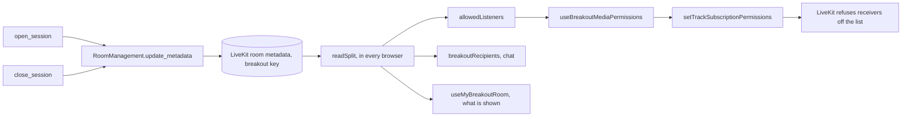

# Breakout rooms

PR: [suitenumerique/meet#1765](https://github.com/suitenumerique/meet/pull/1765),
code linked at its head, 1a67a072.

## TLDR

A host, the meeting's owner or an administrator, splits a meeting into 2 to
20 breakout rooms and brings everyone back with one press. Nobody reconnects:
the backend writes who is in which room into the meeting's LiveKit metadata,
and each browser tells LiveKit that only its own room may receive its audio and
video. LiveKit enforces that list, so a modified browser still cannot listen to
another room. The feature is off by default, behind
[`BREAKOUT_ROOMS_ENABLED`](https://github.com/davd-gzl/meet/blob/1a67a072805feb7b610ee8bacb43ae4d8d0d8877/src/backend/meet/settings.py#L1048-L1051).

## What breakout rooms are

A breakout room is a smaller group inside a meeting, the way a teacher splits a
class into groups and calls everyone back later.

A host opens Breakout rooms under Tools, picks 2 to 20 rooms and
places each person, by hand or at random. Once the host presses Open:

- each person hears, sees and chats with the people in their own room, and a
  banner names it;
- people left unplaced, phone callers and latecomers stay together in the main
  room;
- a host in the main room can still write to every room at once;
- Close brings everyone back together.

Nobody leaves the page or reconnects at any point.

## How it works, in four steps

A browser in a meeting holds one connection to one LiveKit room, the
[`Room`](https://github.com/davd-gzl/meet/blob/1a67a072805feb7b610ee8bacb43ae4d8d0d8877/src/frontend/src/features/rooms/components/Conference.tsx#L139)
that `Conference` creates. A breakout room is not a second LiveKit room. It is
a label the backend puts on each person, and every browser acts on that label.

1. **The host's Open reaches the backend**, which saves the split, one round
   of breakout rooms from Open to Close, in three tables: one row for the
   split, one per room, one per person placed.
2. **The backend publishes the split.** It writes a `breakout` key into the
   meeting's LiveKit metadata, a small piece of text LiveKit hands to every
   browser in the meeting each time it changes:

   ```json
   {
     "breakout": {
       "session_id": "3f0c…",
       "rooms": ["Room 1", "Room 2"],
       "assignments": { "alice": 0, "bob": 1, "carol": 1 }
     }
   }
   ```

   `rooms` names the rooms in order. `assignments` gives each person's room as
   a position in that list: Alice is in Room 1, Bob and Carol in Room 2. A
   person appears by their identity, the id LiveKit knows a connection by,
   never shown on screen. Anyone missing from `assignments` is in the main
   room.
3. **Each browser keeps its audio and video in its room.** It reads the key,
   finds who shares its room, and tells LiveKit that only those people may
   receive its microphone and camera. LiveKit refuses everyone else, so this
   holds even against a browser someone modified.
4. **Each browser hides the other rooms.** The grid, the participant list, the
   chat and the notifications show this browser's room alone. This part lives
   in the interface only: names, mute states and raised hands still reach
   every browser.

Close removes the key, and every browser goes back to letting everyone
receive it.

Keeping everyone in one LiveKit room means opening or closing the rooms never
reconnects anyone: each is one metadata write. The price is that LiveKit knows
nothing about the rooms. Each browser enforces them, and whatever LiveKit
hands to the whole meeting crosses rooms: the names, the recorder, which
hears everything, and phone lines, which cannot say who may receive them.

## The parts, at a glance

| Part | Where | Its job |
| --- | --- | --- |
| The API | [`core/breakout/viewsets.py`](https://github.com/davd-gzl/meet/blob/1a67a072805feb7b610ee8bacb43ae4d8d0d8877/src/backend/core/breakout/viewsets.py) | Open, list and Close, for the meeting's hosts alone |
| The backend logic | [`core/breakout/services.py`](https://github.com/davd-gzl/meet/blob/1a67a072805feb7b610ee8bacb43ae4d8d0d8877/src/backend/core/breakout/services.py) | saves the split, writes the key, takes both back when LiveKit fails |
| The metadata writer | [`core/services/room_management.py`](https://github.com/davd-gzl/meet/blob/1a67a072805feb7b610ee8bacb43ae4d8d0d8877/src/backend/core/services/room_management.py) | one writer at a time per meeting, so no write drops the key |
| The key, read in the browser | [`breakout/utils/split.ts`](https://github.com/davd-gzl/meet/blob/1a67a072805feb7b610ee8bacb43ae4d8d0d8877/src/frontend/src/features/breakout/utils/split.ts) | who is in which room, and who may receive this browser |
| The media permissions | [`breakout/hooks/useBreakoutMediaPermissions.ts`](https://github.com/davd-gzl/meet/blob/1a67a072805feb7b610ee8bacb43ae4d8d0d8877/src/frontend/src/features/breakout/hooks/useBreakoutMediaPermissions.ts) | sends that list to LiveKit |
| The host's panel | [`BreakoutPanel.tsx`](https://github.com/davd-gzl/meet/blob/1a67a072805feb7b610ee8bacb43ae4d8d0d8877/src/frontend/src/features/breakout/components/BreakoutPanel.tsx), [`BreakoutSetup.tsx`](https://github.com/davd-gzl/meet/blob/1a67a072805feb7b610ee8bacb43ae4d8d0d8877/src/frontend/src/features/breakout/components/BreakoutSetup.tsx) | the setup before Open, the open rooms and Close |
| Everyone else's side | [`BreakoutRoomTracker.tsx`](https://github.com/davd-gzl/meet/blob/1a67a072805feb7b610ee8bacb43ae4d8d0d8877/src/frontend/src/features/breakout/components/BreakoutRoomTracker.tsx) | the banner, the toast, the microphone turned off on each change of room |

## The flow, function by function

The same four steps, each box named as the code names it.



## Read the code in this order

Each stop makes the next one legible. The first seven are the browser, the
last three the backend.

### 1. The key's shape, [`split.ts`](https://github.com/davd-gzl/meet/blob/1a67a072805feb7b610ee8bacb43ae4d8d0d8877/src/frontend/src/features/breakout/utils/split.ts#L4-L19)

The backend's [`_split_metadata`](https://github.com/davd-gzl/meet/blob/1a67a072805feb7b610ee8bacb43ae4d8d0d8877/src/backend/core/breakout/services.py#L84-L99)
writes this value under the `breakout` key. An identity missing from
`assignments` is in the main room, so someone who joins during a split lands
there with no code of its own.

```ts
// What the backend writes into the meeting's metadata while it is split.
export type BreakoutSplit = {
  session_id: string
  rooms: string[]
  // The index of each assigned identity's room in rooms.
  assignments: Record<string, number>
}

// The room of everyone not assigned one, the hosts and phone callers included.
// The host's setup uses it too, for someone left unassigned.
export const MAIN_ROOM = -1

type Person = { identity: string; kind: ParticipantKind }

export const breakoutRoomOf = (
  split: BreakoutSplit | null,
  identity: string
) => split?.assignments[identity] ?? MAIN_ROOM
```

[`readSplit`](https://github.com/davd-gzl/meet/blob/1a67a072805feb7b610ee8bacb43ae4d8d0d8877/src/frontend/src/features/breakout/utils/split.ts#L64-L75)
parses the key and keeps a session's first reading. A later write to another
metadata key, the recording status for one, then rebuilds no filter.

### 2. Who may receive me, [`allowedListeners`](https://github.com/davd-gzl/meet/blob/1a67a072805feb7b610ee8bacb43ae4d8d0d8877/src/frontend/src/features/breakout/utils/split.ts#L29-L48)

A browser in a room names the other identities the split puts in that room,
connected or not. A browser in the main room names the main room's browsers
and phone callers who are present. Outside a split it returns null, which lets
everyone in.

```ts
if (!split) return null
const myRoom = breakoutRoomOf(split, me)
if (myRoom !== MAIN_ROOM) {
  return Object.keys(split.assignments).filter(
    (identity) => identity !== me && split.assignments[identity] === myRoom
  )
}
return others
  .filter(
    (p) =>
      breakoutRoomOf(split, p.identity) === MAIN_ROOM &&
      (p.kind === ParticipantKind.STANDARD || p.kind === ParticipantKind.SIP)
  )
  .map((p) => p.identity)
```

Agents and recorders are on no list, which is why
[subtitles pause](https://github.com/davd-gzl/meet/blob/1a67a072805feb7b610ee8bacb43ae4d8d0d8877/src/frontend/src/features/breakout/utils/split.ts#L27-L28)
during a split.

### 3. Telling LiveKit, [`useBreakoutMediaPermissions`](https://github.com/davd-gzl/meet/blob/1a67a072805feb7b610ee8bacb43ae4d8d0d8877/src/frontend/src/features/breakout/hooks/useBreakoutMediaPermissions.ts#L19-L98)

This hook sends the list to LiveKit each time it changes. LiveKit gives
[no permission to any identity left off it](https://github.com/livekit/client-sdk-js/blob/v2.21.0/src/room/participant/LocalParticipant.ts#L1903-L1919),
whatever that identity's browser does. Audio and video are kept apart here and
nowhere else.

`listenersKey` is the list as JSON, so the effect runs only when the list
itself changes: undefined while not connected, `"null"` outside a split.

```ts
useEffect(() => {
  // Not connected: the list already sent stands, and the SDK sends it again
  // on reconnecting.
  if (listenersKey === undefined) return
  const listeners: string[] | null = JSON.parse(listenersKey)
  // Nothing was restricted, so there is nothing to lift.
  if (listeners === null && !restricted.current) return
  restricted.current = listeners !== null

  const { localParticipant } = room
  if (listeners === null) {
    localParticipant.setTrackSubscriptionPermissions(true, [])
    return
  }
  localParticipant.setTrackSubscriptionPermissions(
    false,
    listeners.map((identity) => ({
      participantIdentity: identity,
      allowAll: true,
    }))
  )
}, [room, listenersKey])
```

A second effect
[stops playing every track from another room](https://github.com/davd-gzl/meet/blob/1a67a072805feb7b610ee8bacb43ae4d8d0d8877/src/frontend/src/features/breakout/hooks/useBreakoutMediaPermissions.ts#L75-L97).
It is the only cover for a phone caller, who sets no list.

### 4. Silent until placed, [`Conference`](https://github.com/davd-gzl/meet/blob/1a67a072805feb7b610ee8bacb43ae4d8d0d8877/src/frontend/src/features/rooms/components/Conference.tsx#L137-L144)

Where the flag is on, the browser lets nobody receive it before it connects.
The microphone
[publishes as soon as the room connects](https://github.com/davd-gzl/meet/blob/1a67a072805feb7b610ee8bacb43ae4d8d0d8877/src/frontend/src/features/rooms/components/Conference.tsx#L235),
before the browser has read its room. Without this, someone joining during a
split would reach the whole meeting for a moment.

```tsx
const isBreakoutEnabled = useBreakoutEnabled()
const room = useMemo(() => {
  const room = new Room(roomOptions)
  // Where the meeting can split, nobody receives this browser until it knows its room.
  if (isBreakoutEnabled)
    room.localParticipant.setTrackSubscriptionPermissions(false)
  return room
}, [roomOptions, isBreakoutEnabled])
```

### 5. Chat, [`ChatProvider`](https://github.com/davd-gzl/meet/blob/1a67a072805feb7b610ee8bacb43ae4d8d0d8877/src/frontend/src/features/chat/components/ChatProvider.tsx#L29-L153)

In a split, a message goes to
[`breakoutRecipients`](https://github.com/davd-gzl/meet/blob/1a67a072805feb7b610ee8bacb43ae4d8d0d8877/src/frontend/src/features/breakout/utils/split.ts#L83-L93),
the same identities as `allowedListeners`. It goes
[as a text stream alone](https://github.com/davd-gzl/meet/blob/1a67a072805feb7b610ee8bacb43ae4d8d0d8877/src/frontend/src/features/chat/components/ChatProvider.tsx#L92-L103),
since `useChat`'s send also copies the text to the whole meeting. Each browser
also drops a received message from another room, and during a split one whose
sender it does not know yet:

```tsx
// Each new message is shown and announced once. In a split, one from another
// room never is, an older tab's included, unless a host sent it to every room.
useEffect(() => {
  let latest: ReceivedChatMessage | undefined
  for (; seen.current < chatMessages.length; seen.current++) {
    const message = chatMessages[seen.current]
    const toEveryRoom = isToEveryRoom(message)
    // A sender not yet known, during a split, may be in another room.
    const isElsewhere = message.from
      ? !isInMyBreakoutRoom(message.from.identity)
      : isOpen
    if (isElsewhere && !toEveryRoom) continue
    appendRow(message, toEveryRoom)
    latest = message
  }
```

The exception is a message marked To every room.
[`isToEveryRoom`](https://github.com/davd-gzl/meet/blob/1a67a072805feb7b610ee8bacb43ae4d8d0d8877/src/frontend/src/features/breakout/utils/split.ts#L100-L108)
accepts the mark only from a sender whose `room_role` is `owner` or
`administrator`. The backend
[signs that role into the pass](https://github.com/davd-gzl/meet/blob/1a67a072805feb7b610ee8bacb43ae4d8d0d8877/src/backend/core/utils.py#L133-L139), and
the pass
[forbids changing it](https://github.com/davd-gzl/meet/blob/1a67a072805feb7b610ee8bacb43ae4d8d0d8877/src/backend/core/utils.py#L104).

### 6. What each surface shows, [`useMyBreakoutRoom`](https://github.com/davd-gzl/meet/blob/1a67a072805feb7b610ee8bacb43ae4d8d0d8877/src/frontend/src/features/breakout/hooks/useMyBreakoutRoom.ts#L12-L27)

`isInMyBreakoutRoom` is true when an identity is in this browser's room. Every
surface that lists people drops those it rejects.

```ts
export const useMyBreakoutRoom = () => {
  const room = useRoomContext()
  const { metadata } = useRoomInfo()
  const split = useMemo(() => readSplit(metadata), [metadata])
  const me = room.localParticipant.identity
  const isInMyBreakoutRoom = useCallback(
    (identity: string) => inSameBreakoutRoom(split, me, identity),
    [split, me]
  )
  return {
    isInMyBreakoutRoom,
    isOpen: split !== null,
    isInMainRoom: isInMainRoomOfSplit(split, me),
    roomName: split?.rooms[breakoutRoomOf(split, me)] ?? null,
  }
```

Its callers are the
[grid](https://github.com/davd-gzl/meet/blob/1a67a072805feb7b610ee8bacb43ae4d8d0d8877/src/frontend/src/features/layout/components/StageLayout.tsx#L30-L36),
the [picture in picture](https://github.com/davd-gzl/meet/blob/1a67a072805feb7b610ee8bacb43ae4d8d0d8877/src/frontend/src/features/pip/components/layout/PipStage.tsx#L34-L40),
the [participant list](https://github.com/davd-gzl/meet/blob/1a67a072805feb7b610ee8bacb43ae4d8d0d8877/src/frontend/src/features/participants/components/ParticipantsList.tsx#L30-L36),
the [count](https://github.com/davd-gzl/meet/blob/1a67a072805feb7b610ee8bacb43ae4d8d0d8877/src/frontend/src/features/participants/components/ParticipantsCount.tsx#L39-L42),
the [raised hands](https://github.com/davd-gzl/meet/blob/1a67a072805feb7b610ee8bacb43ae4d8d0d8877/src/frontend/src/features/rooms/livekit/hooks/useRaisedHand.ts#L30-L48)
and the [notification toasts](https://github.com/davd-gzl/meet/blob/1a67a072805feb7b610ee8bacb43ae4d8d0d8877/src/frontend/src/features/notifications/MainNotificationToast.tsx#L88-L98).
A chat toast from another room is
[dropped the same way](https://github.com/davd-gzl/meet/blob/1a67a072805feb7b610ee8bacb43ae4d8d0d8877/src/frontend/src/features/notifications/MainNotificationToast.tsx#L44-L46).
These filters hide people and protect nothing: names, mute states and raised
hands still reach every browser.

### 7. A change of room, [`BreakoutRoomTracker`](https://github.com/davd-gzl/meet/blob/1a67a072805feb7b610ee8bacb43ae4d8d0d8877/src/frontend/src/features/breakout/components/BreakoutRoomTracker.tsx#L38-L105)

Whenever this browser's room changes, Close included, a microphone that is on
goes off first. A microphone left on would reach the new room at once.

```tsx
useEffect(() => {
  // A new room starts muted: a microphone left on would reach new people at once.
  const changed = lastRoomName !== undefined && roomName !== lastRoomName
  const muted = changed && room.localParticipant.isMicrophoneEnabled
  if (muted) void room.localParticipant.setMicrophoneEnabled(false)
  const moved = !!roomName && roomName !== lastRoomName
  const closed = !!wasOpen && !isOpen
  if (!moved && !closed && !muted) return
```

It then plays a toast and a sound, writes a
[dividing line](https://github.com/davd-gzl/meet/blob/1a67a072805feb7b610ee8bacb43ae4d8d0d8877/src/frontend/src/features/breakout/components/BreakoutRoomTracker.tsx#L74-L82)
into the chat, and shows a
[banner](https://github.com/davd-gzl/meet/blob/1a67a072805feb7b610ee8bacb43ae4d8d0d8877/src/frontend/src/features/breakout/components/BreakoutRoomTracker.tsx#L84-L103)
naming the room while the browser is connected. A browser that stays in the
main room keeps its microphone, at Open and at Close.

### 8. Opening and closing, [`services.py`](https://github.com/davd-gzl/meet/blob/1a67a072805feb7b610ee8bacb43ae4d8d0d8877/src/backend/core/breakout/services.py#L122-L210)

[`open_session`](https://github.com/davd-gzl/meet/blob/1a67a072805feb7b610ee8bacb43ae4d8d0d8877/src/backend/core/breakout/services.py#L134-L195) commits
the rows, then writes the key. A failed write removes the key and deletes the
session, since a write cut off by its 5 s deadline may still have landed.

```python
try:
    is_live = _write_metadata(
        room.id, metadata={METADATA_KEY: _split_metadata(session, rooms)}
    )
except MediaServerError:
    # A write cut off by its deadline may still have landed; take it back.
    # Should that fail too, the session stays active, so a close retries.
    with contextlib.suppress(MediaServerError):
        _write_metadata(room.id, remove_keys=[METADATA_KEY])
        session.delete()
    raise
if not is_live:
    session.delete()
    raise MediaServerError()
```

[`close_session`](https://github.com/davd-gzl/meet/blob/1a67a072805feb7b610ee8bacb43ae4d8d0d8877/src/backend/core/breakout/services.py#L198-L210)
[removes the key](https://github.com/davd-gzl/meet/blob/1a67a072805feb7b610ee8bacb43ae4d8d0d8877/src/backend/core/breakout/services.py#L206) before it
[marks the session `closed`](https://github.com/davd-gzl/meet/blob/1a67a072805feb7b610ee8bacb43ae4d8d0d8877/src/backend/core/breakout/services.py#L207-L209).
A failed removal answers 503 and leaves the session `active`, so a second
Close tries again.

### 9. One writer at a time, [`RoomManagement.update_metadata`](https://github.com/davd-gzl/meet/blob/1a67a072805feb7b610ee8bacb43ae4d8d0d8877/src/backend/core/services/room_management.py#L57-L102)

Every metadata writer reads the whole metadata, merges its change and writes
it back: breakout rooms, the
[recording status](https://github.com/davd-gzl/meet/blob/1a67a072805feb7b610ee8bacb43ae4d8d0d8877/src/backend/core/recording/services/recording_events.py#L135)
and the [room configuration](https://github.com/davd-gzl/meet/blob/1a67a072805feb7b610ee8bacb43ae4d8d0d8877/src/backend/core/services/room_management.py#L232).
Two writers racing would drop each other's key, and a dropped `breakout` key
merges every room. A lock in the cache, named after the room, makes them take
turns.

```python
lock = cache.lock(
    f"room-metadata:{room_name}",
    timeout=METADATA_LOCK_TIMEOUT_SECONDS,
    blocking_timeout=METADATA_LOCK_TIMEOUT_SECONDS
    + MEDIA_SERVER_TIMEOUT_SECONDS,
)
try:
    acquired = lock.acquire()
except RedisError as e:
    raise RoomManagementException("Could not lock room metadata") from e
if not acquired:
    raise RoomManagementException("Could not lock room metadata")
```

A write past its deadline
[keeps the lock until it expires](https://github.com/davd-gzl/meet/blob/1a67a072805feb7b610ee8bacb43ae4d8d0d8877/src/backend/core/services/room_management.py#L93-L97),
so the next writer reads after that write lands.

### 10. Who may call, and recording, [`viewsets.py`](https://github.com/davd-gzl/meet/blob/1a67a072805feb7b610ee8bacb43ae4d8d0d8877/src/backend/core/breakout/viewsets.py#L18-L72)

[`BreakoutSessionViewSet`](https://github.com/davd-gzl/meet/blob/1a67a072805feb7b610ee8bacb43ae4d8d0d8877/src/backend/core/breakout/viewsets.py#L26)
lets through the owner or an administrator of the meeting in the URL, through
[`HasPrivilegesOnRoom`](https://github.com/davd-gzl/meet/blob/1a67a072805feb7b610ee8bacb43ae4d8d0d8877/src/backend/core/api/permissions.py#L87-L94).
LiveKit's recorder receives every room, so a recording and a split never
overlap: a recording cannot start during a split, and Open stops a running one. Starting a recording takes the
[same row lock](https://github.com/davd-gzl/meet/blob/1a67a072805feb7b610ee8bacb43ae4d8d0d8877/src/backend/core/breakout/services.py#L75-L81) as Open and
refuses during a split:

```python
try:
    with transaction.atomic():
        breakout_services.lock_room_row(room)
        if breakout_services.has_active_session(room):
            return drf_response.Response(
                {"error": "Close the breakout rooms before recording."},
                status=drf_status.HTTP_409_CONFLICT,
            )
```

Open goes the other way round. While a recording runs, the host's panel
[warns above Open](https://github.com/davd-gzl/meet/blob/1a67a072805feb7b610ee8bacb43ae4d8d0d8877/src/frontend/src/features/breakout/components/BreakoutSetup.tsx#L175) that opening stops it, and
sends `stop_recording`, so Open [stops the recording first](https://github.com/davd-gzl/meet/blob/1a67a072805feb7b610ee8bacb43ae4d8d0d8877/src/backend/core/breakout/services.py#L122-L131).
Open then [asks LiveKit whether a recorder still captures](https://github.com/davd-gzl/meet/blob/1a67a072805feb7b610ee8bacb43ae4d8d0d8877/src/backend/core/breakout/services.py#L145-L147),
then [checks the recording rows](https://github.com/davd-gzl/meet/blob/1a67a072805feb7b610ee8bacb43ae4d8d0d8877/src/backend/core/breakout/services.py#L149-L159)
under the lock, so a recording nobody stopped still refuses the split.

## What each person sees

| Who | Hears and sees | Chat | What tells them |
| --- | --- | --- | --- |
| The host setting up | everyone, since nothing is split yet | everyone | the panel under Tools: a [room count of 2 to 20](https://github.com/davd-gzl/meet/blob/1a67a072805feb7b610ee8bacb43ae4d8d0d8877/src/frontend/src/features/breakout/components/RoomCountField.tsx#L19-L21), each browser with a room picker, Assign randomly, and a [warning](https://github.com/davd-gzl/meet/blob/1a67a072805feb7b610ee8bacb43ae4d8d0d8877/src/frontend/src/features/breakout/components/BreakoutSetup.tsx#L172-L174) when anyone outside a browser is in the meeting, and another [when a recording runs](https://github.com/davd-gzl/meet/blob/1a67a072805feb7b610ee8bacb43ae4d8d0d8877/src/frontend/src/features/breakout/components/BreakoutSetup.tsx#L175), since Open stops it |
| Someone placed in a room | the other members of that room | that room, plus a host's messages to every room, [set apart by a bar](https://github.com/davd-gzl/meet/blob/1a67a072805feb7b610ee8bacb43ae4d8d0d8877/src/frontend/src/features/chat/components/ChatMessage.tsx#L50-L64) | a toast and a sound naming the room, "Your microphone is off." when it was on, the banner "You are in Room 1", and the chat line "Room 1: messages reach this room" |
| Someone in the main room | the main room's browsers and phone callers | the main room; a host here may turn on [Send to every room](https://github.com/davd-gzl/meet/blob/1a67a072805feb7b610ee8bacb43ae4d8d0d8877/src/frontend/src/features/chat/components/Chat.tsx#L41-L56) | no toast, since their room did not change; the banner "Rooms are open. You are in the main room." and the chat line "Main room: messages reach the main room" |
| A phone caller or an agent | a phone caller hears the main room, an agent hears nobody | none | nothing on their side; the host's setup lists [browsers alone](https://github.com/davd-gzl/meet/blob/1a67a072805feb7b610ee8bacb43ae4d8d0d8877/src/frontend/src/features/breakout/utils/setup.ts#L7-L10) and warns that the others cannot be placed in a room |
| Everyone at Close | everyone | everyone; the [switch turns off](https://github.com/davd-gzl/meet/blob/1a67a072805feb7b610ee8bacb43ae4d8d0d8877/src/frontend/src/features/chat/components/ChatProvider.tsx#L43-L46) | a toast and a sound, "Rooms are closed. Everyone is back in the main room.", the microphone line for those coming back from a room, and the chat line "Rooms closed: messages reach everyone" |

## The backend API

A viewset is a Django REST framework class that serves every endpoint of one
resource under one URL prefix. Here the resource is a meeting's breakout
sessions, [routed](https://github.com/davd-gzl/meet/blob/1a67a072805feb7b610ee8bacb43ae4d8d0d8877/src/backend/core/urls.py#L40-L44) under
`/api/v1.0/rooms/<room id>/breakout-sessions/`. Every endpoint answers 401 to
a signed-out caller and 403 to anyone who is not a host of that meeting.

| Method and path | What it does | What it refuses, and with which status |
| --- | --- | --- |
| [`GET breakout-sessions/`](https://github.com/davd-gzl/meet/blob/1a67a072805feb7b610ee8bacb43ae4d8d0d8877/src/backend/core/breakout/viewsets.py#L42-L48) | lists the meeting's active session, zero or one, with its rooms and people | nothing more; it runs with the flag off, so a host still finds a split left open |
| [`POST breakout-sessions/`](https://github.com/davd-gzl/meet/blob/1a67a072805feb7b610ee8bacb43ae4d8d0d8877/src/backend/core/breakout/viewsets.py#L50-L65) | Open: validates the rooms, calls `open_session`, answers 201 with the session | 404 with the flag off, to any signed-in caller; 400 for [fewer than 2 or more than 20 rooms](https://github.com/davd-gzl/meet/blob/1a67a072805feb7b610ee8bacb43ae4d8d0d8877/src/backend/core/breakout/serializers.py#L64) or [an identity placed twice](https://github.com/davd-gzl/meet/blob/1a67a072805feb7b610ee8bacb43ae4d8d0d8877/src/backend/core/breakout/serializers.py#L75-L78); 409 for an [active split or recording](https://github.com/davd-gzl/meet/blob/1a67a072805feb7b610ee8bacb43ae4d8d0d8877/src/backend/core/breakout/services.py#L151-L159) or a [running recorder](https://github.com/davd-gzl/meet/blob/1a67a072805feb7b610ee8bacb43ae4d8d0d8877/src/backend/core/breakout/services.py#L146-L147); with `stop_recording` the running recording stops first; 503 when LiveKit fails, a recording does not stop, or the meeting is not live in LiveKit |
| [`POST breakout-sessions/<id>/close/`](https://github.com/davd-gzl/meet/blob/1a67a072805feb7b610ee8bacb43ae4d8d0d8877/src/backend/core/breakout/viewsets.py#L67-L72) | Close: removes the key, marks the session `closed`, answers 200; a closed session comes back unchanged | 503 when removing the key fails, the session staying `active`; it runs with the flag off |
| [`POST start-recording/`](https://github.com/davd-gzl/meet/blob/1a67a072805feb7b610ee8bacb43ae4d8d0d8877/src/backend/core/api/viewsets.py#L309-L318), existing | starts a recording, as before | 409 "Close the breakout rooms before recording." during a split |

## What it guarantees, and its limits

| What | Kept by | How, or why not |
| --- | --- | --- |
| Audio and video stay in their room | LiveKit | each browser's list, and nobody on it before the browser knows its room |
| Chat and notifications stay in their room | LiveKit and the browser | LiveKit delivers each message to the identities named by `breakoutRecipients`, a notification [included](https://github.com/davd-gzl/meet/blob/1a67a072805feb7b610ee8bacb43ae4d8d0d8877/src/frontend/src/features/notifications/hooks/useNotifyParticipants.ts#L31-L35); a browser drops one from another room |
| A message to every room comes from a host | the browser, on a role LiveKit signs | `isToEveryRoom` reads `room_role` from the pass, which nobody can change |
| A change of room starts with the microphone off | the browser | a modified browser can skip it, and LiveKit's lists still decide who receives that microphone |
| Hosts stay in the main room unless placed by hand | the panel | Assign randomly [shuffles only the people who are not hosts](https://github.com/davd-gzl/meet/blob/1a67a072805feb7b610ee8bacb43ae4d8d0d8877/src/frontend/src/features/breakout/components/BreakoutSetup.tsx#L99-L112) |
| Recording and a split never overlap | the backend | a recording cannot start during a split, and Open stops a running one only once the panel has warned the host; one row lock covers both |
| Phone callers stay out of the rooms | the browser only | a phone line sets no list, so a [modified browser can still receive one](https://github.com/davd-gzl/meet/blob/1a67a072805feb7b610ee8bacb43ae4d8d0d8877/docs/features/breakout_rooms.md?plain=1#L21) |
| Subtitles during a split | not kept | the subtitle agent is on no list, so subtitles pause |
| Names, mute states and raised hands | not kept | they [reach every browser](https://github.com/davd-gzl/meet/blob/1a67a072805feb7b610ee8bacb43ae4d8d0d8877/docs/features/breakout_rooms.md?plain=1#L22), and only the interface hides other rooms |
| A tab loaded with the flag off | the browser, late | it [keeps to its room once it reads the split](https://github.com/davd-gzl/meet/blob/1a67a072805feb7b610ee8bacb43ae4d8d0d8877/src/frontend/src/features/breakout/components/BreakoutRoomTracker.tsx#L21-L36), and anyone may hear it while it joins |
| A tab loaded before the release | not kept | it knows nothing of a split, shows everyone and lets anyone receive it |

## Turning it on

- `BREAKOUT_ROOMS_ENABLED` defaults to false. Browsers read it from the
  configuration endpoint as
  [`breakout_rooms.is_enabled`](https://github.com/davd-gzl/meet/blob/1a67a072805feb7b610ee8bacb43ae4d8d0d8877/src/backend/core/api/__init__.py#L69).
  With it off, Open answers 404, and a split already open can still be listed
  and closed.
- Turn it on
  [once the meetings started before the release have ended](https://github.com/davd-gzl/meet/blob/1a67a072805feb7b610ee8bacb43ae4d8d0d8877/UPGRADE.md?plain=1#L24).
  A tab loaded before the release ignores every split.
- Migration
  [`0025_breakout_rooms`](https://github.com/davd-gzl/meet/blob/1a67a072805feb7b610ee8bacb43ae4d8d0d8877/src/backend/core/migrations/0025_breakout_rooms.py#L11-L13)
  adds three tables whose foreign keys point at rooms and users. The previous
  release cannot delete a room or a user a split references, so
  [rolling back](https://github.com/davd-gzl/meet/blob/1a67a072805feb7b610ee8bacb43ae4d8d0d8877/UPGRADE.md?plain=1#L23) first runs
  `python manage.py migrate core 0024`, which drops every split.
- The metadata lock uses the Django cache, which is already
  [Redis through `django_redis`](https://github.com/davd-gzl/meet/blob/1a67a072805feb7b610ee8bacb43ae4d8d0d8877/src/backend/meet/settings.py#L358).
  Nothing new is deployed.

## Every file, one line each

<details>
<summary>Every file the pull request changes, grouped by side</summary>

| File | Role |
| --- | --- |
| [`core/breakout/services.py`](https://github.com/davd-gzl/meet/blob/1a67a072805feb7b610ee8bacb43ae4d8d0d8877/src/backend/core/breakout/services.py) | opens, closes and ends a split, and writes the `breakout` key |
| [`core/breakout/viewsets.py`](https://github.com/davd-gzl/meet/blob/1a67a072805feb7b610ee8bacb43ae4d8d0d8877/src/backend/core/breakout/viewsets.py) | `BreakoutSessionViewSet`: list, Open, Close |
| [`core/breakout/serializers.py`](https://github.com/davd-gzl/meet/blob/1a67a072805feb7b610ee8bacb43ae4d8d0d8877/src/backend/core/breakout/serializers.py) | validates Open's rooms and writes each answer |
| [`core/breakout/__init__.py`](https://github.com/davd-gzl/meet/blob/1a67a072805feb7b610ee8bacb43ae4d8d0d8877/src/backend/core/breakout/__init__.py) | the package's docstring |
| [`core/models.py`](https://github.com/davd-gzl/meet/blob/1a67a072805feb7b610ee8bacb43ae4d8d0d8877/src/backend/core/models.py#L1091-L1198) | `BreakoutSession`, `BreakoutRoom`, `BreakoutAssignment`, one active session per meeting |
| [`core/migrations/0025_breakout_rooms.py`](https://github.com/davd-gzl/meet/blob/1a67a072805feb7b610ee8bacb43ae4d8d0d8877/src/backend/core/migrations/0025_breakout_rooms.py) | creates the three tables |
| [`core/services/room_management.py`](https://github.com/davd-gzl/meet/blob/1a67a072805feb7b610ee8bacb43ae4d8d0d8877/src/backend/core/services/room_management.py) | the locked metadata writer, the 5 s deadline, `has_active_egress` |
| [`core/services/livekit_events.py`](https://github.com/davd-gzl/meet/blob/1a67a072805feb7b610ee8bacb43ae4d8d0d8877/src/backend/core/services/livekit_events.py#L281-L282) | closes the split when LiveKit reports the room [finished](https://github.com/davd-gzl/meet/blob/1a67a072805feb7b610ee8bacb43ae4d8d0d8877/src/backend/core/services/livekit_events.py#L311-L312) or started again; on a restart it also [removes the `breakout` key](https://github.com/davd-gzl/meet/blob/1a67a072805feb7b610ee8bacb43ae4d8d0d8877/src/backend/core/breakout/services.py#L60-L66) the reloaded room kept |
| [`core/api/viewsets.py`](https://github.com/davd-gzl/meet/blob/1a67a072805feb7b610ee8bacb43ae4d8d0d8877/src/backend/core/api/viewsets.py#L340-L347) | refuses a recording during a split |
| [`core/api/feature_flag.py`](https://github.com/davd-gzl/meet/blob/1a67a072805feb7b610ee8bacb43ae4d8d0d8877/src/backend/core/api/feature_flag.py#L20) | maps `breakout_rooms` to the setting |
| [`core/api/__init__.py`](https://github.com/davd-gzl/meet/blob/1a67a072805feb7b610ee8bacb43ae4d8d0d8877/src/backend/core/api/__init__.py#L69) | sends the flag to browsers |
| [`core/urls.py`](https://github.com/davd-gzl/meet/blob/1a67a072805feb7b610ee8bacb43ae4d8d0d8877/src/backend/core/urls.py#L40-L44) | routes the viewset under the meeting |
| [`meet/settings.py`](https://github.com/davd-gzl/meet/blob/1a67a072805feb7b610ee8bacb43ae4d8d0d8877/src/backend/meet/settings.py#L1048-L1051) | `BREAKOUT_ROOMS_ENABLED`, [on in tests](https://github.com/davd-gzl/meet/blob/1a67a072805feb7b610ee8bacb43ae4d8d0d8877/src/backend/meet/settings.py#L1547) |
| [`core/tests/breakout/`](https://github.com/davd-gzl/meet/blob/1a67a072805feb7b610ee8bacb43ae4d8d0d8877/src/backend/core/tests/breakout/test_api_breakout_sessions.py), [`test_room_management.py`](https://github.com/davd-gzl/meet/blob/1a67a072805feb7b610ee8bacb43ae4d8d0d8877/src/backend/core/tests/services/test_room_management.py) | backend tests |
| [`breakout/utils/split.ts`](https://github.com/davd-gzl/meet/blob/1a67a072805feb7b610ee8bacb43ae4d8d0d8877/src/frontend/src/features/breakout/utils/split.ts) | the split read from the metadata, the lists, the recipients, the To every room mark |
| [`breakout/utils/setup.ts`](https://github.com/davd-gzl/meet/blob/1a67a072805feb7b610ee8bacb43ae4d8d0d8877/src/frontend/src/features/breakout/utils/setup.ts) | who can be placed, the shuffle, Open's body |
| [`breakout/hooks/useBreakoutMediaPermissions.ts`](https://github.com/davd-gzl/meet/blob/1a67a072805feb7b610ee8bacb43ae4d8d0d8877/src/frontend/src/features/breakout/hooks/useBreakoutMediaPermissions.ts) | sends the list to LiveKit, stops playing other rooms |
| [`breakout/hooks/useMyBreakoutRoom.ts`](https://github.com/davd-gzl/meet/blob/1a67a072805feb7b610ee8bacb43ae4d8d0d8877/src/frontend/src/features/breakout/hooks/useMyBreakoutRoom.ts) | `isInMyBreakoutRoom` and this browser's room |
| [`breakout/hooks/useCanManageBreakout.ts`](https://github.com/davd-gzl/meet/blob/1a67a072805feb7b610ee8bacb43ae4d8d0d8877/src/frontend/src/features/breakout/hooks/useCanManageBreakout.ts) | who sees the panel: a host, with the flag on or a split open |
| [`breakout/hooks/useOpenShortcut.ts`](https://github.com/davd-gzl/meet/blob/1a67a072805feb7b610ee8bacb43ae4d8d0d8877/src/frontend/src/features/breakout/hooks/useOpenShortcut.ts) | Enter, or Ctrl or Cmd with Enter, opens the rooms |
| [`breakout/components/BreakoutRoomTracker.tsx`](https://github.com/davd-gzl/meet/blob/1a67a072805feb7b610ee8bacb43ae4d8d0d8877/src/frontend/src/features/breakout/components/BreakoutRoomTracker.tsx) | follows this browser's room: microphone, toast, chat line, banner |
| [`breakout/components/BreakoutPanel.tsx`](https://github.com/davd-gzl/meet/blob/1a67a072805feb7b610ee8bacb43ae4d8d0d8877/src/frontend/src/features/breakout/components/BreakoutPanel.tsx) | the host's panel: the open split and Close, or the setup |
| [`breakout/components/BreakoutSetup.tsx`](https://github.com/davd-gzl/meet/blob/1a67a072805feb7b610ee8bacb43ae4d8d0d8877/src/frontend/src/features/breakout/components/BreakoutSetup.tsx) | the form before Open, with the warning about people outside a browser |
| [`breakout/components/RoomCountField.tsx`](https://github.com/davd-gzl/meet/blob/1a67a072805feb7b610ee8bacb43ae4d8d0d8877/src/frontend/src/features/breakout/components/RoomCountField.tsx) | the room count, 2 to 20 |
| [`breakout/components/ErrorNote.tsx`](https://github.com/davd-gzl/meet/blob/1a67a072805feb7b610ee8bacb43ae4d8d0d8877/src/frontend/src/features/breakout/components/ErrorNote.tsx) | the message after a failed Open or Close |
| [`breakout/api.ts`](https://github.com/davd-gzl/meet/blob/1a67a072805feb7b610ee8bacb43ae4d8d0d8877/src/frontend/src/features/breakout/api.ts), [`breakout/store.ts`](https://github.com/davd-gzl/meet/blob/1a67a072805feb7b610ee8bacb43ae4d8d0d8877/src/frontend/src/features/breakout/store.ts) | the endpoint calls, and `breakoutSetupStore`, the host's plan kept while the panel is closed |
| [`rooms/components/Conference.tsx`](https://github.com/davd-gzl/meet/blob/1a67a072805feb7b610ee8bacb43ae4d8d0d8877/src/frontend/src/features/rooms/components/Conference.tsx#L137-L144) | nobody receives the browser before it connects, and it [mounts `BreakoutRoomTracker`](https://github.com/davd-gzl/meet/blob/1a67a072805feb7b610ee8bacb43ae4d8d0d8877/src/frontend/src/features/rooms/components/Conference.tsx#L310) |
| [`rooms/livekit/components/Tools.tsx`](https://github.com/davd-gzl/meet/blob/1a67a072805feb7b610ee8bacb43ae4d8d0d8877/src/frontend/src/features/rooms/livekit/components/Tools.tsx#L99-L112), [`useSidePanel.ts`](https://github.com/davd-gzl/meet/blob/1a67a072805feb7b610ee8bacb43ae4d8d0d8877/src/frontend/src/features/rooms/livekit/hooks/useSidePanel.ts) | the Breakout rooms entry under Tools |
| [`chat/components/ChatProvider.tsx`](https://github.com/davd-gzl/meet/blob/1a67a072805feb7b610ee8bacb43ae4d8d0d8877/src/frontend/src/features/chat/components/ChatProvider.tsx) | sends to the room, drops other rooms' messages |
| [`chat/components/Chat.tsx`](https://github.com/davd-gzl/meet/blob/1a67a072805feb7b610ee8bacb43ae4d8d0d8877/src/frontend/src/features/chat/components/Chat.tsx#L41-L56), [`ChatMessage.tsx`](https://github.com/davd-gzl/meet/blob/1a67a072805feb7b610ee8bacb43ae4d8d0d8877/src/frontend/src/features/chat/components/ChatMessage.tsx), [`stores/chat.ts`](https://github.com/davd-gzl/meet/blob/1a67a072805feb7b610ee8bacb43ae4d8d0d8877/src/frontend/src/stores/chat.ts) | the Send to every room switch, its bar and tag, the dividing line |
| [`StageLayout.tsx`](https://github.com/davd-gzl/meet/blob/1a67a072805feb7b610ee8bacb43ae4d8d0d8877/src/frontend/src/features/layout/components/StageLayout.tsx), [`PipStage.tsx`](https://github.com/davd-gzl/meet/blob/1a67a072805feb7b610ee8bacb43ae4d8d0d8877/src/frontend/src/features/pip/components/layout/PipStage.tsx), [`ParticipantsList.tsx`](https://github.com/davd-gzl/meet/blob/1a67a072805feb7b610ee8bacb43ae4d8d0d8877/src/frontend/src/features/participants/components/ParticipantsList.tsx), [`ParticipantsCount.tsx`](https://github.com/davd-gzl/meet/blob/1a67a072805feb7b610ee8bacb43ae4d8d0d8877/src/frontend/src/features/participants/components/ParticipantsCount.tsx), [`useRaisedHand.ts`](https://github.com/davd-gzl/meet/blob/1a67a072805feb7b610ee8bacb43ae4d8d0d8877/src/frontend/src/features/rooms/livekit/hooks/useRaisedHand.ts) | show this browser's room alone |
| [`MainNotificationToast.tsx`](https://github.com/davd-gzl/meet/blob/1a67a072805feb7b610ee8bacb43ae4d8d0d8877/src/frontend/src/features/notifications/MainNotificationToast.tsx), [`useNotifyParticipants.ts`](https://github.com/davd-gzl/meet/blob/1a67a072805feb7b610ee8bacb43ae4d8d0d8877/src/frontend/src/features/notifications/hooks/useNotifyParticipants.ts) | notifications stay in the room |
| [`ToastBreakoutRoomChanged.tsx`](https://github.com/davd-gzl/meet/blob/1a67a072805feb7b610ee8bacb43ae4d8d0d8877/src/frontend/src/features/notifications/components/ToastBreakoutRoomChanged.tsx) and the notification type, duration, sound and settings files | the toast and sound at each change of room |
| [`api/useConfig.ts`](https://github.com/davd-gzl/meet/blob/1a67a072805feb7b610ee8bacb43ae4d8d0d8877/src/frontend/src/api/useConfig.ts), [`api/queryKeys.ts`](https://github.com/davd-gzl/meet/blob/1a67a072805feb7b610ee8bacb43ae4d8d0d8877/src/frontend/src/api/queryKeys.ts) | the flag's type and the session's cache key |
| `locales/*/rooms.json`, `notifications.json`, `settings.json` | the strings, in five languages |
| `*.test.ts`, `*.test.tsx` beside the code | frontend tests |
| [`vitest.config.ts`](https://github.com/davd-gzl/meet/blob/1a67a072805feb7b610ee8bacb43ae4d8d0d8877/src/frontend/vitest.config.ts), [`package.json`](https://github.com/davd-gzl/meet/blob/1a67a072805feb7b610ee8bacb43ae4d8d0d8877/src/frontend/package.json), [`Makefile`](https://github.com/davd-gzl/meet/blob/1a67a072805feb7b610ee8bacb43ae4d8d0d8877/Makefile), [`ci.yml`](https://github.com/davd-gzl/meet/blob/1a67a072805feb7b610ee8bacb43ae4d8d0d8877/.github/workflows/ci.yml) | vitest, so the frontend can carry unit tests, run by `make test-frontend` and in CI |
| [`docs/features/breakout_rooms.md`](https://github.com/davd-gzl/meet/blob/1a67a072805feb7b610ee8bacb43ae4d8d0d8877/docs/features/breakout_rooms.md), [`UPGRADE.md`](https://github.com/davd-gzl/meet/blob/1a67a072805feb7b610ee8bacb43ae4d8d0d8877/UPGRADE.md?plain=1#L19-L24), [`CHANGELOG.md`](https://github.com/davd-gzl/meet/blob/1a67a072805feb7b610ee8bacb43ae4d8d0d8877/CHANGELOG.md), [`kubernetes.md`](https://github.com/davd-gzl/meet/blob/1a67a072805feb7b610ee8bacb43ae4d8d0d8877/docs/installation/kubernetes.md) | the feature's documentation, the upgrade notes, the setting's row |

</details>

## Built on top

Two pull requests stack on this one. Each is reviewed on its own.

| Pull request | What it adds |
| --- | --- |
| [davd-gzl/meet#22](https://github.com/davd-gzl/meet/pull/22) | the host moves one person to another room or to the main room while rooms are open |
| [davd-gzl/meet#23](https://github.com/davd-gzl/meet/pull/23) | the host picks how to split and places each person with one press on a numbered room button |

## Words used here

| Word | What it is |
| --- | --- |
| host | the meeting's owner or an administrator: their pass carries a `room_role` of `owner` or `administrator` |
| pass | the LiveKit access token the backend signs for each participant on joining; it carries the identity and the `room_role` |
| identity | the id LiveKit knows a connection by; never shown on screen, and new on every pass for a guest of a public meeting |
| metadata | text LiveKit keeps on a room and sends to every participant each time it changes |
| `breakout` key | the metadata entry present while a split is `active`: the session id, the room names, each identity's room |
| split | one round of breakout rooms from Open to Close: a `BreakoutSession` whose `status` is `active` until Close |
| breakout room | a group inside the meeting's one LiveKit room, a `BreakoutRoom`; it has no LiveKit room of its own |
| main room | everyone whose identity has no assignment in the open split: phone callers, agents, hosts not placed by hand, anyone unassigned or joining later |
| assignment | a `BreakoutAssignment`: one identity's room in one split, at most one per identity |
| allow list, subscription permissions | the identities a browser lets receive its audio and video, set with `setTrackSubscriptionPermissions`; LiveKit grants nothing to an identity off it |
| dividing line | a chat row this browser writes when who its messages reach changes; never sent, never unread |
| Send to every room | the chat switch a host in the main room sees during a split; its messages carry the `breakout.to_every_room` mark |
| viewset | a Django REST framework class serving every endpoint of one resource under one URL prefix |
| recorder, egress | LiveKit's recording process; it receives every room whatever the lists say, and `has_active_egress` asks whether one still captures |
| phone caller, SIP | a participant whose LiveKit kind is `SIP`, dialled in by phone; it cannot set an allow list |
| agent | a participant whose LiveKit kind is `AGENT`, such as the subtitle agent; it is on no allow list during a split |
