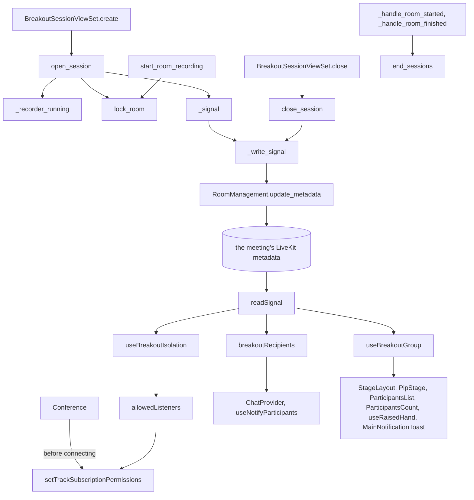

# Breakout rooms, the virtual split

PR: [suitenumerique/meet#1765](https://github.com/suitenumerique/meet/pull/1765)

## TLDR

Before, a meeting was one group: everyone in its LiveKit room received
everyone, and chat and notifications reached the whole meeting. Now the owner
or an administrator splits it into 2 to 10 rooms, and nobody changes
connection. `open_session` stores the split and writes a `breakout` key into
the meeting's LiveKit metadata. Each browser reads the key and tells LiveKit,
through `setTrackSubscriptionPermissions`, that only its room may receive it.
A workshop gets its groups without handing out other meeting links. It is off
by default, behind `BREAKOUT_ROOMS_ENABLED`.

## Before and after

Each row is one place the split enters. The middle column is upstream `main`,
the last column is this branch.

| Where | Before | After |
| --- | --- | --- |
| Tools panel | no breakout entry | the owner or an administrator opens Breakout rooms, through [`BreakoutToolButton`](https://github.com/davd-gzl/meet/blob/50baa47891e703456a614dcf3533162217d3b411/src/frontend/src/features/rooms/livekit/components/Tools.tsx#L100) and [`BreakoutPanel`](https://github.com/davd-gzl/meet/blob/50baa47891e703456a614dcf3533162217d3b411/src/frontend/src/features/breakout/components/BreakoutPanel.tsx#L66) |
| `POST /api/v1.0/rooms/<room id>/breakout-sessions/` | no such endpoint | the split is stored and the `breakout` key written, through [`open_session`](https://github.com/davd-gzl/meet/blob/50baa47891e703456a614dcf3533162217d3b411/src/backend/core/breakout/services.py#L109) |
| `POST .../breakout-sessions/<session id>/close/` | no such endpoint | the key is removed and the session marked `closed`, through [`close_session`](https://github.com/davd-gzl/meet/blob/50baa47891e703456a614dcf3533162217d3b411/src/backend/core/breakout/services.py#L163) |
| A browser connecting | anyone in the meeting may receive it | with the flag on, nobody may receive it until it reads its room, through [`Conference`](https://github.com/davd-gzl/meet/blob/50baa47891e703456a614dcf3533162217d3b411/src/frontend/src/features/rooms/components/Conference.tsx#L142) |
| The meeting's metadata changing | nothing reads a split | each browser names its room's members as its only receivers, through [`useBreakoutIsolation`](https://github.com/davd-gzl/meet/blob/50baa47891e703456a614dcf3533162217d3b411/src/frontend/src/features/breakout/hooks/useBreakoutIsolation.ts#L48) |
| Sending a chat message | `useChat`'s send reaches the whole meeting | in a split, the text goes to the room's identities alone, through [`ChatProvider`](https://github.com/davd-gzl/meet/blob/50baa47891e703456a614dcf3533162217d3b411/src/frontend/src/features/chat/components/ChatProvider.tsx#L63) |
| Sending a notification | one sent without recipients reaches the whole meeting | in a split, it reaches the sender's room, through [`useNotifyParticipants`](https://github.com/davd-gzl/meet/blob/50baa47891e703456a614dcf3533162217d3b411/src/frontend/src/features/notifications/hooks/useNotifyParticipants.ts#L34) |
| Grid, list, count, raised hands, join toasts | everyone in the meeting | the browser's room alone, through `isInMyGroup` from [`useBreakoutGroup`](https://github.com/davd-gzl/meet/blob/50baa47891e703456a614dcf3533162217d3b411/src/frontend/src/features/breakout/hooks/useBreakoutGroup.ts#L7) |
| Starting a recording | it starts | it answers 409 during a split, through [`start_room_recording`](https://github.com/davd-gzl/meet/blob/50baa47891e703456a614dcf3533162217d3b411/src/backend/core/api/viewsets.py#L343) |
| Writing the meeting's metadata | each writer reads and writes at once, with no deadline | writers take turns on a cache lock, and each LiveKit call stops after 5 s, through [`RoomManagement.update_metadata`](https://github.com/davd-gzl/meet/blob/50baa47891e703456a614dcf3533162217d3b411/src/backend/core/services/room_management.py#L75) |
| LiveKit's `room_started` and `room_finished` | no split to close | a split left open is closed, through [`end_sessions`](https://github.com/davd-gzl/meet/blob/50baa47891e703456a614dcf3533162217d3b411/src/backend/core/services/livekit_events.py#L312) |

## How the split works

The diagram shows this branch: what Open and Close call on the backend, the
metadata they write, and what every browser does with it.

- [`BreakoutSessionViewSet.create`](https://github.com/davd-gzl/meet/blob/50baa47891e703456a614dcf3533162217d3b411/src/backend/core/breakout/viewsets.py#L51)
  decides who may open. [`HasPrivilegesOnRoom`](https://github.com/davd-gzl/meet/blob/50baa47891e703456a614dcf3533162217d3b411/src/backend/core/breakout/viewsets.py#L26)
  lets the owner or an administrator through, and
  [`FeatureFlag.require("breakout_rooms")`](https://github.com/davd-gzl/meet/blob/50baa47891e703456a614dcf3533162217d3b411/src/backend/core/breakout/viewsets.py#L50)
  answers 404 while the flag is off. The serializer takes
  [2 to 10 rooms](https://github.com/davd-gzl/meet/blob/50baa47891e703456a614dcf3533162217d3b411/src/backend/core/breakout/serializers.py#L64)
  and refuses an identity placed in two of them. Listing and closing carry no
  flag check, so a host can close a split after the flag is turned off.
- [`open_session`](https://github.com/davd-gzl/meet/blob/50baa47891e703456a614dcf3533162217d3b411/src/backend/core/breakout/services.py#L109)
  decides whether a split may start, and what to undo when LiveKit fails. It
  first asks LiveKit whether a recorder runs, through
  [`_recorder_running`](https://github.com/davd-gzl/meet/blob/50baa47891e703456a614dcf3533162217d3b411/src/backend/core/breakout/services.py#L112).
  Holding the meeting's row, it answers 409 to a second active split or an
  active recording. It writes the rows, then the key. A meeting with no live
  LiveKit room, or a failed write, deletes the session and answers 503. A
  write cut off by its deadline may still land, so it
  [removes the key](https://github.com/davd-gzl/meet/blob/50baa47891e703456a614dcf3533162217d3b411/src/backend/core/breakout/services.py#L154)
  before deleting the session.
- [`lock_room`](https://github.com/davd-gzl/meet/blob/50baa47891e703456a614dcf3533162217d3b411/src/backend/core/breakout/services.py#L67)
  holds the meeting's row with `select_for_update`. Opening a split and
  [`start_room_recording`](https://github.com/davd-gzl/meet/blob/50baa47891e703456a614dcf3533162217d3b411/src/backend/core/api/viewsets.py#L343)
  both take it, so neither passes its check while the other is starting.
- [`_signal`](https://github.com/davd-gzl/meet/blob/50baa47891e703456a614dcf3533162217d3b411/src/backend/core/breakout/services.py#L76)
  builds the value stored under `breakout`: the session id, the room names in
  order, and each assigned identity's room as an index into those names.
- [`RoomManagement.update_metadata`](https://github.com/davd-gzl/meet/blob/50baa47891e703456a614dcf3533162217d3b411/src/backend/core/services/room_management.py#L56)
  decides when a metadata write may run. Every writer goes through it, the
  recording status and the room configuration included. It takes
  [a lock in the cache](https://github.com/davd-gzl/meet/blob/50baa47891e703456a614dcf3533162217d3b411/src/backend/core/services/room_management.py#L75)
  named after the room, so no write drops a key another one set. A dropped
  `breakout` key would merge every room. Each LiveKit call inside stops after
  [5 s](https://github.com/davd-gzl/meet/blob/50baa47891e703456a614dcf3533162217d3b411/src/backend/core/services/room_management.py#L29),
  through [`bounded`](https://github.com/davd-gzl/meet/blob/50baa47891e703456a614dcf3533162217d3b411/src/backend/core/services/room_management.py#L34).
  A write cut off by that deadline
  [leaves the lock](https://github.com/davd-gzl/meet/blob/50baa47891e703456a614dcf3533162217d3b411/src/backend/core/services/room_management.py#L94)
  to expire, so the next writer reads after it lands.
- [`_write_signal`](https://github.com/davd-gzl/meet/blob/50baa47891e703456a614dcf3533162217d3b411/src/backend/core/breakout/services.py#L89)
  turns a metadata write into the split's answers: false when the meeting has
  no live LiveKit room, and a 503 on any other failure.
- [`close_session`](https://github.com/davd-gzl/meet/blob/50baa47891e703456a614dcf3533162217d3b411/src/backend/core/breakout/services.py#L163)
  removes the key, then marks the session `closed`. A failed removal answers
  503 and leaves the session `active`, so a second Close tries again. Closing
  a closed session changes nothing.
- [`end_sessions`](https://github.com/davd-gzl/meet/blob/50baa47891e703456a614dcf3533162217d3b411/src/backend/core/breakout/services.py#L57)
  marks the meeting's active split `closed` when LiveKit reports its room
  [started](https://github.com/davd-gzl/meet/blob/50baa47891e703456a614dcf3533162217d3b411/src/backend/core/services/livekit_events.py#L282)
  or [finished](https://github.com/davd-gzl/meet/blob/50baa47891e703456a614dcf3533162217d3b411/src/backend/core/services/livekit_events.py#L312).
  The metadata ended with the LiveKit room, and nobody is left to close the
  split.
- [`Conference`](https://github.com/davd-gzl/meet/blob/50baa47891e703456a614dcf3533162217d3b411/src/frontend/src/features/rooms/components/Conference.tsx#L142)
  allows nobody to receive the browser before it connects, where the flag is
  on. The microphone publishes as soon as the room connects, before the
  browser has read its room.
- [`BreakoutParticipant`](https://github.com/davd-gzl/meet/blob/50baa47891e703456a614dcf3533162217d3b411/src/frontend/src/features/breakout/components/BreakoutParticipant.tsx#L23)
  mounts the split's code at once where the flag is on. In a tab loaded with
  the flag off, it mounts once a split appears, and stays. It shows the banner
  and plays the toast and the sound.
- [`readSignal`](https://github.com/davd-gzl/meet/blob/50baa47891e703456a614dcf3533162217d3b411/src/frontend/src/features/breakout/utils/group.ts#L65)
  parses the `breakout` key, and returns null outside a split. It keeps the
  first reading of a session, so a write to another key leaves every filter
  as it was.
- [`allowedListeners`](https://github.com/davd-gzl/meet/blob/50baa47891e703456a614dcf3533162217d3b411/src/frontend/src/features/breakout/utils/group.ts#L27)
  decides who may receive this browser. Outside a split it returns null, which
  lets everyone. A browser in a room lists the other members of that room. A
  browser in the main room lists the main room's
  [browsers and phone callers](https://github.com/davd-gzl/meet/blob/50baa47891e703456a614dcf3533162217d3b411/src/frontend/src/features/breakout/utils/group.ts#L43).
  Agents and recorders appear on no list.
- [`useBreakoutIsolation`](https://github.com/davd-gzl/meet/blob/50baa47891e703456a614dcf3533162217d3b411/src/frontend/src/features/breakout/hooks/useBreakoutIsolation.ts#L48)
  sends that list to LiveKit whenever it changes, and LiveKit refuses everyone
  off it. It also
  [stops playing](https://github.com/davd-gzl/meet/blob/50baa47891e703456a614dcf3533162217d3b411/src/frontend/src/features/breakout/hooks/useBreakoutIsolation.ts#L70)
  every track from another room. That covers a phone caller, who sets no list.
- [`breakoutRecipients`](https://github.com/davd-gzl/meet/blob/50baa47891e703456a614dcf3533162217d3b411/src/frontend/src/features/breakout/utils/group.ts#L83)
  decides who a message goes to, read at send time. Outside a split it returns
  undefined, which reaches everyone. In a room of one it returns the
  [sender alone](https://github.com/davd-gzl/meet/blob/50baa47891e703456a614dcf3533162217d3b411/src/frontend/src/features/breakout/utils/group.ts#L89),
  since an empty list would reach everyone too.
- [`ChatProvider`](https://github.com/davd-gzl/meet/blob/50baa47891e703456a614dcf3533162217d3b411/src/frontend/src/features/chat/components/ChatProvider.tsx#L63)
  sends a split's chat as a text stream alone, since `useChat`'s send also
  copies the text to the whole meeting in the legacy format. It
  [drops a received message](https://github.com/davd-gzl/meet/blob/50baa47891e703456a614dcf3533162217d3b411/src/frontend/src/features/chat/components/ChatProvider.tsx#L42)
  from another room, which a tab loaded before the release still sends to
  everyone.
- [`useBreakoutGroup`](https://github.com/davd-gzl/meet/blob/50baa47891e703456a614dcf3533162217d3b411/src/frontend/src/features/breakout/hooks/useBreakoutGroup.ts#L7)
  gives each surface `isInMyGroup`, true when an identity is in this
  browser's room. The grid, the picture in picture, the list, the count, the
  raised hands and the toasts drop everyone it returns false for.

## What a user notices

- The owner or an administrator sees Breakout rooms under Tools while the flag
  is on. With the flag off, they still see it
  [while a split is open](https://github.com/davd-gzl/meet/blob/50baa47891e703456a614dcf3533162217d3b411/src/frontend/src/features/breakout/hooks/useCanManageBreakout.ts#L16),
  to close it. The scope is the account's rights on the meeting.
- The host assigns by hand or shuffles. The people offered are the
  [other browsers that are not hosts](https://github.com/davd-gzl/meet/blob/50baa47891e703456a614dcf3533162217d3b411/src/frontend/src/features/breakout/utils/setup.ts#L9):
  hosts, phone callers and agents stay in the main room.
- At Open, each assigned browser gets a toast and a sound naming its room.
  Every browser shows a banner while rooms are open, naming its room or the
  main room. The scope is the identity, matched against the assignments in the
  metadata.
- Inside a room, a participant hears, sees and chats with that room alone. The
  grid, the list, the count, the raised hands and the join toasts show it
  alone. Names, mute states and raised hands still reach every browser, so a
  modified browser can read them; only the interface hides other rooms.
- Someone who joins during a split starts in the main room. So does a guest of
  a public meeting who reloads, since each pass gives a guest a new identity.
- Phone callers stay in the main room. Browsers in a room do not play them, but
  a modified browser in a room can still receive a caller.
- Subtitles pause during a split, in every room, since the agent is on no
  list.
- Starting a recording during a split answers 409, "Close the breakout rooms
  before recording.", and Open answers 409 while a recording runs. The scope
  is the meeting.
- At Close, every browser gets a toast and a sound, and everyone hears and sees
  everyone. Cameras and microphones stay as they were, since nobody
  reconnected.

## Upgrading

- Migration
  [`0025_breakout_rooms`](https://github.com/davd-gzl/meet/blob/50baa47891e703456a614dcf3533162217d3b411/src/backend/core/migrations/0025_breakout_rooms.py#L9)
  adds three tables whose foreign keys point at rooms and users. The previous
  release cannot delete a room or a user a split references, so
  [rolling back](https://github.com/davd-gzl/meet/blob/50baa47891e703456a614dcf3533162217d3b411/UPGRADE.md?plain=1#L23)
  needs `python manage.py migrate core 0024` first, which drops the tables and
  every split in them.
- [`BREAKOUT_ROOMS_ENABLED`](https://github.com/davd-gzl/meet/blob/50baa47891e703456a614dcf3533162217d3b411/src/backend/meet/settings.py#L1050)
  defaults to false, and the frontend reads it as `breakout_rooms.is_enabled`.
  A tab loaded before the release shows everyone and lets anyone receive it,
  so the flag goes on
  [once the meetings started before the release have ended](https://github.com/davd-gzl/meet/blob/50baa47891e703456a614dcf3533162217d3b411/UPGRADE.md?plain=1#L24).
- The metadata lock uses the Django cache, already Redis through
  `django_redis`, so nothing new is deployed.

## Words used here

| Word | What it is |
| --- | --- |
| split | one round of breakout rooms from Open to Close, a `BreakoutSession` whose `status` is `active` until Close |
| breakout room | a group of participants inside the meeting's one LiveKit room, a `BreakoutRoom`; it has no LiveKit room of its own |
| main room | everyone with no assignment: the hosts, phone callers, agents, and anyone unassigned or joining later; `MAIN_GROUP` in the frontend |
| assignment | a `BreakoutAssignment`, one identity's room in one split; an identity has at most one per split |
| identity | the id LiveKit knows a connection by, never shown on screen |
| metadata | text LiveKit keeps on a room and sends to everyone in it whenever it changes |
| `breakout` key | the value `_signal` builds, present in the metadata while a split is `active` |
| subscription permissions | the list a browser gives LiveKit of who may receive its audio and video, set with `setTrackSubscriptionPermissions`; LiveKit refuses everyone off it |
| phone caller | a participant whose kind is `SIP`, who cannot set that list |
| recorder | LiveKit's egress, which receives every room whatever the lists say; `has_active_egress` asks whether one runs |
