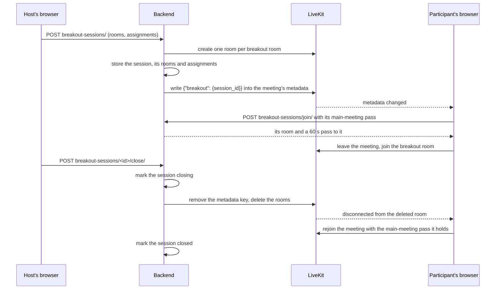

# Breakout rooms, v1

PR: [suitenumerique/meet#1765](https://github.com/suitenumerique/meet/pull/1765)

## TLDR

A host splits a meeting into 2 to 10 smaller meetings, every assigned
participant's browser moves into its room on its own, and closing the rooms
brings everyone back without a page reload. The backend keeps the media
server, LiveKit, and the database in step, and announces an open split
through the main meeting's LiveKit metadata. A browser proves who it is with
the pass it already holds for the main meeting, so this needs no new cookie
and no new identity. It is off by default, behind `BREAKOUT_ROOMS_ENABLED`,
and it is a first version: the comfort features are separate pull requests
that build on it.

## How a split goes

## The endpoints

All under `/api/v1.0/rooms/<room id>/breakout-sessions/`. While
`BREAKOUT_ROOMS_ENABLED` is off, each answers 404 to a caller it would
otherwise accept.

| Call | Who | What it does |
| --- | --- | --- |
| `GET /` | the owner or an administrator | the open split with its rooms and assignments, or an empty list |
| `POST /` | the owner or an administrator | opens a split: 2 to 10 rooms, each with a name and its participants; 409 when one is already open |
| `POST /<id>/close/` | the owner or an administrator | closes it; closing it again answers the same |
| `POST /join/` | anyone holding a pass to this meeting | the caller's room and a pass to it, or 404 when the caller has no room |

`join` authenticates with `Authorization: Bearer <main-meeting pass>`, the way
rename, raise hand and subtitles already do through
`LiveKitTokenAuthentication`. The pass must be for this meeting, and the room
handed back is the one assigned to the identity inside it.

## What is stored

- `BreakoutSession`: the meeting, its state (`active`, `closing` or `closed`),
  who opened it, when it closed. A database constraint allows one open
  session per meeting.
- `BreakoutRoom`: its display name and its LiveKit room name,
  `breakout_<session id>_<index>`.
- `BreakoutAssignment`: the room, the participant's identity in the meeting,
  and their display name at the time.

## What keeps it safe

- The pass to a breakout room is a member pass, carries the meeting's publish
  sources, and lives 60 seconds: LiveKit recreates a deleted room when someone
  joins it, so a short life bounds how long a pass fetched just before Close
  can reopen one.
- `retrieve` refuses a `breakout_` name as an unregistered room, so nobody
  gets a pass to a breakout room by typing its name.
- Close marks the session `closing` before any LiveKit call, so `join` answers
  404 and Open answers 409 while the rooms are being deleted. A close that
  fails part way answers 503 and can be run again.
- Every LiveKit call carries its own 5 second deadline. The LiveKit client's
  own timeout never applies, so without it a LiveKit that stops answering
  holds a backend worker indefinitely.
- When LiveKit reports the main meeting finished, an open split is closed, so
  it does not answer 409 to the next Open.

## What v1 leaves out

| Not in v1 | Added by |
| --- | --- |
| A guest of a public meeting who reloads while rooms are open gets back into their room | [#1762](https://github.com/suitenumerique/meet/pull/1762) |
| A browser that drops out of its breakout room goes back into it | [davd-gzl/meet#19](https://github.com/davd-gzl/meet/pull/19) |
| A removed participant is also taken out of their breakout room | [davd-gzl/meet#19](https://github.com/davd-gzl/meet/pull/19) |
| Camera, microphone, devices and background effect kept across a move | [davd-gzl/meet#19](https://github.com/davd-gzl/meet/pull/19) |
| A refused pass back asks the waiting room again, then offers a rejoin | [davd-gzl/meet#19](https://github.com/davd-gzl/meet/pull/19) |
| A tab loaded before the deploy is never given a room | [davd-gzl/meet#19](https://github.com/davd-gzl/meet/pull/19) |
| Metadata writes take turns | [davd-gzl/meet#19](https://github.com/davd-gzl/meet/pull/19) |
| Raise hand, rename, mute and subtitles hidden in a breakout room | [davd-gzl/meet#19](https://github.com/davd-gzl/meet/pull/19) |
| Mute, subtitles and raise hand working in a breakout room | [davd-gzl/meet#20](https://github.com/davd-gzl/meet/pull/20) |
| Splitting automatically, by hand in one click, or as last time, with a preview | [davd-gzl/meet#21](https://github.com/davd-gzl/meet/pull/21) |
| The tab remembering the plan and the last split | [davd-gzl/meet#21](https://github.com/davd-gzl/meet/pull/21) |
| Up to 20 rooms | [davd-gzl/meet#21](https://github.com/davd-gzl/meet/pull/21) |

## Upgrading

- Migration `0025_breakout_rooms` adds the three tables. Rolling back to the
  previous image needs `python manage.py migrate core 0024` first, which drops
  them.
- Keep `BREAKOUT_ROOMS_ENABLED` off until no pod runs the previous release:
  with `ALLOW_UNREGISTERED_ROOMS=true`, the default, an old pod hands out a
  pass to any `breakout_` room name.

## Words used here

| Word | What it is |
| --- | --- |
| split | one round of breakout rooms, from Open to Close; a `BreakoutSession` |
| main meeting | the meeting everyone started in |
| breakout room | one of the smaller meetings, a LiveKit room of its own |
| assignment | the record saying which breakout room one person belongs in |
| pass | the token a browser presents to LiveKit to enter a room, minted by `generate_token`; it carries the person's identity and the room |
| identity | the name LiveKit knows a connection by: a signed-in user's account id, or a guest's id; never shown on screen |
| metadata | a small piece of text LiveKit keeps on a room and copies to everyone in it |
| unregistered room | a room code with no row in the database, which `ALLOW_UNREGISTERED_ROOMS` lets anyone open |
| rolling upgrade | an upgrade where old and new servers answer requests side by side until the old ones stop |
