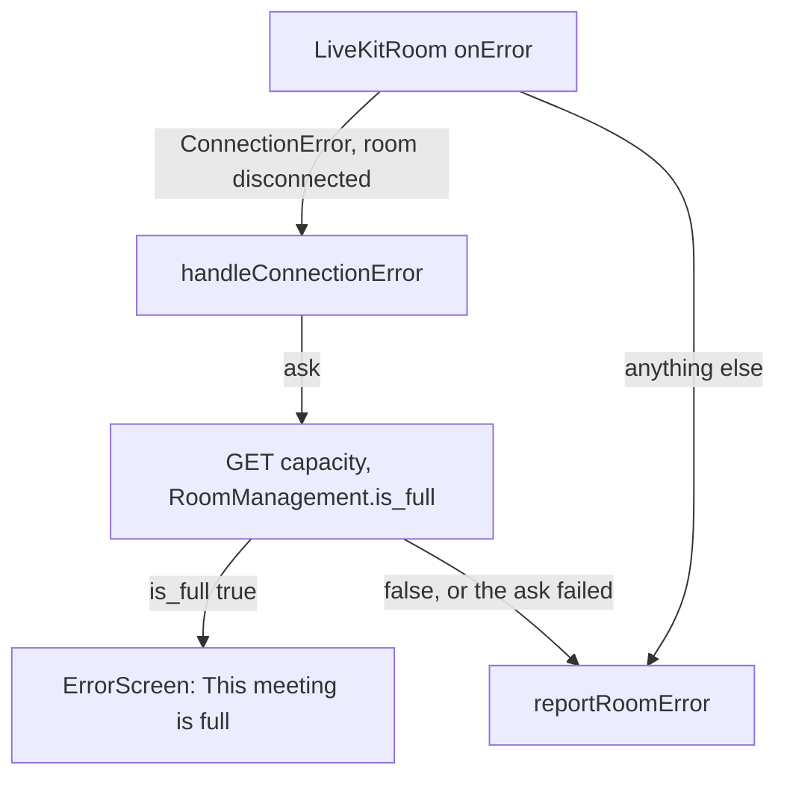

# A full meeting: `capacity` and the full-meeting screen

PR: [suitenumerique/meet#1780](https://github.com/suitenumerique/meet/pull/1780),
code linked at its head, 347cc994.

## TLDR

Before, someone joining a meeting at the media server's participant limit got
an empty meeting with one "Unknown" tile and a "Disconnected" notice, and the
refusal was reported as `livekit_room_error`. Now, after a failed join,
`Conference` asks the new `GET /rooms/<id>/capacity/`; when the answer is
`{"is_full": true}`, it shows "This meeting is full" on `ErrorScreen`, telling
the person to try again later. Any other failure is reported as before.

## Before and after

| Where | Before | After |
| --- | --- | --- |
| A join the media server refuses as full, through `LiveKitRoom.onError` | reported as `livekit_room_error`, empty meeting on screen | one capacity ask, then the full-meeting screen, reported as the `room-full` event |
| A join refused for another reason, or a server the browser cannot reach | reported, empty meeting | one capacity ask answering not full, then reported as before |
| An error once the person is in, a camera that cannot be sent for one | reported | reported, with no capacity ask |

## How the join failure is handled

After the change:



- `onError` sends a `ConnectionError` to `handleConnectionError` only while the
  room is disconnected, which is what a refused join leaves. An error once the
  person has joined is reported directly.
- `handleConnectionError` decides between the full-meeting screen and
  `reportRoomError`, on one capacity ask.
- `RoomManagement.is_full` decides full: the people in the participant list,
  recorders and agents left out, against the room's `max_participants`.

## Read the code in this order

1. [`Conference.tsx#L287-L297`](https://github.com/davd-gzl/meet/blob/347cc9944208a9dc5d677c74501ed7365d41503e/src/frontend/src/features/rooms/components/Conference.tsx#L287-L297)
   is the branch point in `onError`. If it let a publish failure through, a
   person already in a full meeting would be sent to the full-meeting screen.
   ```tsx
   if (
     e instanceof ConnectionError &&
     room.state === ConnectionState.Disconnected
   ) {
     void handleConnectionError(e)
     return
   }
   ```
2. [`Conference.tsx#L232-L245`](https://github.com/davd-gzl/meet/blob/347cc9944208a9dc5d677c74501ed7365d41503e/src/frontend/src/features/rooms/components/Conference.tsx#L232-L245),
   `handleConnectionError`, asks once and picks the screen. A meeting opened
   without being created first has no `data.id`, so it skips the ask and is
   reported as before.
3. [`viewsets.py#L864-L888`](https://github.com/davd-gzl/meet/blob/347cc9944208a9dc5d677c74501ed7365d41503e/src/backend/core/api/viewsets.py#L864-L888),
   the `capacity` action, takes the pass as its credential through
   `LiveKitTokenAuthentication` and `HasLiveKitRoomAccess`, as `toggle_hand`
   does, so only someone holding a pass for that meeting can ask.
4. [`room_management.py#L104-L133`](https://github.com/davd-gzl/meet/blob/347cc9944208a9dc5d677c74501ed7365d41503e/src/backend/core/services/room_management.py#L104-L133),
   `is_full`, counts the participant list rather than the room's
   `num_participants`, which trailed a join by about four seconds in a measured
   run.
   ```python
   people = [p for p in participants.participants if not _is_dependent(p)]
   return len(people) >= response.rooms[0].max_participants
   ```
5. [`room_management.py#L33-L39`](https://github.com/davd-gzl/meet/blob/347cc9944208a9dc5d677c74501ed7365d41503e/src/backend/core/services/room_management.py#L33-L39),
   `_is_dependent`, leaves out recorders and agents by kind or by permission,
   as the media server's own join check does.
6. [`Conference.tsx#L214-L221`](https://github.com/davd-gzl/meet/blob/347cc9944208a9dc5d677c74501ed7365d41503e/src/frontend/src/features/rooms/components/Conference.tsx#L214-L221)
   is the screen: the existing `ErrorScreen`, given the `error.roomFull`
   heading and body, as the `isCreateError` block above it does.

## What a user notices

| Who | What they see | What decides it |
| --- | --- | --- |
| Someone joining a full meeting | "This meeting is full" and "Try again later" | per tab, from one capacity ask after the refused join |
| Someone joining a full meeting opened by a code nobody created | the disconnected screen, as before | no meeting id to ask with |

## Words used here

| Name | What it is |
| --- | --- |
| `GET /api/v1.0/rooms/<id>/capacity/` | answers `{"is_full": bool}`, or 500 when the media server cannot be read; the pass is sent as a bearer token; asked once per refused join |
| `RoomManagement.is_full` | true when the people in a live room, recorders and agents left out, reach its `max_participants`; false when the room has no limit or is not live |
| `max_participants` | the media server's limit for a room, 0 meaning none |
| `handleConnectionError` | the function in `Conference` that turns a refused join into the full-meeting screen or a report |
| `isRoomFull` | the state in `Conference` that swaps the meeting for `ErrorScreen` once the capacity answer says full |
| `room-full` | the analytics event captured when the full-meeting screen is shown |
