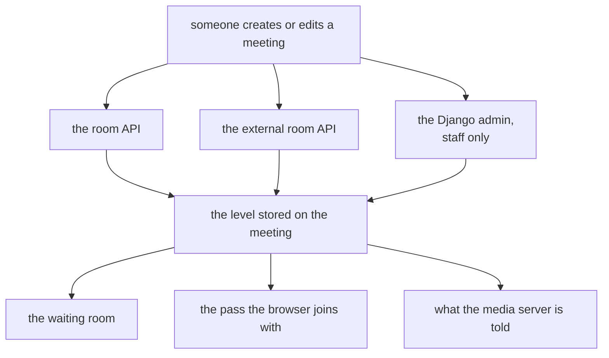

# An operator can forbid public rooms

## TLDR

A meeting in [meet](https://github.com/suitenumerique/meet) is open at one of
three levels, and the widest of them lets anyone holding the link walk in. Until
now the person who runs the server could pick which level new meetings start at,
and the owner of any meeting could then switch it to the widest one anyway. This
change adds one switch, `ALLOW_PUBLIC_ROOMS`, that takes the widest level away
from everybody. It ships on, so upgrading changes nothing.

## The three levels

| The setting says | Who gets in |
| --- | --- |
| `public` | anyone holding the link |
| `trusted` | anyone signed in |
| `restricted` | people invited to that meeting |

`trusted` and `restricted` both put a waiting room in front of the meeting.
`public` does not, which is why turning it off is the whole of this feature.

## Where a meeting's level is set

Before this change, only the room API and the external room API had any say over
which levels were acceptable, and they disagreed: the external one had its own
pair of settings, and the room API had none at all.

## What the switch does when it is off

| | Before | After |
| --- | --- | --- |
| Setting a meeting to public | accepted | refused, on both APIs |
| The settings panel | offers three levels | offers two |
| A meeting already stored public | runs public | runs as `trusted`, and keeps its stored value |
| A meeting code nobody registered | mints a public meeting | answers 404 |
| A server whose own default is public | starts, and ignores one of the two settings | refuses to start |

The third row is the one worth reading twice. Nothing rewrites the meetings that
are already public. The stored value stays, and every screen that names a
meeting's level is told the level it actually runs at instead, so turning the
switch back on restores those meetings exactly as they were.

## The one idea behind the code

A meeting now has two levels rather than one.

- The **stored** level is what its owner chose, and it never changes on its own.
- The **effective** level is what the server enforces, and it drops to `trusted`
  while the stored level is one this server no longer allows.

Everything a person or a browser can observe reads the effective level: the
waiting room, who may admit the people in it, what the media server is told, and
every API answer. Only the database keeps the stored one.

> [!NOTE]
> This is why the change touches one frontend file for behaviour and three more
> only to share a list. The API already answered under a key the screens read;
> it now answers a different value under that same key.

## Concepts

the waiting room

People who are not allowed straight in are held in a waiting room, and someone
already in the meeting admits them one at a time. A meeting open to anyone has
no waiting room at all, so the moment a server stops allowing that level, the
waiting room appears in front of meetings that never had one.

the external room API

A second, narrower API that lets another product create meetings on this server
without a person signing in. It has always had its own opinion about the widest
level, held in two settings of its own. The new switch overrules both, so an
operator does not have to find them.

a meeting code nobody registered

Typing an unused code into the address bar can create a meeting on the spot,
with no row in the database behind it. Such a meeting has nowhere to keep a
level and no waiting room in front of it, so it is a public meeting or it is
nothing.

