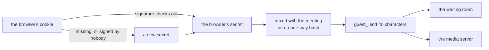

# A guest keeps one identity in each meeting

## TLDR

Someone who joins a [meet](https://github.com/suitenumerique/meet) meeting
without signing in had no name the server could recognise twice: opening a
public meeting gave them a new one every time. This change gives each browser
one secret, kept in a signed cookie, and works out the guest's name in each
meeting from that secret and the meeting. The same browser then has the same
name every time it comes back to a meeting, and a different one in every other
meeting. Splitting a meeting into smaller groups needs exactly that, to know
which group a guest belongs in.

## What it is for

The media server, the part that carries sound and video, knows every person in
a meeting by an identity: a name the screen never shows, one per connection. A
signed-in person's identity is their account, so it is the same every time. A
guest had nothing that stayed the same, so any feature that has to find the same
guest again, such as sending them to their breakout room, had nothing to look
them up by.

## How it works today

Before this change:

| Where the guest is | Their identity | Kept in the browser |
| --- | --- | --- |
| A meeting open to anyone | a new random one every time the page asks for the meeting | nothing |
| A meeting with a waiting room | the value of a cookie the server sets and never checks | that cookie, until the browser closes |
| A meeting code nobody registered | a new random one every time | nothing |

## What the change does

After this change:

| Where the guest is | Their identity | Kept in the browser |
| --- | --- | --- |
| A meeting open to anyone | worked out from the browser's secret and the meeting | one signed cookie, until the browser closes |
| A meeting with a waiting room | the same, and the waiting room knows them by it too | the same cookie |
| A meeting code nobody registered | a new random one every time, unchanged | nothing |

How the identity is worked out, after the change:

The hash only goes one way, so seeing someone's identity tells nobody their
secret. It takes no server key, so changing that key while keeping the old one
as a fallback leaves every identity as it was.

The cookie behaves as the old one did in one respect: it ends when the browser
closes. Every visit signs it again, and a cookie nobody has used for
`SESSION_COOKIE_AGE`, 12 hours by default, stops being accepted.

| What happens | Before | After |
| --- | --- | --- |
| The same guest opens a public meeting twice | two identities | one |
| One browser opens forty meetings | forty identities, no cookie | forty identities, one cookie |
| A guest opens the same meeting in a second tab | two people in the meeting | one, and the older tab is dropped, as for a signed-in person |
| A host admits someone from the waiting room | the request names a UUID | the request names a `guest_` identity |

> [!NOTE]
> The cookie's name changes from `lobbyParticipantId` to `lobbyGuest`, so a
> server still on the previous version never reads the new value. A deployment
> that set its own name in `LOBBY_COOKIE_NAME` has to pick a new one for this
> release, which `UPGRADE.md` says. Guests waiting during the upgrade wait
> again, under their new identity.

## Concepts

a guest

Someone in a meeting who did not sign in. A signed-in person is known by their
account and is not touched by this change.

the waiting room

Where people who are not allowed straight in wait until someone already in the
meeting lets them in, one at a time. A meeting open to anyone has none.

a signed cookie

A value the server stores in the browser together with a signature only the
server can make. When the browser sends it back, the server checks the
signature first, so a value the server never issued is thrown away.

a meeting code nobody registered

Typing an unused code into the address bar can open a meeting on the spot, with
nothing stored behind it. It has no waiting room and no breakout rooms, so
nothing there needs a guest to keep their identity.

