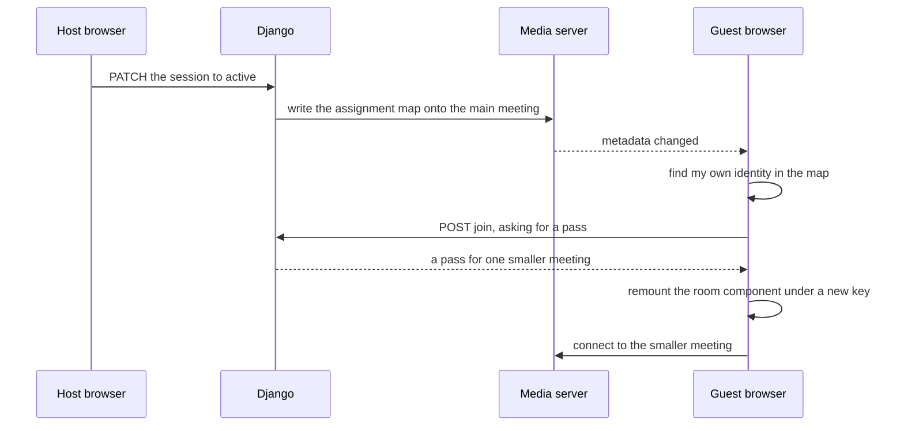

# Breakout rooms in samourai-visio

Explained by claude-opus-5.

## TLDR

A meeting can be split into as many as ten smaller meetings for a while, and
then put back together. The host decides how many, who goes where and for how
long; everyone else is moved without clicking anything and lands back in the
main meeting when the host ends it. Nothing about the smaller meetings is
permanent: they exist on the media server for the length of the session and
leave three rows behind in the database.

## Concepts

The code and the project use words that mean something narrower than they
sound. This column pair is what the rest of the file uses.

| The code says | This file says |
| --- | --- |
| LiveKit | the media server, the thing that carries audio and video |
| room | the meeting |
| breakout room | one of the smaller meetings |
| main room | the meeting everyone started in |
| participant | someone in the meeting |
| identity | who the media server thinks you are, one string per connection |
| token | the pass a browser shows to join a meeting |
| metadata | a small piece of text the media server keeps on a meeting and copies to everyone in it |
| assignment | the record saying which smaller meeting one person belongs in |
| session | one round of splitting up, from the host's setup to the recall |

## What a host does

The host opens **More options** and picks **Breakout Rooms**, which fills the
side panel. Setup asks two things: how many smaller meetings, from two to ten,
and how long, from no timer up to four hours. Pressing **Create Breakout Rooms**
makes them.

The panel then lists everyone in the meeting with a dropdown each, and offers
**Assign all randomly** for the impatient. **Open All Rooms** starts the
session, and everyone with an assignment is moved.

While it runs, the panel becomes a supervision view: who is in which smaller
meeting, a countdown, a box for sending one announcement into all of them at
once, a **Visit** button per meeting, and a dropdown to move somebody while the
session is live. **Close All Rooms** ends it.

Anyone inside a smaller meeting sees a strip naming where they are, a
countdown, a **Return to main room** button and an **Ask for Help** button that
alerts the host.

## How somebody gets moved

The move is the part a reader cannot guess, because nothing navigates. The
browser stays on the same address and swaps which meeting it is connected to.

Two things carry the news that a session started. The map of who goes where is
written onto the main meeting's [metadata](https://github.com/samouraiworld/samourai-visio/blob/feat/breakout-rooms/src/backend/core/breakout/services.py#L170),
which the media server copies to every browser connected to it, and a separate
message is pushed into the same meeting for speed. The browser watches the
metadata in
[`useBreakoutMetadataWatcher`](https://github.com/samouraiworld/samourai-visio/blob/feat/breakout-rooms/src/frontend/src/features/breakout/hooks/useBreakoutMetadataWatcher.ts#L36),
looks up its own identity, and calls
[`moveToBreakoutRoom`](https://github.com/samouraiworld/samourai-visio/blob/feat/breakout-rooms/src/frontend/src/features/breakout/hooks/useBreakoutRoomSwap.ts#L41)
when it finds itself.

The swap itself is one line of React. The component holding the connection
carries [`key={activeRoomConnection.roomName}`](https://github.com/samouraiworld/samourai-visio/blob/feat/breakout-rooms/src/frontend/src/features/rooms/components/Conference.tsx#L283),
so writing a new meeting name into that state throws the old connection away and
builds a new one, keeping the page and the camera permission the browser already
granted.

## What is stored, and what is not

The smaller meetings are not meetings in the usual sense. No row is created for
them in the table that holds real meetings, they have no address anyone can
type, and they cannot be joined except through a pass minted for one person.
What exists is three small tables:

| Table | Holds |
| --- | --- |
| [`meet_breakout_session`](https://github.com/samouraiworld/samourai-visio/blob/feat/breakout-rooms/src/backend/core/breakout/models.py#L16) | one round of splitting up, its status, its timer and who started it |
| [`meet_breakout_room`](https://github.com/samouraiworld/samourai-visio/blob/feat/breakout-rooms/src/backend/core/breakout/models.py#L105) | one smaller meeting, its display name and the name the media server knows it by |
| [`meet_breakout_assignment`](https://github.com/samouraiworld/samourai-visio/blob/feat/breakout-rooms/src/backend/core/breakout/models.py#L158) | one person in one smaller meeting |

On the media server each smaller meeting is created with a five minute
[empty timeout](https://github.com/samouraiworld/samourai-visio/blob/feat/breakout-rooms/src/backend/core/breakout/services.py#L40), so an abandoned
one disappears by itself.

A meeting may have only one live session at a time. That is a database rule
rather than a convention, and it covers both the setup stage and the running
one, so a session left open blocks the next attempt until it is closed.

## The endpoints

All nested under `/api/v1.0/rooms/{room_id}/breakout-sessions/`, wired in
[`core/urls.py`](https://github.com/samouraiworld/samourai-visio/blob/feat/breakout-rooms/src/backend/core/urls.py#L62).

| Call | Does |
| --- | --- |
| `POST /` | make a session and its smaller meetings |
| `GET /` | list the live sessions for this meeting |
| `PATCH /{id}/` | start the session, or end it |
| `GET /{id}/status/` | who is in each smaller meeting right now, asked of the media server |
| `PUT /{id}/assignments/` | replace the whole map of who goes where |
| `POST /{id}/randomize/` | deal everyone out evenly |
| `POST /{id}/broadcast/` | send one announcement into every smaller meeting |
| `POST /{id}/request-help/` | tell the host somebody needs them |
| `POST /{id}/rooms/{rid}/join/` | mint the pass for one smaller meeting |

The status call is the busy one. The browser asks for it
[every five seconds](https://github.com/samouraiworld/samourai-visio/blob/feat/breakout-rooms/src/frontend/src/features/breakout/api/useBreakoutStatus.ts#L29)
while the supervision panel is open, and Django answers it by asking the media
server about each smaller meeting in turn.

## The switch

The whole feature is behind one setting,
[`MEET_BREAKOUT_ROOMS_ENABLED`](https://github.com/samouraiworld/samourai-visio/blob/feat/breakout-rooms/src/backend/meet/settings.py#L754), false by
default. With it off, every endpoint above answers 404 and the menu entry is
absent. Local development and the test suite both turn it on.
